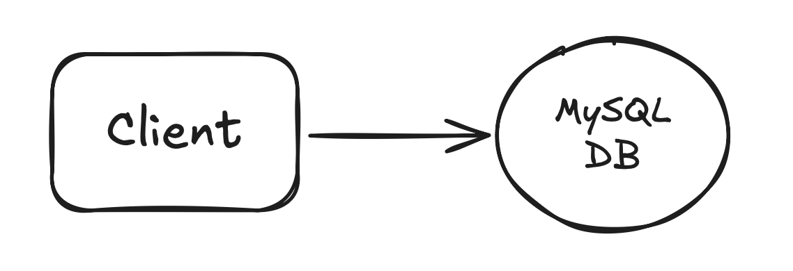

# 📺 Kafka – Section 1b

In this section, we’ll take our first step toward building the backend for the E-Commerce App by setting up a **MySQL database** on **AWS RDS** — using **Terraform** to automate the entire process. This section focuses entirely on infrastructure provisioning — we won’t connect any microservices or Kafka components yet. By the end, you’ll have a fully configured and reachable database ready for the microservices we’ll build in the next section.

<div align="center">
    
</div>

## 🎥 Video Walkthrough

**Title:** Kafka – Section 1b  
**Link:** [Watch on Udemy](https://www.udemy.com/course/practical-system-design/learn/lecture/55998819#overview)

# ⚙️ Instructions and Commands

### 1. Create the Project Directory

Create the base project folder:

```bash
mkdir -p ~/Desktop/kafka_demo
```

Open the folder in VS Code:

```bash
code -r ~/Desktop/kafka_demo
```

&nbsp;&nbsp;&nbsp;&nbsp; _Alternatively, you can also drag the `kafka_demo` folder directly into VS Code._

Create the terraform directory structure:

```bash
mkdir -p terraform/rds
```

Navigate into the directory:

```bash
cd terraform/rds
```

Create terraform entry file:

```bash
touch main.tf
```

-  On **Windows PowerShell**:
  ```bash
  New-Item main.tf
  ```

### 2. Install and Verify Terraform

If you don’t have Terraform yet, install it with Homebrew (on **macOS**):

```bash
brew install terraform
```

-  On **Windows PowerShell**, install it with `winget`:
  ```bash
  winget install HashiCorp.Terraform
  ```

Confirm the installation:

```bash
terraform --version
```

&nbsp;&nbsp;&nbsp;&nbsp; _**Note:** If this command isn’t recognized, restart your terminal or VS Code and try again._  
&nbsp;&nbsp; If a version number is returned, Terraform is installed and ready to use.

### 3. Initialize and Apply the Terraform Configuration

Initialize Terraform:

```bash
terraform init
```

Preview the resources Terraform will create:

```bash
terraform plan
```

Apply the plan to create your RDS instance:

```bash
terraform apply
```

When prompted, type `yes` to confirm the deployment.

### 4. Verify the Database Setup

Set the `APP_DB_ENDPOINT` environment variable:

```bash
APP_DB_ENDPOINT=$(terraform output -raw app_db_endpoint)
```

-  On **Windows PowerShell**:
  ```bash
  $APP_DB_ENDPOINT = terraform output -raw app_db_endpoint
  ```

Display the tables in the `services_db` database:

```bash
docker run --rm -e MYSQL_PWD='Password100!' mysql:8.0 \
 mysql -h $APP_DB_ENDPOINT -u admin \
 --table -e "USE services_db; SHOW TABLES;"
```

-  On **Windows PowerShell**, run the command on a single line (no line breaks):
  ```bash
  docker run --rm -e MYSQL_PWD=Password100! mysql:8.0 mysql -h $APP_DB_ENDPOINT -u admin --table -e "USE services_db; SHOW TABLES;"
  ```

### 5. (Optional) Clean Up Resources

```bash
terraform destroy
```

<br>
