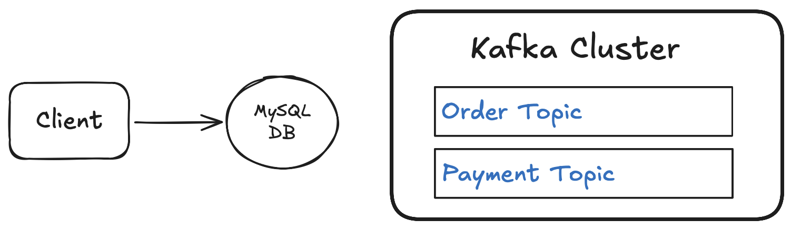

# 📺 Kafka – Section 1c

In this section, we'll use **Docker Compose** to launch a **single-broker Kafka cluster (KRaft mode)** locally. We'll generate a cluster ID, bring the broker up, verify the environment, and create our topics (`order`, `payment`). No app code yet — this is purely about standing up Kafka cleanly so later sections can produce/consume against them.

<div align="center">
    
</div>

## 🎥 Video Walkthrough

**Title:** Kafka – Section 1c  
**Link:** [Watch on Udemy](https://www.udemy.com/course/practical-system-design/learn/lecture/55998823#overview)

# ⚙️ Instructions and Commands

### 1. Create the Compose file

From `~/Desktop/kafka_demo`:

```bash
touch docker-compose.yml
```

-  On **Windows PowerShell**:

  ```bash
  New-Item docker-compose.yml
  ```

Then paste in starter code

### 2. Generate a `CLUSTER_ID`

```bash
docker run --rm confluentinc/cp-kafka:7.6.7 \
  bash -lc 'kafka-storage random-uuid'
```

-  On **Windows PowerShell**, run the command on a single line (no line breaks):

  ```bash
  docker run --rm confluentinc/cp-kafka:7.6.7 bash -lc 'kafka-storage random-uuid'
  ```

Add this value into `docker-compose.yml`

### 3. Start the cluster

```bash
PUBLIC_DNS=localhost docker compose up -d
```

-  On **Windows PowerShell**:

  ```bash
  $env:PUBLIC_DNS="localhost"; docker compose up -d
  ```

Confirm the container is running

```bash
docker ps
```

Confirm that `PUBLIC_DNS` is being passed correctly

```bash
docker compose exec kafka env
```

Verify topics (should be empty initially):

```bash
docker exec -it kafka-kraft kafka-topics \
  --list --bootstrap-server localhost:9092
```

-  On **Windows PowerShell**, run the command on a single line (no line breaks):

  ```bash
  docker exec -it kafka-kraft kafka-topics --list --bootstrap-server localhost:9092
  ```

### 4. Create topics (Order + Payment)

```bash
docker exec -it kafka-kraft bash -lc '
for t in order payment; do
  kafka-topics --bootstrap-server localhost:9092 \
    --create --if-not-exists --topic "$t" \
    --partitions 1 --replication-factor 1
done'
```

Verify topics created:

```bash
docker exec -it kafka-kraft kafka-topics \
  --list --bootstrap-server localhost:9092
```

-  On **Windows PowerShell**, run the command on a single line (no line breaks):

  ```bash
  docker exec -it kafka-kraft kafka-topics --list --bootstrap-server localhost:9092
  ```

### 5. (Optional) Cleanup

```bash
docker compose down -v
```

<br>
