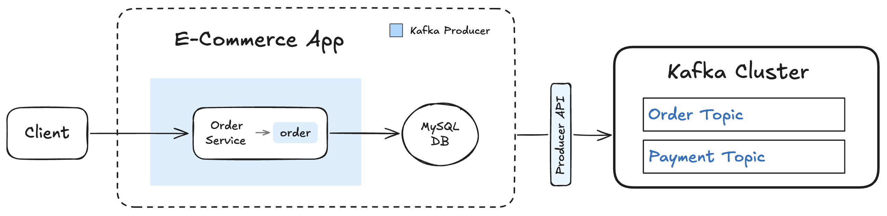

# 📺 Kafka – Section 1d

In this section, we’ll create the foundation of our **E-Commerce App** by building its first microservice — the **Order Service**. This service acts solely as a **Kafka producer**, publishing order-related events into the `order` topic whenever a new order is placed. We'll set up a lightweight Flask API, connect it to our existing **MySQL database** and **Kafka cluster**, and test the complete flow — from an HTTP request, to writing the order into MySQL, and finally publishing the corresponding event to Kafka.

<div align="center">
    
</div>

## 🎥 Video Walkthrough

**Title:** Kafka – Section 1d  
**Link:** [Watch on Udemy](https://www.udemy.com/course/practical-system-design/learn/lecture/55998829#overview)

# ⚙️ Instructions and Commands

From the root of your project (`~/Desktop/kafka_demo`)

### 1. Create the E-Commerce App Structure

Create the main `e_commerce_app` package:

```bash
mkdir e_commerce_app
```

Create the package initializer:

```bash
touch e_commerce_app/__init__.py
```

-  On **Windows PowerShell**:
  ```bash
  New-Item e_commerce_app/__init__.py
  ```

Create the application launcher file:

```bash
touch e_commerce_app/launcher.py
```

-  On **Windows PowerShell**:
  ```bash
  New-Item e_commerce_app/launcher.py
  ```

_Paste in the provided `launcher.py` starter code._

### 2. Create the Services Directory Structure

Create a directory to hold the application services:

```bash
mkdir -p e_commerce_app/services
```

Add the package initializer:

```bash
touch e_commerce_app/services/__init__.py
```

-  On **Windows PowerShell**:
  ```bash
  New-Item e_commerce_app/services/__init__.py
  ```

Create the `order_service` file:

```bash
touch e_commerce_app/services/order_service.py
```

-  On **Windows PowerShell**:
  ```bash
  New-Item e_commerce_app/services/order_service.py
  ```

_Paste in the provided `order_service` starter code._

### 3. Create the Shared Service Base Module

Create a shared `service_base.py` module for reusable configuration and helper logic:

```bash
touch e_commerce_app/service_base.py
```

-  On **Windows PowerShell**:
  ```bash
  New-Item e_commerce_app/service_base.py
  ```

_Paste in the provided `service_base.py` starter code._

### 4. Set Up Virtual Environment and Install Dependencies

Create a virtual environment:

```bash
python3 -m venv venv
```

- Alternatively (on some systems):
  ```bash
  python -m venv venv
  ```

Activate the virtual environment:

```bash
source venv/bin/activate
```

-  On **Windows PowerShell**:

  ```bash
  .\venv\Scripts\Activate.ps1
  ```

- 💬 **Note**: If activation fails, you may need to allow script execution first:
  ```bash
  Set-ExecutionPolicy -Scope CurrentUser -ExecutionPolicy RemoteSigned -Force
  ```

Install the dependencies:

```bash
pip install pymysql flask kafka-python
```

### 5. Ensure Kafka Cluster is Running & Topics are Created

Before launching the application, verify that your Kafka cluster is running and the required topics have been created:

- Revisit **[Section 1C → Step 3](../section_1c/README.md#3-start-the-cluster)** to launch the Kafka cluster
- Revisit **[Section 1C → Step 4](../section_1c/README.md##4-create-topics-order--payment)** to create the `Order` and `Payment` topics

### 6. Ensure the `APP_DB_ENDPOINT` Environment Variable is Set

From the project root (`~/Desktop/kafka_demo`), load the `APP_DB_ENDPOINT` environment variable:

```bash
source terraform/rds/.env
```

-  On **Windows PowerShell**:
  ```bash
  . .\terraform\rds\.env
  ```

### 7. Launch the E-Commerce App

Start the Flask app with the required `KAFKA_BOOTSTRAP` and `DB_HOST` environment variables passed in:

```bash
KAFKA_BOOTSTRAP=localhost:9092 \
  DB_HOST=$APP_DB_ENDPOINT \
  python -m e_commerce_app.launcher
```

-  On **Windows PowerShell**:
  ```bash
  $env:KAFKA_BOOTSTRAP = "localhost:9092"
  $env:DB_HOST = $APP_DB_ENDPOINT
  python -m e_commerce_app.launcher
  ```

### 8. Produce a Test Order Event for `order_1`

```bash
curl -X POST http://localhost:5001/produce \
  -H "Content-Type: application/json" \
  -d '{
    "topic": "order",
    "key": "order_1",
    "event": {
      "event_type": "OrderPlaced",
      "order_id": "order_1",
      "user_id": "user_1",
      "items": [
        { "product_id": "prod_1", "quantity": 2 },
        { "product_id": "prod_2", "quantity": 1 }
      ],
      "total_amount": 84.97,
      "timestamp": "2025-01-01T10:00:00Z"
    }
  }'
```

-  On **Windows PowerShell**:
  ```bash
  curl.exe -X POST http://localhost:5001/produce `
    -H "Content-Type: application/json" `
    -d '{
      \"topic\": \"order\",
      \"key\": \"order_1\",
      \"event\": {
        \"event_type\": \"OrderPlaced\",
        \"order_id\": \"order_1\",
        \"user_id\": \"user_1\",
        \"items\": [
          { \"product_id\": \"prod_1\", \"quantity\": 2 },
          { \"product_id\": \"prod_2\", \"quantity\": 1 }
        ],
        \"total_amount\": 84.97,
        \"timestamp\": \"2025-01-01T10:00:00Z\"
      }
    }'
  ```

### 9. Verify Order in the Database

Refer back to **[Step 6](#6-ensure-the-app_db_endpoint-environment-variable-is-set)** to set the `APP_DB_ENDPOINT` environment variable.

```bash
docker run --rm -e MYSQL_PWD='Password100!' mysql:8.0 \
  mysql -h $APP_DB_ENDPOINT -u admin \
  --table -e "USE services_db; SELECT * FROM Orders;"
```

-  On **Windows PowerShell**:
  ```bash
  docker run --rm -e MYSQL_PWD='Password100!' mysql:8.0 `
    mysql -h $APP_DB_ENDPOINT -u admin `
    --table -e "USE services_db; SELECT * FROM Orders;"
  ```

### 10. Verify Event in Kafka

```bash
docker exec -it kafka-kraft kafka-console-consumer \
  --bootstrap-server localhost:9092 \
  --topic order --from-beginning --max-messages 1
```

-  On **Windows PowerShell**:
  ```bash
  docker exec -it kafka-kraft kafka-console-consumer `
    --bootstrap-server localhost:9092 `
    --topic order --from-beginning --max-messages 1
  ```

### 11. Cleanup: Reset for Future Tests

In the terminal where the `e_commerce_app` is running, press:

```bash
Ctrl + C
```

Truncate the `Orders` table:

> _Refer back to [Step 6](#6-ensure-the-app_db_endpoint-environment-variable-is-set) to set the `APP_DB_ENDPOINT` environment variable._

```bash
docker run --rm -e MYSQL_PWD='Password100!' mysql:8.0 \
  mysql -h $APP_DB_ENDPOINT -u admin \
  --table -e "USE services_db; TRUNCATE TABLE Orders;"
```

-  On **Windows PowerShell**, run the command on a single line (no line breaks):
  ```bash
  docker run --rm -e MYSQL_PWD='Password100!' mysql:8.0 `
    mysql -h $APP_DB_ENDPOINT -u admin `
    --table -e "USE services_db; TRUNCATE TABLE Orders;"
  ```

Bring down Kafka container:

```bash
docker-compose down -v
```

<br>
