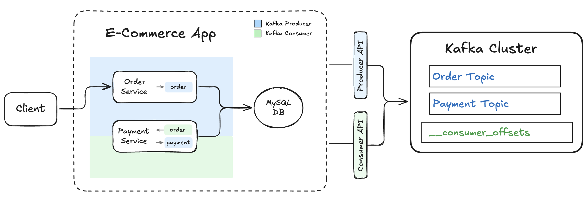

# 📺 Kafka – Section 1e

In this section, we’ll extend our **E-Commerce App** by adding the **Payment Service**, which plays a dual role in our event-driven architecture.
It acts as a **Kafka consumer**, listening for new order events from the `order` topic, and as a **Kafka producer**, publishing corresponding payment events to the `payment` topic.
We'll learn how to subscribe to a topic, process incoming messages, emit new events, and verify that both sides of the pipeline are working correctly — from order creation, to payment confirmation, all the way to messages flowing through Kafka and persisting in the database.

<div align="center">
    
</div>

## 🎥 Video Walkthrough

**Title:** Kafka – Section 1e  
**Link:** [Watch on Udemy](https://www.udemy.com/course/practical-system-design/learn/lecture/55998833#overview)

# ⚙️ Instructions and Commands

From the root of your project (`~/Desktop/kafka_demo`):

### 1. Create the Payment Service

```bash
touch e_commerce_app/services/payment_service.py
```

-  On **Windows PowerShell**:
  ```bash
  New-Item e_commerce_app/services/payment_service.py
  ```

_Paste in the provided `payment_service` starter code._

### 2. Launch the Kafka Cluster

```bash
PUBLIC_DNS=localhost docker compose up -d
```

-  On **Windows PowerShell**:

  ```bash
  $env:PUBLIC_DNS="localhost"; docker compose up -d
  ```

### 3. Create topics (`Order` + `Payment`)

Create `Order` and `Payment` topics:

```bash
docker exec -it kafka-kraft bash -lc '
for t in order payment; do
  kafka-topics --bootstrap-server localhost:9092 \
    --create --if-not-exists --topic "$t" \
    --partitions 1 --replication-factor 1
done'
```

Verify topics created:

```bash
docker exec -it kafka-kraft kafka-topics \
  --list --bootstrap-server localhost:9092
```

-  On **Windows PowerShell**:
  ```bash
  docker exec -it kafka-kraft kafka-topics `
    --list --bootstrap-server localhost:9092
  ```

### 4. Verify No Consumer Groups Registered Yet

Before launching the e-commerce app, verify that no consumer groups are currently registered with the broker:

```bash
docker exec -it kafka-kraft kafka-consumer-groups \
  --bootstrap-server localhost:9092 \
  --list
```

-  On **Windows PowerShell**:
  ```bash
  docker exec -it kafka-kraft kafka-consumer-groups `
    --bootstrap-server localhost:9092 `
    --list
  ```

### 5. Launch the E-Commerce App

> _Before running the app, make sure your virtual environment is created and activated. You can revisit **[Section 1D → Step 4](../section_1d/README.md#4-set-up-virtual-environment-and-install-dependencies)** for the specific commands._

> _Additionally, ensure that the `APP_DB_ENDPOINT` environment variable is properly set. You can revisit **[Section 1D → Step 6](../section_1d/README.md#6-ensure-the-app_db_endpoint-environment-variable-is-set)** for the specific commands._

```bash
KAFKA_BOOTSTRAP=localhost:9092 \
  DB_HOST=$APP_DB_ENDPOINT \
  python -m e_commerce_app.launcher
```

-  On **Windows PowerShell**:
  ```bash
  $env:KAFKA_BOOTSTRAP = "localhost:9092"
  $env:DB_HOST = $APP_DB_ENDPOINT
  python -m e_commerce_app.launcher
  ```

### 6. Verify Consumer Group Registered Successfully

After launching the e-commerce app, verify that the `payment_service` consumer group successfully registered with the Kafka broker:

```bash
docker exec -it kafka-kraft kafka-consumer-groups \
  --bootstrap-server localhost:9092 \
  --list
```

-  On **Windows PowerShell**, run the command on a single line (no line breaks):
  ```bash
  docker exec -it kafka-kraft kafka-consumer-groups `
    --bootstrap-server localhost:9092 `
    --list
  ```

### 7. Produce a Test Order Event for `order_1`

```bash
curl -X POST http://localhost:5001/produce \
  -H "Content-Type: application/json" \
  -d '{
    "topic": "order",
    "key": "order_1",
    "event": {
      "event_type": "OrderPlaced",
      "order_id": "order_1",
      "user_id": "user_1",
      "items": [
        { "product_id": "prod_1", "quantity": 2 },
        { "product_id": "prod_2", "quantity": 1 }
      ],
      "total_amount": 84.97,
      "timestamp": "2025-01-01T10:00:00Z"
    }
  }'
```

-  On **Windows PowerShell**:
  ```bash
  curl.exe -X POST http://localhost:5001/produce `
    -H "Content-Type: application/json" `
    -d '{
      \"topic\": \"order\",
      \"key\": \"order_1\",
      \"event\": {
        \"event_type\": \"OrderPlaced\",
        \"order_id\": \"order_1\",
        \"user_id\": \"user_1\",
        \"items\": [
          { \"product_id\": \"prod_1\", \"quantity\": 2 },
          { \"product_id\": \"prod_2\", \"quantity\": 1 }
        ],
        \"total_amount\": 84.97,
        \"timestamp\": \"2025-01-01T10:00:00Z\"
      }
    }'
  ```

### 8. Verify Order in the Database

> _Refer back to **[Section 1D → Step 6](../section_1d/README.md#6-ensure-the-app_db_endpoint-environment-variable-is-set)** to set the `APP_DB_ENDPOINT` environment variable._

```bash
docker run --rm -e MYSQL_PWD='Password100!' mysql:8.0 \
  mysql -h $APP_DB_ENDPOINT -u admin \
  --table -e "USE services_db; SELECT * FROM Orders;"
```

-  On **Windows PowerShell**:
  ```bash
  docker run --rm -e MYSQL_PWD='Password100!' mysql:8.0 `
    mysql -h $APP_DB_ENDPOINT -u admin `
    --table -e "USE services_db; SELECT * FROM Orders;"
  ```

### 9. Read 1 Message from Each Topic (`Order` & `Payment`)

```bash
docker exec -it kafka-kraft bash -lc '
for t in order payment; do
  echo === $t ===
  kafka-console-consumer --bootstrap-server localhost:9092 \
    --topic "$t" --from-beginning --max-messages 1
done'
```

### 10. Inspect the Internal `__consumer_offsets` Topic

```bash
docker exec -it kafka-kraft kafka-console-consumer \
  --bootstrap-server localhost:9092 \
  --topic __consumer_offsets \
  --from-beginning \
  --formatter "kafka.coordinator.group.GroupMetadataManager\$OffsetsMessageFormatter"
```

-  On **Windows PowerShell**:
  ```bash
  docker exec -it kafka-kraft kafka-console-consumer `
    --bootstrap-server localhost:9092 `
    --topic __consumer_offsets `
    --from-beginning `
    --formatter "kafka.coordinator.group.GroupMetadataManager`$OffsetsMessageFormatter"
  ```

To stop the console consumer:

```bash
Ctrl + C
```

### 11. Cleanup: Reset for Future Tests

In the terminal where the `e_commerce_app` is running, press:

```bash
Ctrl + C
```

Truncate the `Orders` table:

> _Refer back to **[Section 1D → Step 6](../section_1d/README.md#6-ensure-the-app_db_endpoint-environment-variable-is-set)** to set the `APP_DB_ENDPOINT` environment variable._

```bash
docker run --rm -e MYSQL_PWD='Password100!' mysql:8.0 \
  mysql -h $APP_DB_ENDPOINT -u admin \
  --table -e "USE services_db; TRUNCATE TABLE Orders;"
```

-  On **Windows PowerShell**:
  ```bash
  docker run --rm -e MYSQL_PWD='Password100!' mysql:8.0 `
    mysql -h $APP_DB_ENDPOINT -u admin `
    --table -e "USE services_db; TRUNCATE TABLE Orders;"
  ```

Bring down Kafka container:

```bash
docker-compose down -v
```

<br>
