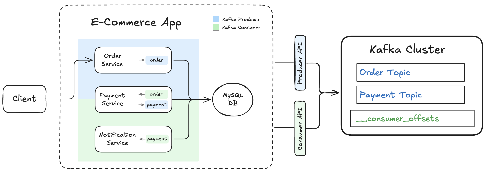

# 📺 Kafka – Section 1f

In this final step, we’ll add the **Notification Service**, which completes the e-commerce event flow.
The service subscribes to the `payment` topic and reacts to `PaymentSuccess` events, representing how an external notification system (like email or SMS) might integrate with Kafka in production.
This highlights the power of event-driven design — new consumers can react to events independently, without modifying upstream services.

<div align="center">
    
</div>

## 🎥 Video Walkthrough

**Title:** Kafka – Section 1f  
**Link:** [Watch on Udemy](https://www.udemy.com/course/practical-system-design/learn/lecture/55998835#overview)

# ⚙️ Instructions and Commands

### 1. Add the Notification Service

From `~/Desktop/kafka_demo`:

```bash
touch e_commerce_app/services/notification_service.py
```

-  On **Windows PowerShell**:
  ```bash
  New-Item e_commerce_app/services/notification_service.py
  ```

_Then paste in starter code_

### 2. Prepare a Clean, Running Environment (Kafka + DB)

Before testing this section, make sure you’re starting from a clean environment by resetting both the database and Kafka state. Additionally, ensure your Kafka cluster is running with all required topics created. For the specific commands, you can revisit:

- **[Section 1D → Step 8](../section_1d/README.md#8-cleanup-reset-for-future-tests)** — DB + Kafka cleanup
- **[Section 1C → Steps 3-4](../section_1c/README.md#3-start-the-cluster)** — Start Kafka cluster + create topics

### 3. Launch the E-Commerce App

Refer back to **[Section 1E → Step 4](../section_1e/README.md#4-launch-the-e-commerce-app)** for the exact command to launch `e_commerce_app`

### 4. Verify consumer groups (after starting)

```bash
docker exec -it kafka-kraft kafka-consumer-groups \
  --bootstrap-server localhost:9092 \
  --list
```

-  On **Windows PowerShell**, run the command on a single line (no line breaks):
  ```bash
  docker exec -it kafka-kraft kafka-consumer-groups --bootstrap-server localhost:9092 --list
  ```

You should now see `payment_service` and `notification_service` in the list.

### 6. Produce a Test Order Event for `order_1`

Refer back to **[Section 1D → Step 6](../section_1d/README.md#6-produce-a-test-order-event-for-order_1)** for the exact command to produce the `order_1` test event.

### 7. Verify Order in the Database

Refer back to **[Section 1D → Step 7](../section_1d/README.md#7-verify-order-in-the-database)** for the exact command to display all records in the `Orders` table.

### 8. Read 1 Message from Each Topic (`Order` & `Payment`)

Refer back to **[Section 1E → Step 8](../section_1e/README.md#8-read-1-message-from-each-topic-order--payment)** for the exact command to read 1 message from the `Order` and `Payment` topics.

### 9. Inspect the internal `__consumer_offsets` topic

Refer back to **[Section 1E → Step 9](../section_1e/README.md#9-inspect-the-internal-__consumer_offsets-topic)** for the exact command to inspect the internal `__consumer_offsets` topic.

### 10. Produce a Test Order Event for `order_2`

```bash
curl -X POST http://localhost:5001/produce \
  -H "Content-Type: application/json" \
  -d '{
    "topic": "order",
    "key": "order_2",
    "event": {
      "event_type": "OrderPlaced",
      "order_id": "order_2",
      "user_id": "user_1",
      "items": [
        { "product_id": "prod_3", "quantity": 1 }
      ],
      "total_amount": 39.99,
      "timestamp": "2025-01-01T10:00:30Z"
    }
  }'
```

-  On **Windows PowerShell:**
  - Use `curl.exe` instead of `curl` (to avoid the PowerShell alias)
  - Use backticks (`` ` ``) for multiline commands—**not** backslashes (`\`)
  - Any quotes inside your JSON payload must be escaped (use `\"` instead of `"`)

  ```bash
  curl.exe -X POST http://localhost:5001/produce `
    -H "Content-Type: application/json" `
    -d '{
      \"topic\": \"order\",
      \"key\": \"order_2\",
      \"event\": {
        \"event_type\": \"OrderPlaced\",
        \"order_id\": \"order_2\",
        \"user_id\": \"user_1\",
        \"items\": [
          { \"product_id\": \"prod_3\", \"quantity\": 1 }
        ],
      \"total_amount\": 39.99,
      \"timestamp\": \"2025-01-01T10:00:30Z\"
    }
  }'
  ```

### 11. Verify Orders in the Database

Refer back to **[Section 1D → Step 7](../section_1d/README.md#7-verify-order-in-the-database)** for the exact command to display all records in the `Orders` table.

### 12. Read 2 Messages from Each Topic (`Order` & `Payment`)

```bash
docker exec -it kafka-kraft bash -lc '
for t in order payment; do
  echo === $t ===
  kafka-console-consumer --bootstrap-server localhost:9092 \
    --topic "$t" --from-beginning --max-messages 2
done'
```

### 13. Inspect the internal `__consumer_offsets` topic

Refer back to **[Section 1E → Step 9](../section_1e/README.md#9-inspect-the-internal-__consumer_offsets-topic)** for the exact command to inspect the internal `__consumer_offsets` topic.

### 10. Cleanup: Reset for Future Tests

You can revisit **[Section 1D → Step 9](../section_1d/README.md#9-cleanup-reset-for-future-tests)** for the specific commands.

<br>
