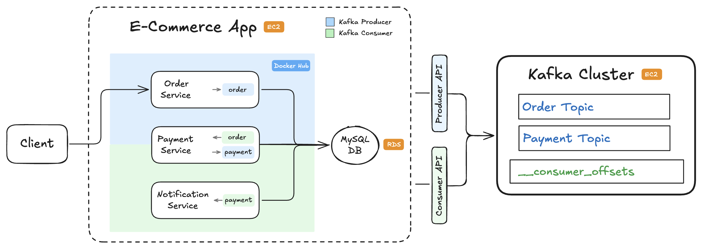

# 📺 Kafka – Section 1g

In this section, we'll take everything we’ve built so far (Kafka cluster, `order` + `payment` + `notification` flows), package the services into **Docker containers**, and **deploy the entire stack to AWS** using **Terraform**.

- **Part 1 — Dockerize & Publish the App**:  
  We containerize the e-commerce application and push the image to Docker Hub so it can be pulled by our AWS EC2 instance.

- **Part 2 — Provision & Deploy with Terraform**:  
  We use Terraform to provision the full AWS stack — Kafka on EC2, MySQL on RDS, and the Dockerized e-commerce app on EC2. We then verify the deployment from our local machine.

<div align="center">
    
</div>

## 🎥 Video Walkthrough

### 🔹 Part 1: Dockerize & Publish the App

**Title:** Kafka – Section 1g (Part 1)  
**Link:** [Watch on Udemy](https://www.udemy.com)

### 🔹 Part 2: Provision & Deploy with Terraform

**Title:** Kafka – Section 1g (Part 2)  
**Link:** [Watch on Udemy](https://www.udemy.com)

# ⚙️ Instructions and Commands

## ✏️ Part 1 – Dockerize & Publish the App

From `~/Desktop/kafka_demo` (project root):

### 1. Create Python requirements + Dockerfile

```bash
touch e_commerce_app/requirements.txt
```

-  On **Windows PowerShell**:
  ```bash
  New-Item e_commerce_app/requirements.txt
  ```

_Paste in the starter requirements._

```bash
touch e_commerce_app/dockerfile
```

-  On **Windows PowerShell**:
  ```bash
  New-Item e_commerce_app/dockerfile
  ```

_Paste in the starter Dockerfile._

### 2. Build & Push to Docker Hub

Navigate into the `e_commerce_app` directory:

```bash
cd e_commerce_app
```

Authenticate with docker:

```bash
docker logout && docker login
```

-  On **Windows PowerShell**:
  ```bash
  docker logout; docker login
  ```

Remove previous `buildx` (if one exists):

```bash
docker buildx rm multi
```

Create new `buildx`:

```bash
docker buildx create --name multi --use --bootstrap
```

Build + push (replace `<YOUR_DOCKERHUB_USERNAME>` with your own username):

```bash
docker buildx build \
  --platform linux/amd64,linux/arm64 \
  -t <YOUR_DOCKERHUB_USERNAME>/e-commerce-app:latest \
  --push .
```

-  On **Windows PowerShell**, run the command on a single line (no line breaks):
  ```bash
  docker buildx build --platform linux/amd64,linux/arm64 -t <YOUR_DOCKERHUB_USERNAME>/e-commerce-app:latest --push .
  ```

### 3. Create Terraform project

Navigate back into `~/Desktop/kafka_demo`:

```bash
cd ..
```

Create directory for `full-stack` configuration:

```bash
mkdir terraform/full-stack
```

Create `main.tf` file:

```bash
touch terraform/full-stack/main.tf
```

-  On **Windows PowerShell**:
  ```bash
  New-Item terraform/full-stack/main.tf
  ```

_Paste in the starter Terraform code._

<br>

## ✏️ Part 2 – Provision & Deploy with Terraform

From `~/Desktop/kafka_demo` (project root):

### 1. Deploy the Full Stack with Terraform

Navigate into `terraform/full-stack`:

```bash
cd terraform/full-stack
```

Initialize Terraform:

```bash
terraform init
```

Apply Terraform configuration (this runs the plan step as well):

```bash
terraform apply
```

> _When prompted, type `yes` to confirm the deployment._

### 2. Capture Terraform Outputs as Environment Variables

Run these commands inside `<project_root>/terraform/full-stack`:

```bash
FULLSTACK_DB_ENDPOINT=$(terraform output -raw fullstack_db_endpoint)
KAFKA_BOOTSTRAP_URL=$(terraform output -raw kafka_bootstrap_url)
E_COMMERCE_APP_URL=$(terraform output -raw e_commerce_app_url)
```

-  On **Windows PowerShell**:
  ```bash
  $FULLSTACK_DB_ENDPOINT = terraform output -raw fullstack_db_endpoint
  $KAFKA_BOOTSTRAP_URL = terraform output -raw kafka_bootstrap_url
  $E_COMMERCE_APP_URL = terraform output -raw e_commerce_app_url
  ```

### 3. Verify RDS Database Deployment

```bash
docker run --rm -e MYSQL_PWD='Password100!' mysql:8.0 \
  mysql -h $FULLSTACK_DB_ENDPOINT -u admin \
  --table -e "USE services_db; SHOW TABLES;"
```

-  On **Windows PowerShell**, run the command on a single line (no line breaks):
  ```bash
  docker run --rm -e MYSQL_PWD='Password100!' mysql:8.0 mysql -h $FULLSTACK_DB_ENDPOINT -u admin --table -e "USE services_db; SHOW TABLES;"
  ```

### 4. Verify Kafka EC2 Deployment

List topics:

```bash
docker run --rm confluentinc/cp-kafka:7.6.7 \
  kafka-topics \
  --bootstrap-server "$KAFKA_BOOTSTRAP_URL:9092" \
  --list
```

-  On **Windows PowerShell**, run the command on a single line (no line breaks), and wrap the `KAFKA_BOOTSTRAP_URL` environment variable in `${}`:
  ```bash
  docker run --rm confluentinc/cp-kafka:7.6.7 kafka-topics --bootstrap-server "${KAFKA_BOOTSTRAP_URL}:9092" --list
  ```

List consumer groups:

```bash
docker run --rm confluentinc/cp-kafka:7.6.7 \
  kafka-consumer-groups \
  --bootstrap-server "$KAFKA_BOOTSTRAP_URL:9092" \
  --list
```

-  On **Windows PowerShell**, run the command on a single line (no line breaks), and wrap the `KAFKA_BOOTSTRAP_URL` environment variable in `${}`:
  ```bash
  docker run --rm confluentinc/cp-kafka:7.6.7 kafka-consumer-groups --bootstrap-server "${KAFKA_BOOTSTRAP_URL}:9092" --list
  ```

If you see `payment_service` and `notification_service` in the list, that confirms the e-commerce app has successfully started up and connected to Kafka as expected.

### 5. Verify the E-Commerce App EC2 Deployment

Hit the health check endpoint:

```bash
curl "$E_COMMERCE_APP_URL:5001/healthz"
curl "$E_COMMERCE_APP_URL:5002/healthz"
curl "$E_COMMERCE_APP_URL:5003/healthz"
```

-  On **Windows PowerShell**, use `curl.exe` and wrap the `E_COMMERCE_APP_URL` environment variable in `${}`:
  ```bash
  curl.exe "${E_COMMERCE_APP_URL}:5001/healthz"
  curl.exe "${E_COMMERCE_APP_URL}:5002/healthz"
  curl.exe "${E_COMMERCE_APP_URL}:5003/healthz"
  ```

_💡 Optional — also hit the individual debug endpoints_

```bash
curl "$E_COMMERCE_APP_URL:5001"
curl "$E_COMMERCE_APP_URL:5002"
curl "$E_COMMERCE_APP_URL:5003"
```

-  On **Windows PowerShell**, use `curl.exe` and wrap the `E_COMMERCE_APP_URL` environment variable in `${}`:
  ```bash
  curl.exe "${E_COMMERCE_APP_URL}:5001"
  curl.exe "${E_COMMERCE_APP_URL}:5002"
  curl.exe "${E_COMMERCE_APP_URL}:5003"
  ```

### 6. Produce Test Orders (`order_1`, `order_2`)

Send `order_1` and `order_2`

```bash
curl -X POST "$E_COMMERCE_APP_URL:5001/produce" \
  -H "Content-Type: application/json" \
  -d '{
    "topic": "order",
    "key": "order_1",
    "event": {
      "event_type": "OrderPlaced",
      "order_id": "order_1",
      "user_id": "user_1",
      "items": [
        { "product_id": "prod_1", "quantity": 2 },
        { "product_id": "prod_2", "quantity": 1 }
      ],
      "total_amount": 84.97,
      "timestamp": "2025-01-01T10:00:00Z"
    }
  }'

curl -X POST "$E_COMMERCE_APP_URL:5001/produce" \
  -H "Content-Type: application/json" \
  -d '{
    "topic": "order",
    "key": "order_2",
    "event": {
      "event_type": "OrderPlaced",
      "order_id": "order_2",
      "user_id": "user_1",
      "items": [
        { "product_id": "prod_3", "quantity": 1 }
      ],
      "total_amount": 39.99,
      "timestamp": "2025-01-01T10:00:30Z"
    }
  }'
```

-  On **Windows PowerShell:**
  - Use `curl.exe` instead of `curl` (to avoid the PowerShell alias)
  - Use backticks (`` ` ``) for multiline commands—**not** backslashes (`\`)
  - Any quotes inside your JSON payload must be escaped (use `\"` instead of `"`)
  - Wrap the `E_COMMERCE_APP_URL` environment variable in `${}`

  ```bash
  curl.exe -X POST "${E_COMMERCE_APP_URL}:5001/produce" `
    -H "Content-Type: application/json" `
    -d '{
      \"topic\": \"order\",
      \"key\": \"order_1\",
      \"event\": {
        \"event_type\": \"OrderPlaced\",
        \"order_id\": \"order_1\",
        \"user_id\": \"user_1\",
        \"items\": [
          { \"product_id\": \"prod_1\", \"quantity\": 2 },
          { \"product_id\": \"prod_2\", \"quantity\": 1 }
        ],
        \"total_amount\": 84.97,
        \"timestamp\": \"2025-01-01T10:00:00Z\"
      }
    }'

  curl.exe -X POST "${E_COMMERCE_APP_URL}:5001/produce" `
    -H "Content-Type: application/json" `
    -d '{
      \"topic\": \"order\",
      \"key\": \"order_2\",
      \"event\": {
        \"event_type\": \"OrderPlaced\",
        \"order_id\": \"order_2\",
        \"user_id\": \"user_1\",
        \"items\": [
          { \"product_id\": \"prod_3\", \"quantity\": 1 }
        ],
      \"total_amount\": 39.99,
      \"timestamp\": \"2025-01-01T10:00:30Z\"
    }
  }'
  ```

### 7. Verify DB Writes:

```bash
docker run --rm -e MYSQL_PWD='Password100!' mysql:8.0 \
  mysql -h $FULLSTACK_DB_ENDPOINT -u admin \
  --table -e "USE services_db; SELECT * FROM Orders;"
```

-  On **Windows PowerShell**, run the command on a single line (no line breaks):
  ```bash
  docker run --rm -e MYSQL_PWD='Password100!' mysql:8.0 mysql -h $FULLSTACK_DB_ENDPOINT -u admin --table -e "USE services_db; SELECT * FROM Orders;"
  ```

### 8. Verify Kafka Data Topics & Internal `__consumer_offsets`

Read from Kafka topics:

```bash
docker run --rm -e BROKER="$KAFKA_BOOTSTRAP_URL:9092" \
  confluentinc/cp-kafka:7.6.7 bash -lc '
for t in order payment; do
  echo === $t ===
  kafka-console-consumer --bootstrap-server "$BROKER" \
    --topic "$t" --from-beginning --max-messages 2
done'
```

-  On **Windows PowerShell**, wrap the `KAFKA_BOOTSTRAP_URL` environment variable in `${}` and keep the `docker run` portion of the command on a single line:

  ```bash
  docker run --rm -e BROKER="${KAFKA_BOOTSTRAP_URL}:9092" confluentinc/cp-kafka:7.6.7 bash -lc '
  for t in order payment; do
    echo === $t ===
    kafka-console-consumer --bootstrap-server "$BROKER" \
      --topic "$t" --from-beginning --max-messages 2
  done'
  ```

Inspect internal `__consumer_offsets` topic

```bash
docker run --rm --name kafka-cli confluentinc/cp-kafka:7.6.7 kafka-console-consumer \
  --bootstrap-server "$KAFKA_BOOTSTRAP_URL:9092" \
  --topic __consumer_offsets \
  --from-beginning \
  --formatter "kafka.coordinator.group.GroupMetadataManager\$OffsetsMessageFormatter"
```

-  On **Windows PowerShell**, run the command on a single line (no line breaks), wrap the `KAFKA_BOOTSTRAP_URL` environment variable in `${}`, and escape the `$OffsetsMessageFormatter` portion using `` `$ ``:
  ```bash
  docker run --rm --name kafka-cli confluentinc/cp-kafka:7.6.7 kafka-console-consumer --bootstrap-server "${KAFKA_BOOTSTRAP_URL}:9092" --topic __consumer_offsets --from-beginning --formatter "kafka.coordinator.group.GroupMetadataManager`$OffsetsMessageFormatter"
  ```

From a new terminal window, stop the `kafka-console-consumer`

```bash
docker stop kafka-cli
```

### 9. SSH into the E-Commerce App EC2 to View Logs

Navigate back into `~/Desktop/kafka_demo`:

```bash
cd ../..
```

If you're on **macOS or Linux**, set the correct permissions on the key pair file (**Windows PowerShell** users can usually skip the `chmod` step):

```bash
chmod 400 "ecommerce-app-fullstack-keypair.pem"
```

Use the SSH command provided in **AWS Console → EC2 → Instances → Connect → SSH Client**  
Or alternatively, use the existing `$E_COMMERCE_APP_URL` environment variable

```bash
ssh -i "ecommerce-app-fullstack-keypair.pem" ubuntu@$E_COMMERCE_APP_URL
```

-  On **Windows PowerShell**:

  ```bash
  ssh -i "ecommerce-app-fullstack-keypair.pem" "ubuntu@${E_COMMERCE_APP_URL}"
  ```

> _When prompted, type `yes` for fingerprint verification._

Once connected to the EC2 instance, list the running containers:

```bash
sudo docker ps
```

Tail the `e-commerce-app` container logs:

```bash
sudo docker logs -f e-commerce-app
```

Exit the log stream:

```bash
Ctrl + C
```

Exit the SSH session:

```bash
exit
```

<p style="margin-bottom: 4px;"><em>💡 Optional — troubleshoot setup problems by viewing the cloud-init logs:</em></p>

```bash
sudo tail -n 200 /var/log/cloud-init-output.log
```

### 10. Destroy Terraform

Navigate into `terraform/full-stack`:

```bash
cd terraform/full-stack
```

Tear down environment:

```bash
terraform destroy
```

> _When prompted, type `yes` to confirm the destroy plan._

<br>

## 🔧 (Optional) SSH into Kafka EC2 for Advanced Debugging

If you want to inspect the Kafka EC2 instance directly, SSH into it using the command provided in
**AWS Console → EC2 → Instances → Connect → SSH Client**:

```bash
cd ~/Desktop/kafka_demo
chmod 400 "ecommerce-app-fullstack-keypair.pem"
```

```bash
ssh -i "ecommerce-app-fullstack-keypair.pem" ubuntu@<YOUR_KAFKA_EC2_PUBLIC_DNS>
```

When prompted, type `yes` for fingerprint verification.

**Once connected**:  
Check running containers:

```bash
cd /opt/kafka
sudo docker ps
```

View Kafka logs:

```bash
sudo docker compose logs -f kafka
```

Inspect environment variables:

```bash
sudo docker exec kafka-kraft printenv | sort
```

List topics and consumer groups:

```bash
export PRIVATE_DNS="$(hostname -f 2>/dev/null || true)"

sudo docker exec -it kafka-kraft kafka-topics \
  --bootstrap-server "${PRIVATE_DNS}:9092" --list

sudo docker exec -it kafka-kraft kafka-consumer-groups \
  --bootstrap-server "${PRIVATE_DNS}:9092" --list
```

Check the `cloud-init` logs (helpful if Kafka failed to start):

```bash
sudo tail -n 200 /var/log/cloud-init-output.log
```

<br>
