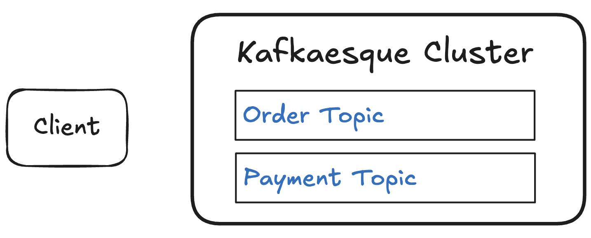

# 📺 Kafka – Section 2a

In this section, we begin building **Kafkaesque** — our own Kafka-inspired broker implemented from scratch in Python. We scaffold the core packages, initialize on-disk state, and expose basic HTTP endpoints for creating and inspecting topics. This intentionally simplified version gives us a working broker foundation that we’ll extend with partitions, replication, consumers, and offsets in future sections.

<div align="center">
    
</div>

## 🎥 Video Walkthrough

**Title:** Kafka – Section 2a  
**Link:** [Watch on Udemy](https://www.udemy.com/course/practical-system-design/learn/lecture/55998843#overview)

# ⚙️ Instructions and Commands

From `~/Desktop/kafka_demo` (project root):

### 1. Create Kafkaesque Folder Structure

Create the `kafkaesque` folder:

```bash
mkdir kafkaesque
```

Create the package initializer:

```bash
touch kafkaesque/__init__.py
```

-  On **Windows PowerShell**:
  ```bash
  New-Item kafkaesque/__init__.py
  ```

Create the entrypoint file:

```bash
touch kafkaesque/__main__.py
```

-  On **Windows PowerShell**:
  ```bash
  New-Item kafkaesque/__main__.py
  ```

_Paste in the provided `__main__.py` starter code._

### 2. Scaffold Kafkaesque Broker Package

Create the broker folder:

```bash
mkdir kafkaesque/broker
```

Create the broker's package initializer:

```bash
touch kafkaesque/broker/_init__.py
```

-  On **Windows PowerShell**:
  ```bash
  New-Item kafkaesque/broker/__init__.py
  ```

Create the broker's `app.py` file:

```bash
touch kafkaesque/broker/app.py
```

-  On **Windows PowerShell**:
  ```bash
  New-Item kafkaesque/broker/app.py
  ```

_Paste in the provided broker `app.py` starter code._

Create the broker's utility file:

```bash
touch kafkaesque/broker/_util.py
```

-  On **Windows PowerShell**:
  ```bash
  New-Item kafkaesque/broker/_util.py
  ```

_Paste in the provided broker `_util.py` starter code._

### 3. Ensure Virtual Environment is Activated

```bash
source venv/bin/activate
```

-  On **Windows PowerShell**:

  ```bash
  .\venv\Scripts\Activate.ps1
  ```

### 4. Launch Kafkaesque Broker

Launch Kafkaesque broker:

```bash
python -m kafkaesque
```

_After launch, make sure the `.var` folder is created along with the nested `kafkaesque` and `default_broker` subfolders._

Hit the health check endpoint:

```bash
curl http://localhost:19092/healthz
```

-  On **Windows PowerShell**:
  ```bash
  curl.exe http://localhost:19092/healthz
  ```

### 5. Create Kafkaesque Topics

Create the `Order` and `Payment` topics, both with 1 partition and a replication factor of 1:

```bash
curl -X POST http://localhost:19092/topics \
  -H 'content-type: application/json' \
  -d '{"name":"order","partitions":1,"replication_factor":1}'

curl -X POST http://localhost:19092/topics \
  -H 'content-type: application/json' \
  -d '{"name":"payment","partitions":1,"replication_factor":1}'
```

-  On **Windows PowerShell**:

  ```bash
  curl.exe -X POST http://localhost:19092/topics `
    -H 'content-type: application/json' `
    -d '{\"name\":\"order\",\"partitions\":1,\"replication_factor\":1}'

  curl.exe -X POST http://localhost:19092/topics `
    -H 'content-type: application/json' `
    -d '{\"name\":\"payment\",\"partitions\":1,\"replication_factor\":1}'
  ```

_Verify that the topic folders get created under `.var/kafkaesque/default_broker`, along with empty partition files._

### 6. Hit Describe Topics Endpoint

Hit the topics describe endpoints:

```bash
curl http://localhost:19092/topics/order
curl http://localhost:19092/topics/payment
```

-  On **Windows PowerShell**:
  ```bash
  curl.exe http://localhost:19092/topics/order
  curl.exe http://localhost:19092/topics/payment
  ```

### 7. Verify Internal Broker State

Hit the debug endpoint:

```bash
curl http://localhost:19092/debug
```

-  On **Windows PowerShell**:
  ```bash
  curl.exe http://localhost:19092/debug
  ```

### 8. Shutdown & Reset Environment

Stop the Kafkaesque broker:

```bash
Ctrl + C
```

Cleanup Kafkaesque broker data:

```bash
rm -rf .var
```

-  On **Windows PowerShell**:
  ```bash
  Remove-Item .var -Recurse
  ```

<br>
