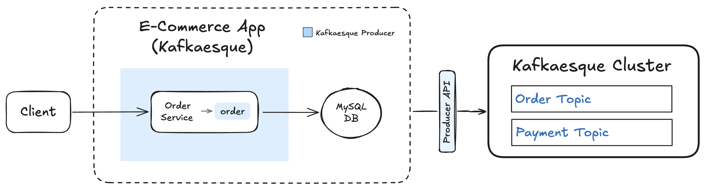

# 📺 Kafka – Section 2b

In this section, we introduce the **Kafkaesque Producer API** and integrate it into our existing E-Commerce application.

- **Part 1 — Building the Kafkaesque Producer API**:  
  We scaffold the Kafkaesque API layer, implement the `KafkaesqueProducer`, and introduce Kafka-compatible abstractions for sending events.

- **Part 2 — Implementing Broker-Side Produce**:  
  We extend the broker with a `/produce` endpoint, implement deterministic key-based partitioning, and export the `KafkaesqueProducer`.

- **Part 3 — Migrating the E-Commerce App to Kafkaesque + Testing**:
  We clone and refactor the E-Commerce app to use Kafkaesque, launch the broker and create topics, produce an order event end to end, and verify database writes and on-disk partition logs.

<div align="center">
    
</div>

## 🎥 Video Walkthrough

### 🔹 Part 1: Building the Kafkaesque Producer API

**Title:** Kafka – Section 2b (Part 1)  
**Link:** [Watch on Udemy](https://www.udemy.com/course/practical-system-design/learn/lecture/55998847#overview)

### 🔹 Part 2: Implementing Broker-Side Produce

**Title:** Kafka – Section 2b (Part 2)  
**Link:** [Watch on Udemy](https://www.udemy.com/course/practical-system-design/learn/lecture/55998849#overview)

### 🔹 Part 3: Migrating the E-Commerce App to Kafkaesque + Testing

**Title:** Kafka – Section 2b (Part 3)  
**Link:** [Watch on Udemy](https://www.udemy.com/course/practical-system-design/learn/lecture/55998855#overview)

# ⚙️ Instructions and Commands

## ✏️ Part 1 – Building the Kafkaesque Producer API

From `~/Desktop/kafka_demo` (project root):

### 1. Scaffold Kafkaesque API Package

Create the API package directory:

```bash
mkdir kafkaesque/api
```

Create the package initializer:

```bash
touch kafkaesque/api/__init__.py
```

-  On **Windows PowerShell**:
  ```bash
  New-Item kafkaesque/api/__init__.py
  ```

### 2. Introduce Producer API

Create the producer API module:

```bash
touch kafkaesque/api/producer_api.py
```

-  On **Windows PowerShell**:
  ```bash
  New-Item kafkaesque/api/producer_api.py
  ```

_Paste in provided `producer_api` starter code._

Create the API utility module:

```bash
touch kafkaesque/api/_util.py
```

-  On **Windows PowerShell**:
  ```bash
  New-Item kafkaesque/api/_util.py
  ```

_Paste in provided API `_util.py` starter code._

### 3. Create Structs FIle

```bash
touch kafkaesque/structs.py
```

-  On **Windows PowerShell**:
  ```bash
  New-Item kafkaesque/structs.py
  ```

_Paste in provided `structs.py` starter code._

<br>

## ✏️ Part 2 – Implementing Broker-Side Produce

Add updated code to `broker/app.py`, `broker/_util.py` and `kafkaesque/__init__.py`.

<br>

## ✏️ Part 3 – Migrating the E-Commerce App to Kafkaesque + Testing

From `~/Desktop/kafka_demo` (project root):

### 1. Create `e_commerce_app_kafkaesque` Directory

Copy existing `e_commerce_app` folder into `e_commerce_app_kafkaesque` using `rsync` (macOS)

```bash
rsync -a --exclude='__pycache__/' --exclude='/dockerfile' --exclude='/requirements.txt'\
  e_commerce_app/ e_commerce_app_kafkaesque/
```

-  On **Windows PowerShell** use `robocopy`:
  ```bash
  robocopy e_commerce_app e_commerce_app_kafkaesque /E `
    /XD __pycache__ `
    /XF dockerfile requirements.txt
  ```

### 2. Replace references in `e_commerce_app_kafkaesque`

If `grep` is not installed, install it with Homebrew (**macOS** users):

```bash
brew install grep
```

Replace references to `e_commerce_app` with `e_commerce_app_kafkaesque`:

```bash
ggrep -RIlZ 'e_commerce_app' e_commerce_app_kafkaesque \
  | xargs -0 perl -pi -e 's/\be_commerce_app\b/e_commerce_app_kafkaesque/g'
```

-  On **Windows PowerShell** you can do this natively without installing anything:
  ```bash
  Get-ChildItem e_commerce_app_kafkaesque -Recurse -File |
    ForEach-Object {
      $path = $_.FullName
      $content = Get-Content $path -Raw
      if ($content -match '\be_commerce_app\b') {
        $content -replace '\be_commerce_app\b', 'e_commerce_app_kafkaesque' |
          Set-Content $path
      }
    }
  ```

### 3. Update `e_commerce_app_kafkaesque` Code

Add code updates to`launcher.py`, `service_base.py` and `services/order_service.py`.

### 4. Virtual Environment Updates

Make sure your virtual environment is activated:

```bash
source venv/bin/activate
```

-  On **Windows PowerShell**:
  ```bash
  .\venv\Scripts\Activate.ps1
  ```

Install `requests` library into your virtual environment:

```bash
pip install requests
```

### 5. Launch Kafkaesque Broker

```bash
python -m kafkaesque
```

### 6. Create Kafkaesque Topics

Refer back to **[Section 2A → Step 4](../section_2a/README.md#4-create-kafkaesque-topics)** for the exact commands to create the `Order` and `Payment` topics.

### 7. Launch `e_commerce_app_kafkaesque`

Please make sure that the `APP_DB_ENDPOINT` environment variable is properly set. You can revisit **[Section 1D → Step 4](/chapter_1//section_1d/README.md#4-ensure-the-app_db_endpoint-environment-variable-is-set)** for the specific commands.

```bash
KAFKA_BOOTSTRAP=localhost:19092 \
  DB_HOST=$APP_DB_ENDPOINT \
  python -m e_commerce_app_kafkaesque.launcher
```

-  On **Windows PowerShell**:
  ```bash
  $env:KAFKA_BOOTSTRAP = "localhost:19092"
  $env:DB_HOST = $APP_DB_ENDPOINT
  python -m e_commerce_app_kafkaesque.launcher
  ```

### 8. Produce a Test Order Event for `order_1`

```bash
curl -X POST http://localhost:5001/produce \
  -H "Content-Type: application/json" \
  -d '{
    "topic": "order",
    "key": "order_1",
    "event": {
      "event_type": "OrderPlaced",
      "order_id": "order_1",
      "user_id": "user_1",
      "items": [
        { "product_id": "prod_1", "quantity": 2 },
        { "product_id": "prod_2", "quantity": 1 }
      ],
      "total_amount": 84.97,
      "timestamp": "2025-01-01T10:00:00Z"
    }
  }'
```

-  On **Windows PowerShell:**
  - Use `curl.exe` instead of `curl` (to avoid the PowerShell alias)
  - Use backticks (`` ` ``) for multiline commands—**not** backslashes (`\`)
  - Any quotes inside your JSON payload must be escaped (use `\"` instead of `"`)

  ```bash
  curl.exe -X POST http://localhost:5001/produce `
    -H "Content-Type: application/json" `
    -d '{
      \"topic\": \"order\",
      \"key\": \"order_1\",
      \"event\": {
        \"event_type\": \"OrderPlaced\",
        \"order_id\": \"order_1\",
        \"user_id\": \"user_1\",
        \"items\": [
          { \"product_id\": \"prod_1\", \"quantity\": 2 },
          { \"product_id\": \"prod_2\", \"quantity\": 1 }
        ],
        \"total_amount\": 84.97,
        \"timestamp\": \"2025-01-01T10:00:00Z\"
      }
    }'
  ```

### 9. Verify Order in the Database

Refer back to **[Section 1D → Step 4](/chapter_1//section_1d/README.md#4-ensure-the-app_db_endpoint-environment-variable-is-set)** to set the `APP_DB_ENDPOINT` environment variable.

```bash
docker run --rm -e MYSQL_PWD='Password100!' mysql:8.0 \
  mysql -h $APP_DB_ENDPOINT -u admin \
  --table -e "USE services_db; SELECT * FROM Orders;"
```

-  On **Windows PowerShell**, run the command on a single line (no line breaks):
  ```bash
  docker run --rm -e MYSQL_PWD='Password100!' mysql:8.0 mysql -h $APP_DB_ENDPOINT -u admin --table -e "USE services_db; SELECT * FROM Orders;"
  ```

### 10. Verify Partition Files

```bash
for f in .var/kafkaesque/*/*/*.log; do echo "== $f =="; cat "$f"; done
```

-  On **Windows PowerShell**:
  ```bash
  Get-ChildItem .var\kafkaesque\*\*\*.log | ForEach-Object {
    $r=$_.FullName.Replace((Get-Location).Path + '\','')
    "== $r =="; Get-Content $_ }
  ```

### 11. Verify Internal Broker State

Hit the debug endpoint:

```bash
curl http://localhost:19092/debug
```

-  On **Windows PowerShell**:
  ```bash
  curl.exe http://localhost:19092/debug
  ```

### 12. Shutdown & Reset Environment

Stop the Kafkaesque broker:

```bash
Ctrl + C
```

Stop the `e_commerce_app_kafkaesque`

```bash
Ctrl + C
```

Clear out `Orders` table:  
&nbsp;&nbsp;&nbsp;&nbsp;_Refer back to **[Section 1D → Step 4](/chapter_1//section_1d/README.md#4-ensure-the-app_db_endpoint-environment-variable-is-set)** to set the `APP_DB_ENDPOINT` environment variable._

```bash
docker run --rm -e MYSQL_PWD='Password100!' mysql:8.0 \
  mysql -h $APP_DB_ENDPOINT -u admin \
  --table -e "USE services_db; TRUNCATE TABLE Orders;"
```

-  On **Windows PowerShell**, run the command on a single line (no line breaks):
  ```bash
  docker run --rm -e MYSQL_PWD='Password100!' mysql:8.0 mysql -h $APP_DB_ENDPOINT -u admin --table -e "USE services_db; TRUNCATE TABLE Orders;"
  ```

Cleanup Kafkaesque broker data:

```bash
rm -rf .var
```

-  On **Windows PowerShell**:
  ```bash
  Remove-Item .var -Recurse
  ```

<br>
