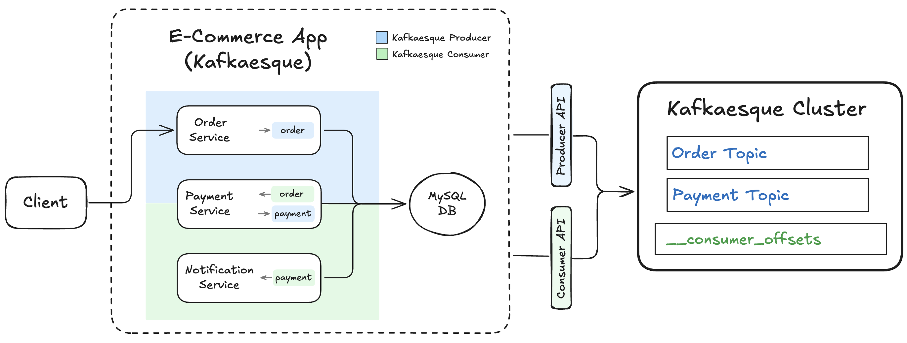

# 📺 Kafka – Section 2c

In this section, we introduce the **Kafkaesque Consumer API** and wire it into our existing `e_commerce_app_kafkaesque` application, completing the core producer–consumer workflow.

- **Part 1 — Kafkaesque Consumer API**:  
  We implement the `KafkaesqueConsumer` class and add consumer-specific data structures to the `kafkaesque/structs.py` file.

- **Part 2 — Broker-Side Consumer Support**:
  We extend the broker with the endpoints needed to support the newly added Consumer API.

- **Part 3 — App Integration and Validation**:  
  We migrate the `e_commerce_app_kafkaesque` to use `KafkaesqueConsumer` and validate the full end-to-end flow by producing `order_1` and `order_2`.

<div align="center">
    
</div>

## 🎥 Video Walkthrough

### 🔹 Part 1: Kafkaesque Consumer API

**Title:** Kafka – Section 2c (Part 1)  
**Link:** [Watch on Udemy](https://www.udemy.com/course/practical-system-design/learn/lecture/55998857#overview)

### 🔹 Part 2: Broker-Side Consumer Support

**Title:** Kafka – Section 2c (Part 2)  
**Link:** [Watch on Udemy](https://www.udemy.com/course/practical-system-design/learn/lecture/55998859#overview)

### 🔹 Part 3: App Integration and Validation

**Title:** Kafka – Section 2c (Part 3)  
**Link:** [Watch on Udemy](https://www.udemy.com/course/practical-system-design/learn/lecture/55998863#overview)

# ⚙️ Instructions and Commands

## ✏️ Part 1 – Kafkaesque Consumer API

From `~/Desktop/kafka_demo` (project root):

### 1. Introduce Consumer API

```bash
touch kafkaesque/api/consumer_api.py
```

-  On **Windows PowerShell**:
  ```bash
  New-Item kafkaesque/api/consumer_api.py
  ```

> _Paste in provided `consumer_api` starter code._

### 2. Update Structs File

Update the existing `kafkaesque/structs.py` file to include `TopicPartition` and `OffsetAndMetadata`.

<br>

## ✏️ Part 2 – Broker-Side Consumer Support

Add updated code to `broker/app.py`, `broker/_util.py` and `kafkaesque/__init__.py`.

<br>

## ✏️ Part 3 – App Integration and Validation

### 1. Update `e_commerce_app_kafkaesque` Code

Inside the `e_commerce_app_kafkaesque` directory, apply the provided code updates to `launcher.py`, `service_base.py`, `services/payment_service.py` and `services/notification_service.py`.

### 2. Launch Kafkaesque Broker

> _Please make sure your virtual environment is activated. You can revisit **[Section 2A → Step 3](/chapter_2/section_2a/README.md#3-ensure-virtual-environment-is-activated)** for the exact command._

```bash
python -m kafkaesque
```

### 3. Create Kafkaesque Topics

Create the `Order` and `Payment` data topics, both with 1 partition and a replication factor of 1:

```bash
curl -X POST http://localhost:19092/topics \
  -H 'content-type: application/json' \
  -d '{"name":"order","partitions":1,"replication_factor":1}'

curl -X POST http://localhost:19092/topics \
  -H 'content-type: application/json' \
  -d '{"name":"payment","partitions":1,"replication_factor":1}'
```

-  On **Windows PowerShell**:

  ```bash
  curl.exe -X POST http://localhost:19092/topics `
    -H 'content-type: application/json' `
    -d '{\"name\":\"order\",\"partitions\":1,\"replication_factor\":1}'

  curl.exe -X POST http://localhost:19092/topics `
    -H 'content-type: application/json' `
    -d '{\"name\":\"payment\",\"partitions\":1,\"replication_factor\":1}'
  ```

Create the internal `__consumer_offsets` topic with `partitions=1` and `RF=1`:

```bash
curl -X POST http://localhost:19092/topics \
  -H 'content-type: application/json' \
  -d '{"name":"__consumer_offsets","partitions":1,"replication_factor":1}'
```

-  On **Windows PowerShell**:

  ```bash
  curl.exe -X POST http://localhost:19092/topics `
    -H 'content-type: application/json' `
    -d '{\"name\":\"__consumer_offsets\",\"partitions\":1,\"replication_factor\":1}'
  ```

> _Verify updates to `.var` directory._

### 4. Verify Internal Broker State (Before Launching App)

Hit the debug endpoint:

```bash
curl http://localhost:19092/debug
```

-  On **Windows PowerShell**:
  ```bash
  curl.exe http://localhost:19092/debug
  ```

> _Verify that `consumer_groups_cache` is currently empty._

### 5. Launch `e_commerce_app_kafkaesque`

> _Refer back to **[Section 1D → Step 6](/chapter_1/section_1d/README.md#6-ensure-the-app_db_endpoint-environment-variable-is-set)** to set the `APP_DB_ENDPOINT` environment variable._

```bash
KAFKA_BOOTSTRAP=localhost:19092 \
  DB_HOST=$APP_DB_ENDPOINT \
  python -m e_commerce_app_kafkaesque.launcher
```

-  On **Windows PowerShell**:
  ```bash
  $env:KAFKA_BOOTSTRAP = "localhost:19092"
  $env:DB_HOST = $APP_DB_ENDPOINT
  python -m e_commerce_app_kafkaesque.launcher
  ```

### 6. Verify Internal Broker State (After App Launch)

Hit the debug endpoint:

```bash
curl http://localhost:19092/debug
```

-  On **Windows PowerShell**:
  ```bash
  curl.exe http://localhost:19092/debug
  ```

> _This time, `consumer_groups_cache` should now be populated._

### 7. Produce a Test Order Event for `order_1`

```bash
curl -X POST http://localhost:5001/produce \
  -H "Content-Type: application/json" \
  -d '{
    "topic": "order",
    "key": "order_1",
    "event": {
      "event_type": "OrderPlaced",
      "order_id": "order_1",
      "user_id": "user_1",
      "items": [
        { "product_id": "prod_1", "quantity": 2 },
        { "product_id": "prod_2", "quantity": 1 }
      ],
      "total_amount": 84.97,
      "timestamp": "2025-01-01T10:00:00Z"
    }
  }'
```

-  On **Windows PowerShell:**
  ```bash
  curl.exe -X POST http://localhost:5001/produce `
    -H "Content-Type: application/json" `
    -d '{
      \"topic\": \"order\",
      \"key\": \"order_1\",
      \"event\": {
        \"event_type\": \"OrderPlaced\",
        \"order_id\": \"order_1\",
        \"user_id\": \"user_1\",
        \"items\": [
          { \"product_id\": \"prod_1\", \"quantity\": 2 },
          { \"product_id\": \"prod_2\", \"quantity\": 1 }
        ],
        \"total_amount\": 84.97,
        \"timestamp\": \"2025-01-01T10:00:00Z\"
      }
    }'
  ```

### 8. Verify `order_1` Outputs

Verify order in the database:

> _Refer back to **[Section 1D → Step 6](/chapter_1/section_1d/README.md#6-ensure-the-app_db_endpoint-environment-variable-is-set)** to set the `APP_DB_ENDPOINT` environment variable._

```bash
docker run --rm -e MYSQL_PWD='Password100!' mysql:8.0 \
  mysql -h $APP_DB_ENDPOINT -u admin \
  --table -e "USE services_db; SELECT * FROM Orders;"
```

-  On **Windows PowerShell**:

  ```bash
  docker run --rm -e MYSQL_PWD='Password100!' mysql:8.0 `
    mysql -h $APP_DB_ENDPOINT -u admin `
    --table -e "USE services_db; SELECT * FROM Orders;"
  ```

Verify partition files:

```bash
for f in .var/kafkaesque/*/*/*.log; do echo "== $f =="; cat "$f"; done
```

-  On **Windows PowerShell**:

  ```bash
  Get-ChildItem .var\kafkaesque\*\*\*.log | ForEach-Object {
    $r=$_.FullName.Replace((Get-Location).Path + '\','')
    "== $r =="; Get-Content $_ }
  ```

Verify internal broker state by hitting the debug endpoint:

```bash
curl http://localhost:19092/debug
```

-  On **Windows PowerShell**:
  ```bash
  curl.exe http://localhost:19092/debug
  ```

### 9. Produce a Test Order Event for `order_2`

```bash
curl -X POST http://localhost:5001/produce \
  -H "Content-Type: application/json" \
  -d '{
    "topic": "order",
    "key": "order_2",
    "event": {
      "event_type": "OrderPlaced",
      "order_id": "order_2",
      "user_id": "user_1",
      "items": [
        { "product_id": "prod_3", "quantity": 1 }
      ],
      "total_amount": 39.99,
      "timestamp": "2025-01-01T10:00:30Z"
    }
  }'
```

-  On **Windows PowerShell**:
  ```bash
  curl.exe -X POST http://localhost:5001/produce `
    -H "Content-Type: application/json" `
    -d '{
      \"topic\": \"order\",
      \"key\": \"order_2\",
      \"event\": {
        \"event_type\": \"OrderPlaced\",
        \"order_id\": \"order_2\",
        \"user_id\": \"user_1\",
        \"items\": [
          { \"product_id\": \"prod_3\", \"quantity\": 1 }
        ],
      \"total_amount\": 39.99,
      \"timestamp\": \"2025-01-01T10:00:30Z\"
    }
  }'
  ```

### 10. Verify `order_2` Outputs

> _Refer back to **[Step 8](#8-verify-order_1-outputs)** for the commands used to query the database, inspect the partition log files, and verify the broker’s in-memory state._

### 11. Shutdown & Reset Environment

Stop the Kafkaesque broker:

```bash
Ctrl + C
```

Stop the `e_commerce_app_kafkaesque`:

```bash
Ctrl + C
```

Clear out `Orders` table:

> _Refer back to **[Section 1D → Step 6](/chapter_1/section_1d/README.md#6-ensure-the-app_db_endpoint-environment-variable-is-set)** to set the `APP_DB_ENDPOINT` environment variable._

```bash
docker run --rm -e MYSQL_PWD='Password100!' mysql:8.0 \
  mysql -h $APP_DB_ENDPOINT -u admin \
  --table -e "USE services_db; TRUNCATE TABLE Orders;"
```

-  On **Windows PowerShell**:
  ```bash
  docker run --rm -e MYSQL_PWD='Password100!' mysql:8.0 `
    mysql -h $APP_DB_ENDPOINT -u admin `
    --table -e "USE services_db; TRUNCATE TABLE Orders;"
  ```

Clean up Kafkaesque broker data:

```bash
rm -rf .var
```

-  On **Windows PowerShell**:
  ```bash
  Remove-Item .var -Recurse
  ```

<br>
