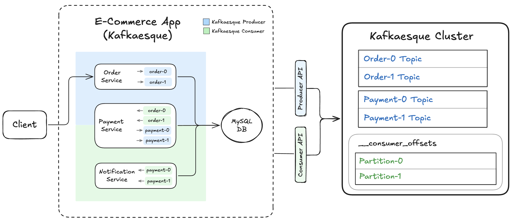

# 📺 Kafka – Section 3a

In this section, we scale Kafkaesque from one to **two partitions per topic** and observe how key-based partitioning distributes events. We verify ordering guarantees within partitions, inspect consumer offset commits, and see how multiple partitions enable parallel processing across the system.

<div align="center">
    
</div>

## 🎥 Video Walkthrough

**Title:** Kafka – Section 3a  
**Link:** [Watch on Udemy](https://www.udemy.com/course/practical-system-design/learn/lecture/55998871#overview)

# ⚙️ Instructions and Commands

From `~/Desktop/kafka_demo` (project root):

### 1. Launch Kafkaesque Broker

Please make sure your virtual environment is created and activated, and that the legacy dependencies are installed. You can revisit **[Section 1D → Step 2](/chapter_1/section_1d/README.md#2-set-up-a-virtual-environment-and-install-dependencies)** for the specific commands.

Additionally, make sure you have the requests library installed. You can revisit **[Section 2B (Part 3) → Step 4](/chapter_2/section_2b/README.md#4-virtual-environment-updates)** for the command.

```bash
python -m kafkaesque
```

### 2. Create Kafkaesque Topics with 2 Partitions Each

Create the `Order` and `Payment` data topics, this time with 2 partitions per topic (still set `RF=1` for now):

```bash
curl -X POST http://localhost:19092/topics \
  -H 'content-type: application/json' \
  -d '{"name":"order","partitions":2,"replication_factor":1}'

curl -X POST http://localhost:19092/topics \
  -H 'content-type: application/json' \
  -d '{"name":"payment","partitions":2,"replication_factor":1}'
```

-  On **Windows PowerShell**:

  ```bash
  curl.exe -X POST http://localhost:19092/topics `
    -H 'content-type: application/json' `
    -d '{\"name\":\"order\",\"partitions\":2,\"replication_factor\":1}'

  curl.exe -X POST http://localhost:19092/topics `
    -H 'content-type: application/json' `
    -d '{\"name\":\"payment\",\"partitions\":2,\"replication_factor\":1}'
  ```

Create the internal `__consumer_offsets` topic, also with 2 partitions and `RF=1`:

```bash
curl -X POST http://localhost:19092/topics \
  -H 'content-type: application/json' \
  -d '{"name":"__consumer_offsets","partitions":2,"replication_factor":1}'
```

-  On **Windows PowerShell**:

  ```bash
  curl.exe -X POST http://localhost:19092/topics `
    -H 'content-type: application/json' `
    -d '{\"name\":\"__consumer_offsets\",\"partitions\":2,\"replication_factor\":1}'
  ```

_Verify that the correct folders and partition files have been created under the `.var` directory._

### 3. Verify Internal Broker State (Before Launching App)

Hit the debug endpoint:

```bash
curl http://localhost:19092/debug
```

-  On **Windows PowerShell**:
  ```bash
  curl.exe http://localhost:19092/debug
  ```

_Verify the correct structure is stored under `topic_registry_cache`, and that `consumer_groups_cache` is currently empty._

### 4. Launch `e_commerce_app_kafkaesque`

Please make sure that the `APP_DB_ENDPOINT` environment variable is properly set. You can revisit **[Section 1D → Step 4](/chapter_1/section_1d/README.md#4-ensure-the-app_db_endpoint-environment-variable-is-set)** for the specific commands.

```bash
KAFKA_BOOTSTRAP=localhost:19092 \
  DB_HOST=$APP_DB_ENDPOINT \
  python -m e_commerce_app_kafkaesque.launcher
```

-  On **Windows PowerShell**:
  ```bash
  $env:KAFKA_BOOTSTRAP = "localhost:19092"
  $env:DB_HOST = $APP_DB_ENDPOINT
  python -m e_commerce_app_kafkaesque.launcher
  ```

### 5. Verify Internal Broker State (After App Launch)

Refer back to **[Step 3](#3-verify-internal-broker-state-before-launching-app)** for the debug command.

### 6. Produce `order_1` + `order_2`

```bash
curl -X POST http://localhost:5001/produce \
  -H "Content-Type: application/json" \
  -d '{
    "topic": "order",
    "key": "order_1",
    "event": {
      "event_type": "OrderPlaced",
      "order_id": "order_1",
      "user_id": "user_1",
      "items": [
        { "product_id": "prod_1", "quantity": 2 },
        { "product_id": "prod_2", "quantity": 1 }
      ],
      "total_amount": 84.97,
      "timestamp": "2025-01-01T10:00:00Z"
    }
  }'

curl -X POST http://localhost:5001/produce \
  -H "Content-Type: application/json" \
  -d '{
    "topic": "order",
    "key": "order_2",
    "event": {
      "event_type": "OrderPlaced",
      "order_id": "order_2",
      "user_id": "user_1",
      "items": [
        { "product_id": "prod_3", "quantity": 1 }
      ],
      "total_amount": 39.99,
      "timestamp": "2025-01-01T10:00:30Z"
    }
  }'
```

-  On **Windows PowerShell:**
  - Use `curl.exe` instead of `curl` (to avoid the PowerShell alias)
  - Use backticks (`` ` ``) for multiline commands—**not** backslashes (`\`)
  - Any quotes inside your JSON payload must be escaped (use `\"` instead of `"`)

  ```bash
  curl.exe -X POST http://localhost:5001/produce `
    -H "Content-Type: application/json" `
    -d '{
      \"topic\": \"order\",
      \"key\": \"order_1\",
      \"event\": {
        \"event_type\": \"OrderPlaced\",
        \"order_id\": \"order_1\",
        \"user_id\": \"user_1\",
        \"items\": [
          { \"product_id\": \"prod_1\", \"quantity\": 2 },
          { \"product_id\": \"prod_2\", \"quantity\": 1 }
        ],
        \"total_amount\": 84.97,
        \"timestamp\": \"2025-01-01T10:00:00Z\"
      }
    }'

  curl.exe -X POST http://localhost:5001/produce `
    -H "Content-Type: application/json" `
    -d '{
      \"topic\": \"order\",
      \"key\": \"order_2\",
      \"event\": {
        \"event_type\": \"OrderPlaced\",
        \"order_id\": \"order_2\",
        \"user_id\": \"user_1\",
        \"items\": [
          { \"product_id\": \"prod_3\", \"quantity\": 1 }
        ],
      \"total_amount\": 39.99,
      \"timestamp\": \"2025-01-01T10:00:30Z\"
    }
  }'
  ```

### 7. Verify Outputs

Verify database records:  
&nbsp;&nbsp;&nbsp;&nbsp;_Refer back to **[Section 1D → Step 4](/chapter_1/section_1d/README.md#4-ensure-the-app_db_endpoint-environment-variable-is-set)** to set the `APP_DB_ENDPOINT` environment variable._

```bash
docker run --rm -e MYSQL_PWD='Password100!' mysql:8.0 \
  mysql -h $APP_DB_ENDPOINT -u admin \
  --table -e "USE services_db; SELECT * FROM Orders;"
```

-  On **Windows PowerShell**, run the command on a single line (no line breaks):
  ```bash
  docker run --rm -e MYSQL_PWD='Password100!' mysql:8.0 mysql -h $APP_DB_ENDPOINT -u admin --table -e "USE services_db; SELECT * FROM Orders;"
  ```

Verify on disk partition log file contents:

```bash
for f in .var/kafkaesque/*/*/*.log; do echo "== $f =="; cat "$f"; done
```

-  On **Windows PowerShell**:
  ```bash
  Get-ChildItem .var\kafkaesque\*\*\*.log | ForEach-Object {
    $r=$_.FullName.Replace((Get-Location).Path + '\','')
    "== $r =="; Get-Content $_ }
  ```

Verify internal broker state:

```bash
curl http://localhost:19092/debug
```

-  On **Windows PowerShell**:
  ```bash
  curl.exe http://localhost:19092/debug
  ```

### 8. Produce `order_3` + `order_4`

```bash
curl -X POST http://localhost:5001/produce \
  -H "Content-Type: application/json" \
  -d '{
    "topic": "order",
    "key": "order_3",
    "event": {
      "event_type": "OrderPlaced",
      "order_id": "order_3",
      "user_id": "user_1",
      "items": [
        { "product_id": "prod_4", "quantity": 1 }
      ],
      "total_amount": 2.13,
      "timestamp": "2025-01-01T10:01:00Z"
    }
  }'

curl -X POST http://localhost:5001/produce \
  -H "Content-Type: application/json" \
  -d '{
    "topic": "order",
    "key": "order_4",
    "event": {
      "event_type": "OrderPlaced",
      "order_id": "order_4",
      "user_id": "user_1",
      "items": [
        { "product_id": "prod_5", "quantity": 1 }
      ],
      "total_amount": 4.11,
      "timestamp": "2025-01-01T10:01:30Z"
    }
  }'
```

-  On **Windows PowerShell:**
  - Use `curl.exe` instead of `curl` (to avoid the PowerShell alias)
  - Use backticks (`` ` ``) for multiline commands—**not** backslashes (`\`)
  - Any quotes inside your JSON payload must be escaped (use `\"` instead of `"`)

  ```bash
  curl.exe -X POST http://localhost:5001/produce `
    -H "Content-Type: application/json" `
    -d '{
      \"topic\": \"order\",
      \"key\": \"order_3\",
      \"event\": {
        \"event_type\": \"OrderPlaced\",
        \"order_id\": \"order_3\",
        \"user_id\": \"user_1\",
        \"items\": [
          { \"product_id\": \"prod_4\", \"quantity\": 1 }
        ],
        \"total_amount\": 2.13,
        \"timestamp\": \"2025-01-01T10:01:00Z\"
      }
    }'

  curl.exe -X POST http://localhost:5001/produce `
    -H "Content-Type: application/json" `
    -d '{
      \"topic\": \"order\",
      \"key\": \"order_4\",
      \"event\": {
        \"event_type\": \"OrderPlaced\",
        \"order_id\": \"order_4\",
        \"user_id\": \"user_1\",
        \"items\": [
          { \"product_id\": \"prod_5\", \"quantity\": 1 }
        ],
      \"total_amount\": 4.11,
      \"timestamp\": \"2025-01-01T10:01:30Z\"
    }
  }'
  ```

### 9. Verify Outputs

Refer back to **[Step 7](#7-verify-outputs)** for the commands to verify the database, partition logs, and broker internal state.

### 10. Shutdown & Reset Environment

Stop the Kafkaesque Broker(s):

```bash
Ctrl + C
```

Stop the `e_commerce_app_kafkaesque`

```bash
Ctrl + C
```

Clear out `Orders` table:  
&nbsp;&nbsp;&nbsp;&nbsp;_Refer back to **[Section 1D → Step 4](/chapter_1//section_1d/README.md#4-ensure-the-app_db_endpoint-environment-variable-is-set)** to set the `APP_DB_ENDPOINT` environment variable._

```bash
docker run --rm -e MYSQL_PWD='Password100!' mysql:8.0 \
  mysql -h $APP_DB_ENDPOINT -u admin \
  --table -e "USE services_db; TRUNCATE TABLE Orders;"
```

-  On **Windows PowerShell**, run the command on a single line (no line breaks):
  ```bash
  docker run --rm -e MYSQL_PWD='Password100!' mysql:8.0 mysql -h $APP_DB_ENDPOINT -u admin --table -e "USE services_db; TRUNCATE TABLE Orders;"
  ```

Cleanup Kafkaesque broker data:

```bash
rm -rf .var
```

-  On **Windows PowerShell**:
  ```bash
  Remove-Item .var -Recurse
  ```

<br>
