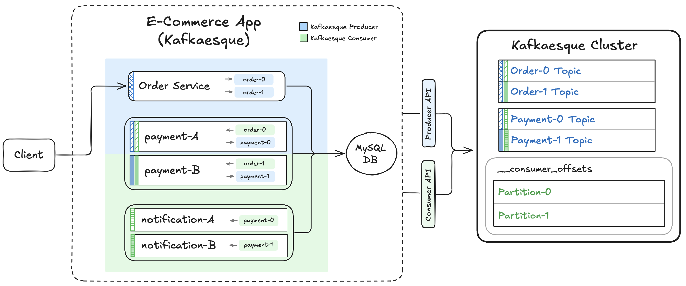

# 📺 Kafka – Section 3b

In this section, we scale Kafkaesque by increasing the number of **consumer instances per group** and introduce **heartbeat** driven rebalancing. We extend the Consumer API and broker to support group generations, liveness detection, partition reassignment, and clean recovery from failures.

- **Part 1 — Code Changes for Multi-Consumer Support**:  
  We update the launcher to run multiple consumer instances per group, extend the `KafkaesqueConsumer` with heartbeat support, and enhance the broker with join, heartbeat, generation tracking, and rebalance logic.

- **Part 2 — Validation & Testing**:  
  We validate the system end-to-end by producing multiple orders, observing clean partition ownership across consumers, simulating consumer failures, triggering rebalances, and restoring parallelism upon recovery.

<div align="center">
    
</div>

## 🎥 Video Walkthrough

### 🔹 Part 1: Code Changes for Multi-Consumer Support

**Title:** Kafka – Section 3b (Part 1)  
**Link:** [Watch on Udemy](https://www.udemy.com/course/practical-system-design/learn/lecture/55998881#overview)

### 🔹 Part 2: Validation & Testing

**Title:** Kafka – Section 3b (Part 2)  
**Link:** [Watch on Udemy](https://www.udemy.com/course/practical-system-design/learn/lecture/55998883#overview)

# ⚙️ Instructions and Commands

## ✏️ Part 1 – Code Changes for Multi-Consumer Support

### 1. Update `e_commerce_app_kafkaesque` to Support 2 Consumers Per Group

Add an additional instance of `payment_service` and `notification_service` in `e_commerce_app_kafkaesque/launcher.py`.

### 2. Update Kafkaesque to Support 2 Consumers Per Group

Update `consumer_api.py`, `broker/app.py` and `broker/_util.py`.

<br>

## ✏️ Part 2 – Validation & Testing

From `~/Desktop/kafka_demo` (project root):

### 1. Launch Kafkaesque Broker

Refer back to **[Section 3A → Step 1](../section_3a/README.md#1-launch-kafkaesque-broker)** for the exact command to launch the broker.

### 2. Create Kafkaesque Topics with 2 Partitions Each

Refer back to **[Section 3A → Step 2](../section_3a/README.md#2-create-kafkaesque-topics-with-2-partitions-each)** for the exact command to create the data topics and internal `__consumer_offsets` topic with `partitions=2` and `RF=1`.

### 3. Launch `e_commerce_app_kafkaesque`

Refer back to **[Section 3A → Step 4](../section_3a/README.md#4-launch-e_commerce_app_kafkaesque)** for the exact command to launch `e_commerce_app_kafkaesque`.

### 4. Verify Internal Broker State

Hit the debug endpoint:

```bash
curl http://localhost:19092/debug
```

-  On **Windows PowerShell**:
  ```bash
  curl.exe http://localhost:19092/debug
  ```

_Verify assignments in `consumer_groups_cache`._

### 5. Produce `order_1` + `order_2`

Refer back to **[Section 3A → Step 6](../section_3a/README.md#6-produce-order_1--order_2)** for the exact commands to produce `order_1` and `order_2`.

### 6. Simulate Consumer Failure

Kill `payment-A` consumer:

```bash
lsof -i :5002
kill -9 <PID>
```

-  On **Windows PowerShell**:
  ```bash
  netstat -ano | findstr :5002
  Stop-Process -Id <PID> -Force
  ```

Kill `notification-B` consumer:

```bash
lsof -i :5103
kill -9 <PID>
```

-  On **Windows PowerShell**:
  ```bash
  netstat -ano | findstr :5103
  Stop-Process -Id <PID> -Force
  ```

### 7. Inspect Broker Internal State

Refer back to **[Step 4](#4-verify-internal-broker-state)** for the debug command.

_Verify updated assignments in `consumer_groups_cache`._

### 8. Produce `order_3`

```bash
curl -X POST http://localhost:5001/produce \
  -H "Content-Type: application/json" \
  -d '{
    "topic": "order",
    "key": "order_3",
    "event": {
      "event_type": "OrderPlaced",
      "order_id": "order_3",
      "user_id": "user_1",
      "items": [
        { "product_id": "prod_4", "quantity": 1 }
      ],
      "total_amount": 2.13,
      "timestamp": "2025-01-01T10:01:00Z"
    }
  }'
```

-  On **Windows PowerShell:**
  - Use `curl.exe` instead of `curl` (to avoid the PowerShell alias)
  - Use backticks (`` ` ``) for multiline commands—**not** backslashes (`\`)
  - Any quotes inside your JSON payload must be escaped (use `\"` instead of `"`)

  ```bash
  curl.exe -X POST http://localhost:5001/produce `
    -H "Content-Type: application/json" `
    -d '{
      \"topic\": \"order\",
      \"key\": \"order_3\",
      \"event\": {
        \"event_type\": \"OrderPlaced\",
        \"order_id\": \"order_3\",
        \"user_id\": \"user_1\",
        \"items\": [
          { \"product_id\": \"prod_4\", \"quantity\": 1 }
        ],
        \"total_amount\": 2.13,
        \"timestamp\": \"2025-01-01T10:01:00Z\"
      }
    }'
  ```

### 9. Simulate Consumer Recovery

> _Revisit **[Section 1D → Step 4](/chapter_1/section_1d/README.md#4-ensure-the-app_db_endpoint-environment-variable-is-set)** for the commands to set the `APP_DB_ENDPOINT` environment variable._

Spin `payment-A` back up:

```bash
PORT=5002 \
  GROUP_ID=payment_service \
  CLIENT_ID=payment-A \
  SUBSCRIPTIONS=order \
  KAFKA_BOOTSTRAP=localhost:19092 \
  DB_HOST=$APP_DB_ENDPOINT \
  python -m e_commerce_app_kafkaesque.services.payment_service
```

-  On **Windows PowerShell**:
  ```bash
  $env:PORT = 5002
  $env:GROUP_ID = "payment_service"
  $env:CLIENT_ID = "payment-A"
  $env:SUBSCRIPTIONS = "order"
  $env:KAFKA_BOOTSTRAP = "localhost:19092"
  $env:DB_HOST = $APP_DB_ENDPOINT
  python -m e_commerce_app_kafkaesque.services.payment_service
  ```

Spin `notification-B` back up:

```bash
PORT=5103 \
  GROUP_ID=notification_service \
  CLIENT_ID=notification-B \
  SUBSCRIPTIONS=payment \
  KAFKA_BOOTSTRAP=localhost:19092 \
  DB_HOST=$APP_DB_ENDPOINT \
  python -m e_commerce_app_kafkaesque.services.notification_service
```

-  On **Windows PowerShell**:
  ```bash
  $env:PORT = 5103
  $env:GROUP_ID = "notification_service"
  $env:CLIENT_ID = "notification-B"
  $env:SUBSCRIPTIONS = "payment"
  $env:KAFKA_BOOTSTRAP = "localhost:19092"
  $env:DB_HOST = $APP_DB_ENDPOINT
  python -m e_commerce_app_kafkaesque.services.notification_service
  ```

### 10. Inspect Broker Internal State

Refer back to **[Step 4](#4-verify-internal-broker-state)** for the debug command.

_Verify updated assignments in `consumer_groups_cache`._

### 11. Produce `order_4`

```bash
curl -X POST http://localhost:5001/produce \
  -H "Content-Type: application/json" \
  -d '{
    "topic": "order",
    "key": "order_4",
    "event": {
      "event_type": "OrderPlaced",
      "order_id": "order_4",
      "user_id": "user_1",
      "items": [
        { "product_id": "prod_5", "quantity": 1 }
      ],
      "total_amount": 4.11,
      "timestamp": "2025-01-01T10:01:30Z"
    }
  }'
```

-  On **Windows PowerShell:**
  - Use `curl.exe` instead of `curl` (to avoid the PowerShell alias)
  - Use backticks (`` ` ``) for multiline commands—**not** backslashes (`\`)
  - Any quotes inside your JSON payload must be escaped (use `\"` instead of `"`)

  ```bash
  curl.exe -X POST http://localhost:5001/produce `
    -H "Content-Type: application/json" `
    -d '{
      \"topic\": \"order\",
      \"key\": \"order_4\",
      \"event\": {
        \"event_type\": \"OrderPlaced\",
        \"order_id\": \"order_4\",
        \"user_id\": \"user_1\",
        \"items\": [
          { \"product_id\": \"prod_5\", \"quantity\": 1 }
        ],
      \"total_amount\": 4.11,
      \"timestamp\": \"2025-01-01T10:01:30Z\"
    }
  }'
  ```

### 12. Verify All Outputs

Refer back to **[Section 3A → Step 7](../section_3a/README.md#7-verify-outputs)** for the commands to verify the database, partition logs, and broker internal state.

### 13. Shutdown & Reset Environment

Make sure to shut down the processes for `payment-A` and `notification-B` in their respective windows:

```bash
Ctrl + C
```

Refer back to **[Section 3A → Step 10](../section_3a/README.md#10-shutdown--reset-environment)** for the remaining shutdown and cleanup commands.

<br>
