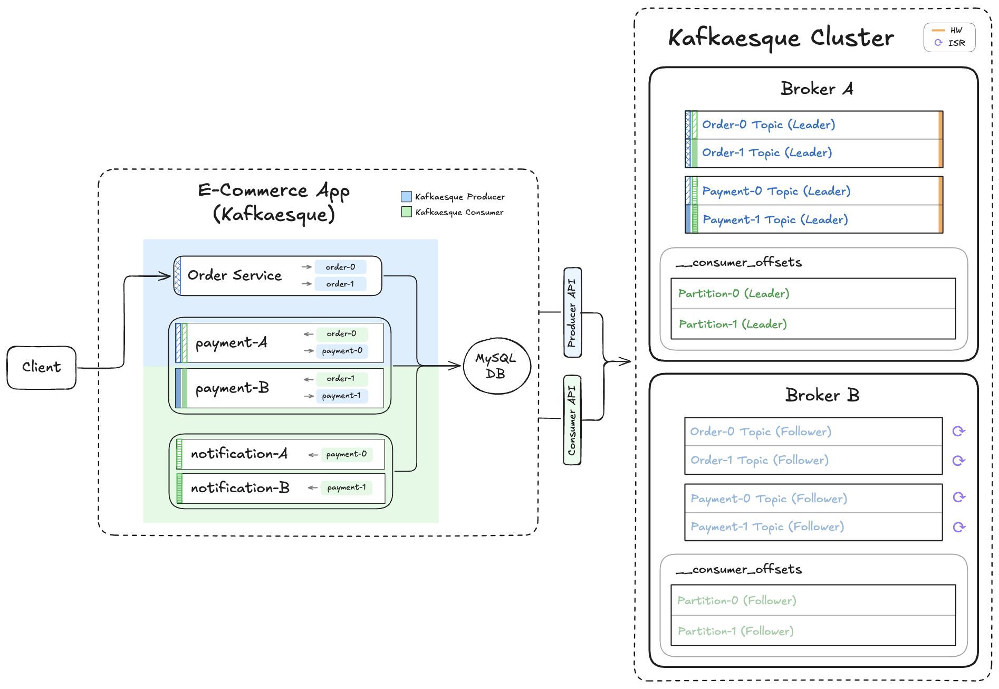

# 📺 Kafka – Section 3e

In this section, we introduce **In-Sync Replicas (ISR)** and **High Watermarks (HW)** to enforce durability and consistency in our Kafkaesque cluster. These guarantees ensure that writes are safely replicated and reads only return committed data.

- **Part 1 — ISR & High Watermark Implementation**:  
  We update the broker to track ISR and High Watermarks, extend topic creation with `minISR`, enforce write rejection when replicas are out of sync, and gate consumer reads using committed offsets.

- **Part 2 — ISR & High Watermark Validation**:  
  We launch both brokers, create topics with `minISR=2`, observe failed writes before replication, verify ISR + HW initialization, and confirm that consumers only process fully replicated events.

<div align="center">
    
</div>

## 🎥 Video Walkthrough

### 🔹 Part 1: ISR & High Watermark Implementation

**Title:** Kafka – Section 3e (Part 1)  
**Link:** [Watch on Udemy](https://www.udemy.com/course/practical-system-design/learn/lecture/55998907#overview)

### 🔹 Part 2: ISR & High Watermark Validation

**Title:** Kafka – Section 3e (Part 2)  
**Link:** [Watch on Udemy](https://www.udemy.com/course/practical-system-design/learn/lecture/55998909#overview)

# ⚙️ Instructions and Commands

## ✏️ Part 1 – ISR & High Watermark Implementation

Inside the `kafkaesque` directory, update `broker/app.py` and `broker/_util.py`.

<br>

## ✏️ Part 2 – ISR & High Watermark Validation

From `~/Desktop/kafka_demo` (project root):

### 1. Launch Kafkaesque Brokers

> _Please make sure your virtual environment is activated. You can revisit **[Section 3A → Step 1](/chapter_3/section_3a/README.md#1-ensure-virtual-environment-is-activated)** for the exact command._

Launch `broker_a` in first terminal window:

```bash
BROKER_PORT=19092 BROKER_NAME=broker_a python -m kafkaesque
```

-  On **Windows PowerShell**:
  ```bash
  $env:BROKER_PORT="19092"; $env:BROKER_NAME="broker_a"; python -m kafkaesque
  ```

Launch `broker_b` in a second terminal window:

```bash
BROKER_PORT=29092 BROKER_NAME=broker_b python -m kafkaesque
```

-  On **Windows PowerShell**:
  ```bash
  $env:BROKER_PORT="29092"; $env:BROKER_NAME="broker_b"; python -m kafkaesque
  ```

### 2. Create `broker_a` Topics (`minISR=2` for Data Topics)

Create the `Order` and `Payment` data topics, this time with 2 partitions per topic, a replication factor set to 2, and a `minISR` of 2:

```bash
curl -X POST http://localhost:19092/topics \
  -H 'content-type: application/json' \
  -d '{"name":"order","partitions":2,"replication_factor":2,"minISR":2}'

curl -X POST http://localhost:19092/topics \
  -H 'content-type: application/json' \
  -d '{"name":"payment","partitions":2,"replication_factor":2,"minISR":2}'
```

-  On **Windows PowerShell**:

  ```bash
  curl.exe -X POST http://localhost:19092/topics `
    -H 'content-type: application/json' `
    -d '{\"name\":\"order\",\"partitions\":2,\"replication_factor\":2,\"minISR\":2}'

  curl.exe -X POST http://localhost:19092/topics `
    -H 'content-type: application/json' `
    -d '{\"name\":\"payment\",\"partitions\":2,\"replication_factor\":2,\"minISR\":2}'
  ```

Create the internal `__consumer_offsets` topic, also with 2 partitions and `RF=2`, but without `minISR`:

```bash
curl -X POST http://localhost:19092/topics \
  -H 'content-type: application/json' \
  -d '{"name":"__consumer_offsets","partitions":2,"replication_factor":2}'
```

-  On **Windows PowerShell**:
  ```bash
  curl.exe -X POST http://localhost:19092/topics `
    -H 'content-type: application/json' `
    -d '{\"name\":\"__consumer_offsets\",\"partitions\":2,\"replication_factor\":2}'
  ```

### 3. Create `broker_b` Topics (`minISR=2` for Data Topics)

Create the `Order` and `Payment` data topics, this time with 2 partitions per topic, replication factor set to 2, and a `minISR` of 2:

```bash
curl -X POST http://localhost:29092/topics \
  -H 'content-type: application/json' \
  -d '{"name":"order","partitions":2,"replication_factor":2,"minISR":2}'

curl -X POST http://localhost:29092/topics \
  -H 'content-type: application/json' \
  -d '{"name":"payment","partitions":2,"replication_factor":2,"minISR":2}'
```

-  On **Windows PowerShell**:

  ```bash
  curl.exe -X POST http://localhost:29092/topics `
    -H 'content-type: application/json' `
    -d '{\"name\":\"order\",\"partitions\":2,\"replication_factor\":2,\"minISR\":2}'

  curl.exe -X POST http://localhost:29092/topics `
    -H 'content-type: application/json' `
    -d '{\"name\":\"payment\",\"partitions\":2,\"replication_factor\":2,\"minISR\":2}'
  ```

Create the internal `__consumer_offsets` topic, also with 2 partitions and `RF=2`, but without `minISR`:

```bash
curl -X POST http://localhost:29092/topics \
  -H 'content-type: application/json' \
  -d '{"name":"__consumer_offsets","partitions":2,"replication_factor":2}'
```

-  On **Windows PowerShell**:
  ```bash
  curl.exe -X POST http://localhost:29092/topics `
    -H 'content-type: application/json' `
    -d '{\"name\":\"__consumer_offsets\",\"partitions\":2,\"replication_factor\":2}'
  ```

### 4. Launch `e_commerce_app_kafkaesque`

Launch app with both `broker_a` and `broker_b` addresses passed into `KAFKA_BOOTSTRAP`:

> _Refer back to **[Section 1D → Step 6](/chapter_1/section_1d/README.md#6-ensure-the-app_db_endpoint-environment-variable-is-set)** to set the `APP_DB_ENDPOINT` environment variable._

```bash
KAFKA_BOOTSTRAP=localhost:19092,localhost:29092 \
  DB_HOST=$APP_DB_ENDPOINT \
  python -m e_commerce_app_kafkaesque.launcher
```

-  On **Windows PowerShell**:
  ```bash
  $env:KAFKA_BOOTSTRAP = "localhost:19092,localhost:29092"
  $env:DB_HOST = $APP_DB_ENDPOINT
  python -m e_commerce_app_kafkaesque.launcher
  ```

### 5. Verify Internal State on `broker_a` and `broker_b` (Before Initial Replication)

Before any replication cycles occur, hit the debug endpoint on each broker to establish a baseline of their internal state:

```bash
curl http://localhost:19092/debug
curl http://localhost:29092/debug
```

-  On **Windows PowerShell**:
  ```bash
  curl.exe http://localhost:19092/debug
  curl.exe http://localhost:29092/debug
  ```

### 6. Produce `order_1` (Before Initial Replication)

Before any replication cycles occur, produce an order and observe how the system behaves while `minISR` requirements have not yet been satisfied:

```bash
curl -X POST http://localhost:5001/produce \
  -H "Content-Type: application/json" \
  -d '{
    "topic": "order",
    "key": "order_1",
    "event": {
      "event_type": "OrderPlaced",
      "order_id": "order_1",
      "user_id": "user_1",
      "items": [
        { "product_id": "prod_1", "quantity": 2 },
        { "product_id": "prod_2", "quantity": 1 }
      ],
      "total_amount": 84.97,
      "timestamp": "2025-01-01T10:00:00Z"
    }
  }'
```

-  On **Windows PowerShell**:
  ```bash
  curl.exe -X POST http://localhost:5001/produce `
    -H "Content-Type: application/json" `
    -d '{
      \"topic\": \"order\",
      \"key\": \"order_1\",
      \"event\": {
        \"event_type\": \"OrderPlaced\",
        \"order_id\": \"order_1\",
        \"user_id\": \"user_1\",
        \"items\": [
          { \"product_id\": \"prod_1\", \"quantity\": 2 },
          { \"product_id\": \"prod_2\", \"quantity\": 1 }
        ],
        \"total_amount\": 84.97,
        \"timestamp\": \"2025-01-01T10:00:00Z\"
      }
    }'
  ```

### 7. Wait for Initial Replication Cycles

_Wait for the current delayed replication countdown to complete and for replication cycles to begin._

For testing convenience, the current delay period can be skipped by creating the following file:

```bash
touch .var/skip_replication_delay
```

-  On **Windows PowerShell**:
  ```bash
  New-Item .var/skip_replication_delay
  ```

> **ℹ️ Note:** When the replication thread detects `.var/skip_replication_delay`, it immediately exits the current delay period and deletes the file. This ensures that only the active delay is skipped and that future delayed replication windows remain unaffected.

### 8. Verify Internal State on `broker_a` and `broker_b` (After Initial Replication)

Hit the debug endpoint:

```bash
curl http://localhost:19092/debug
curl http://localhost:29092/debug
```

-  On **Windows PowerShell**:
  ```bash
  curl.exe http://localhost:19092/debug
  curl.exe http://localhost:29092/debug
  ```

### 9. Produce All 4 Test Orders (After Initial Replication)

```bash
curl -X POST http://localhost:5001/produce \
  -H "Content-Type: application/json" \
  -d '{
    "topic": "order",
    "key": "order_1",
    "event": {
      "event_type": "OrderPlaced",
      "order_id": "order_1",
      "user_id": "user_1",
      "items": [
        { "product_id": "prod_1", "quantity": 2 },
        { "product_id": "prod_2", "quantity": 1 }
      ],
      "total_amount": 84.97,
      "timestamp": "2025-01-01T10:00:00Z"
    }
  }'

curl -X POST http://localhost:5001/produce \
  -H "Content-Type: application/json" \
  -d '{
    "topic": "order",
    "key": "order_2",
    "event": {
      "event_type": "OrderPlaced",
      "order_id": "order_2",
      "user_id": "user_1",
      "items": [
        { "product_id": "prod_3", "quantity": 1 }
      ],
      "total_amount": 39.99,
      "timestamp": "2025-01-01T10:00:30Z"
    }
  }'

curl -X POST http://localhost:5001/produce \
  -H "Content-Type: application/json" \
  -d '{
    "topic": "order",
    "key": "order_3",
    "event": {
      "event_type": "OrderPlaced",
      "order_id": "order_3",
      "user_id": "user_1",
      "items": [
        { "product_id": "prod_4", "quantity": 1 }
      ],
      "total_amount": 2.13,
      "timestamp": "2025-01-01T10:01:00Z"
    }
  }'

curl -X POST http://localhost:5001/produce \
  -H "Content-Type: application/json" \
  -d '{
    "topic": "order",
    "key": "order_4",
    "event": {
      "event_type": "OrderPlaced",
      "order_id": "order_4",
      "user_id": "user_1",
      "items": [
        { "product_id": "prod_5", "quantity": 1 }
      ],
      "total_amount": 4.11,
      "timestamp": "2025-01-01T10:01:30Z"
    }
  }'
```

-  On **Windows PowerShell**:

  ```bash
  curl.exe -X POST http://localhost:5001/produce `
    -H "Content-Type: application/json" `
    -d '{
      \"topic\": \"order\",
      \"key\": \"order_1\",
      \"event\": {
        \"event_type\": \"OrderPlaced\",
        \"order_id\": \"order_1\",
        \"user_id\": \"user_1\",
        \"items\": [
          { \"product_id\": \"prod_1\", \"quantity\": 2 },
          { \"product_id\": \"prod_2\", \"quantity\": 1 }
        ],
        \"total_amount\": 84.97,
        \"timestamp\": \"2025-01-01T10:00:00Z\"
      }
    }'

  curl.exe -X POST http://localhost:5001/produce `
    -H "Content-Type: application/json" `
    -d '{
      \"topic\": \"order\",
      \"key\": \"order_2\",
      \"event\": {
        \"event_type\": \"OrderPlaced\",
        \"order_id\": \"order_2\",
        \"user_id\": \"user_1\",
        \"items\": [
          { \"product_id\": \"prod_3\", \"quantity\": 1 }
        ],
      \"total_amount\": 39.99,
      \"timestamp\": \"2025-01-01T10:00:30Z\"
    }
  }'

  curl.exe -X POST http://localhost:5001/produce `
    -H "Content-Type: application/json" `
    -d '{
      \"topic\": \"order\",
      \"key\": \"order_3\",
      \"event\": {
        \"event_type\": \"OrderPlaced\",
        \"order_id\": \"order_3\",
        \"user_id\": \"user_1\",
        \"items\": [
          { \"product_id\": \"prod_4\", \"quantity\": 1 }
        ],
        \"total_amount\": 2.13,
        \"timestamp\": \"2025-01-01T10:01:00Z\"
      }
    }'

  curl.exe -X POST http://localhost:5001/produce `
    -H "Content-Type: application/json" `
    -d '{
      \"topic\": \"order\",
      \"key\": \"order_4\",
      \"event\": {
        \"event_type\": \"OrderPlaced\",
        \"order_id\": \"order_4\",
        \"user_id\": \"user_1\",
        \"items\": [
          { \"product_id\": \"prod_5\", \"quantity\": 1 }
        ],
      \"total_amount\": 4.11,
      \"timestamp\": \"2025-01-01T10:01:30Z\"
    }
  }'
  ```

### 10. Verify Partition Files (Before Event Replication)

```bash
for f in .var/kafkaesque/*/*/*.log; do echo "== $f =="; cat "$f"; done
```

-  On **Windows PowerShell**:
  ```bash
  Get-ChildItem .var\kafkaesque\*\*\*.log | ForEach-Object {
    $r=$_.FullName.Replace((Get-Location).Path + '\','')
    "== $r =="; Get-Content $_ }
  ```

### 11. Verify Internal State on `broker_a` and `broker_b` (Before Event Replication)

Hit the debug endpoint:

```bash
curl http://localhost:19092/debug
curl http://localhost:29092/debug
```

-  On **Windows PowerShell**:
  ```bash
  curl.exe http://localhost:19092/debug
  curl.exe http://localhost:29092/debug
  ```

### 12. Wait for Event Replication Cycles

_Wait for the current delayed replication countdown to complete and for the event replication cycles to complete._

For testing convenience, the current delay period can be skipped by creating the following file:

```bash
touch .var/skip_replication_delay
```

-  On **Windows PowerShell**:
  ```bash
  New-Item .var/skip_replication_delay
  ```

> **ℹ️ Note:** When the replication thread detects `.var/skip_replication_delay`, it immediately exits the current delay period and deletes the file. This ensures that only the active delay is skipped and that future delayed replication windows remain unaffected.

### 13. Verify All Outputs (After Event Replication)

Verify database records:

> _Refer back to **[Section 1D → Step 6](/chapter_1/section_1d/README.md#6-ensure-the-app_db_endpoint-environment-variable-is-set)** to set the `APP_DB_ENDPOINT` environment variable._

```bash
docker run --rm -e MYSQL_PWD='Password100!' mysql:8.0 \
  mysql -h $APP_DB_ENDPOINT -u admin \
  --table -e "USE services_db; SELECT * FROM Orders;"
```

-  On **Windows PowerShell**:
  ```bash
  docker run --rm -e MYSQL_PWD='Password100!' mysql:8.0 `
    mysql -h $APP_DB_ENDPOINT -u admin `
    --table -e "USE services_db; SELECT * FROM Orders;"
  ```

Verify on-disk partition log file contents:

```bash
for f in .var/kafkaesque/*/*/*.log; do echo "== $f =="; cat "$f"; done
```

-  On **Windows PowerShell**:
  ```bash
  Get-ChildItem .var\kafkaesque\*\*\*.log | ForEach-Object {
    $r=$_.FullName.Replace((Get-Location).Path + '\','')
    "== $r =="; Get-Content $_ }
  ```

Verify internal state on `broker_a` and `broker_b`:

```bash
curl http://localhost:19092/debug
curl http://localhost:29092/debug
```

-  On **Windows PowerShell**:
  ```bash
  curl.exe http://localhost:19092/debug
  curl.exe http://localhost:29092/debug
  ```

### 14. Shutdown & Reset Environment

Stop the Kafkaesque Brokers:

```bash
Ctrl + C
```

Stop the `e_commerce_app_kafkaesque`

```bash
Ctrl + C
```

Clear out `Orders` table:

> _Refer back to **[Section 1D → Step 6](/chapter_1/section_1d/README.md#6-ensure-the-app_db_endpoint-environment-variable-is-set)** to set the `APP_DB_ENDPOINT` environment variable._

```bash
docker run --rm -e MYSQL_PWD='Password100!' mysql:8.0 \
  mysql -h $APP_DB_ENDPOINT -u admin \
  --table -e "USE services_db; TRUNCATE TABLE Orders;"
```

-  On **Windows PowerShell**:
  ```bash
  docker run --rm -e MYSQL_PWD='Password100!' mysql:8.0 `
    mysql -h $APP_DB_ENDPOINT -u admin `
    --table -e "USE services_db; TRUNCATE TABLE Orders;"
  ```

Clean up Kafkaesque broker data:

```bash
rm -rf .var
```

-  On **Windows PowerShell**:
  ```bash
  Remove-Item .var -Recurse
  ```

<br>
