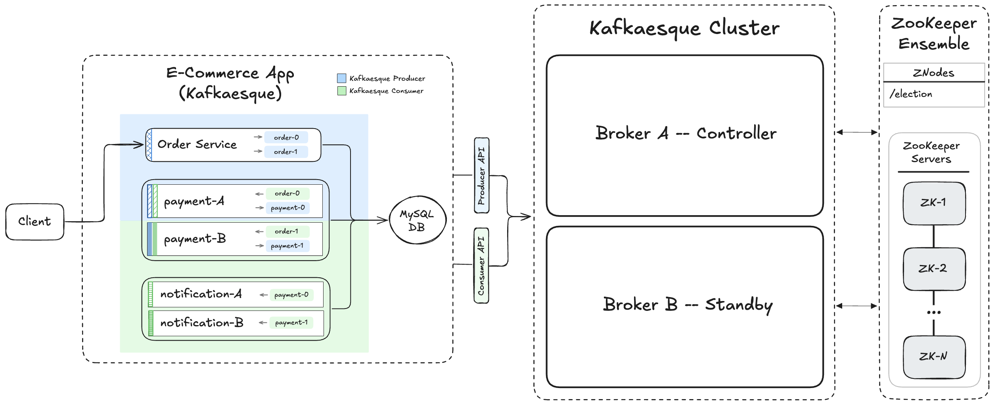

# 📺 Kafka – Section 4a

In this section, we introduce **ZooKeeper** into our Kafkaesque cluster and implement **controller election**. This allows brokers to coordinate cluster-wide responsibilities and automatically elect a new controller on failure.

- **Part 1 — ZooKeeper Setup & Server Initialization**:  
  We install Java and ZooKeeper, configure the `zoo.cfg` file, start the ZooKeeper server and CLI, and verify the initial znode state.

- **Part 2 — Controller Election with ZooKeeper**:  
  We implement controller election using ephemeral sequential znodes, integrate ZooKeeper into the broker startup process, launch multiple brokers, and verify automatic leader election and failover behavior.

<div align="center">
    
</div>

## 🎥 Video Walkthrough

### 🔹 Part 1: ZooKeeper Setup & Server Initialization

**Title:** Kafka – Section 4a (Part 1)  
**Link:** [Watch on Udemy](https://www.udemy.com/course/practical-system-design/learn/lecture/55998911#overview)

### 🔹 Part 2: Controller Election with ZooKeeper

**Title:** Kafka – Section 4a (Part 2)  
**Link:** [Watch on Udemy](https://www.udemy.com/course/practical-system-design/learn/lecture/55998913#overview)

# ⚙️ Instructions and Commands

## ✏️ Part 1 – ZooKeeper Setup & Server Initialization

From `~/Desktop/kafka_demo` (project root):

### 1. Verify Java Installation

Confirm the Java version (this course uses **Java 17**):

```bash
java --version
```

Verify that the `JAVA_HOME` environment variable is set:

```bash
echo $JAVA_HOME
```

-  On **Windows PowerShell**:
  ```bash
  echo $env:JAVA_HOME
  ```

Verify that the Java binary is available on your `PATH`:

```bash
which java
```

-  On **Windows PowerShell**:
  ```bash
  where.exe java
  ```

### 2. Install Java (If Needed)

If Java is not installed — or if **Java 17** is missing — install it using `SDKMAN` (**macOS** users):

```bash
sdk install java 17.0.17-tem
```

-  On **Windows PowerShell**, use `WinGet`:
  ```bash
  winget install --id EclipseAdoptium.Temurin.17.JDK -e
  ```

After installation:

- Restart your terminal / VS Code window.
- Re-run the verification commands from **[Step 1](#1-verify-java-installation)** to confirm everything is set up correctly.

### 3. ZooKeeper `3.8.4` Download

Install legacy version `3.8.4`:

```bash
wget https://archive.apache.org/dist/zookeeper/zookeeper-3.8.4/apache-zookeeper-3.8.4-bin.tar.gz
```

-  On **Windows PowerShell**:
  ```bash
  iwr https://archive.apache.org/dist/zookeeper/zookeeper-3.8.4/apache-zookeeper-3.8.4-bin.tar.gz -OutFile apache-zookeeper-3.8.4-bin.tar.gz
  ```

Extract the archive:

```bash
tar -xzf apache-zookeeper-3.8.4-bin.tar.gz
```

Remove the original `tar.gz` file:

```bash
rm apache-zookeeper-3.8.4-bin.tar.gz
```

-  On **Windows PowerShell**:
  ```bash
  Remove-Item apache-zookeeper-3.8.4-bin.tar.gz
  ```

### 4. ZooKeeper Configuration Setup

Inspect the ZooKeeper configuration directory:

```bash
ls apache-zookeeper-3.8.4-bin/conf
```

Create the required `zoo.cfg` file:

```bash
cp apache-zookeeper-3.8.4-bin/conf/zoo_sample.cfg apache-zookeeper-3.8.4-bin/conf/zoo.cfg
```

-  On **Windows PowerShell**:
  ```bash
  Copy-Item apache-zookeeper-3.8.4-bin/conf/zoo_sample.cfg apache-zookeeper-3.8.4-bin/conf/zoo.cfg
  ```

_Open up `zoo.cfg` and update `dataDir=./.var/zookeeper`_

### 5. Ensure Port `2181` is Available for ZooKeeper

Before launching ZooKeeper, ensure that port `2181` is not already in use.  
If a process is running on that port, terminate it before proceeding.

```bash
lsof -i :2181
kill -9 <PID>
```

-  On **Windows PowerShell**:
  ```bash
  netstat -ano | findstr :2181
  Stop-Process -Id <PID> -Force
  ```

### 6. Start `zkServer` & `zkCli`

Start the ZooKeeper Server in foreground:

```bash
./apache-zookeeper-3.8.4-bin/bin/zkServer.sh start-foreground
```

-  On **Windows PowerShell**:
  ```bash
  .\apache-zookeeper-3.8.4-bin\bin\zkServer.cmd
  ```

> _Verify that the `.var/zookeeper` folder is created_

Start ZooKeeper CLI:

```bash
./apache-zookeeper-3.8.4-bin/bin/zkCli.sh
```

-  On **Windows PowerShell**:
  ```bash
  .\apache-zookeeper-3.8.4-bin\bin\zkCli.cmd
  ```

### 7. Inspect ZooKeeper State

From the ZooKeeper CLI:

```bash
ls /
ls /zookeeper
```

<br>

## ✏️ Part 2 – Controller Election with ZooKeeper

From `~/Desktop/kafka_demo` (project root):

### 1. Scaffold ZooKeeper Directory

Create `zookeeper` directory:

```bash
mkdir kafkaesque/zookeeper
```

Create the package initializer:

```bash
touch kafkaesque/zookeeper/__init__.py
```

-  On **Windows PowerShell**:
  ```bash
  New-Item kafkaesque/zookeeper/__init__.py
  ```

### 2. Create Znodes File

```bash
touch kafkaesque/zookeeper/znodes.py
```

-  On **Windows PowerShell**:
  ```bash
  New-Item kafkaesque/zookeeper/znodes.py
  ```

_Paste in `znodes.py` starter code._

### 3. Create `ControllerElection` Class

```bash
touch kafkaesque/zookeeper/controller_election.py
```

-  On **Windows PowerShell**:
  ```bash
  New-Item kafkaesque/zookeeper/controller_election.py
  ```

_Paste in `controller_election.py` starter code._

### 4. Ensure `zkServer` & `zkCli` are Running

Refer back to **[Part 1 - Step 6](#6-start-zkServer--zkCli)** for the commands to start ZooKeeper server and CLI.

### 5. Virtual Environment Updates

Make sure your virtual environment is activated:

```bash
source venv/bin/activate
```

-  On **Windows PowerShell**:
  ```bash
  .\venv\Scripts\Activate.ps1
  ```

Install `kazoo` library into your virtual environment:

```bash
pip install kazoo
```

### 6. Launch Kafkaesque `broker_a`

```bash
BROKER_PORT=19092 BROKER_NAME=broker_a python -m kafkaesque
```

-  On **Windows PowerShell**:
  ```bash
  $env:BROKER_PORT="19092"; $env:BROKER_NAME="broker_a"; python -m kafkaesque
  ```

### 7. Inspect ZooKeeper State

From the ZooKeeper CLI:

```bash
ls /
ls /election
get /election/<random_id>__lock__0000000000
```

### 8. Launch Kafkaesque `broker_b`

```bash
BROKER_PORT=29092 BROKER_NAME=broker_b python -m kafkaesque
```

-  On **Windows PowerShell**:
  ```bash
  $env:BROKER_PORT="29092"; $env:BROKER_NAME="broker_b"; python -m kafkaesque
  ```

### 9. Inspect ZooKeeper State

From the ZooKeeper CLI:

```bash
ls /election
get /election/<random_id>__lock__0000000001
```

### 10. Kill the Controller (`broker_a`)

In `broker_a`'s terminal window, stop the process:

```bash
Ctrl + C
```

### 11. Inspect ZooKeeper State

From the ZooKeeper CLI:

```bash
ls /election
```

### 12. Bring `broker_a` back Online

Refer back to **[Part 2 - Step 6](#6-launch-kafkaesque-broker_a)** for the command to launch `broker_a`.

### 13. Inspect ZooKeeper State

From the ZooKeeper CLI:

```bash
ls /election
get /election/<random_id>__lock__0000000002
```

### 14. Shut Down Both Kafkaesque Brokers

In `broker_b`'s terminal window, stop the process:

```bash
Ctrl + C
```

In `broker_a`'s terminal window, stop the process:

```bash
Ctrl + C
```

### 15. Inspect ZooKeeper State

Refer back to **[Part 2 - Step 11](#11-inspect-zookeeper-state)** for the command to list the `/election` znode.

### 16. Shut Down ZooKeeper CLI & Server

In the terminal windows running `zkCli` and `zkServer`, stop each process:

```bash
Ctrl + C
```

> _Press `Y` if prompted to terminate batches_

### 17. Clean Up Kafkaesque & ZooKeeper State

```bash
rm -rf .var
```

-  On **Windows PowerShell**:
  ```bash
  Remove-Item .var -Recurse
  ```

<br>
