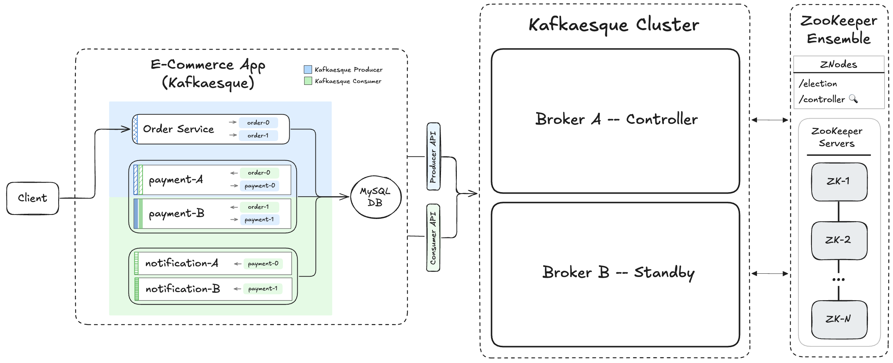

# 📺 Kafka – Section 4b

In this section, we introduce a **controller znode** in ZooKeeper and add **watchers** so brokers can maintain a live, in-memory view of the active controller. We publish controller identity to the `/controller` znode, subscribe to changes using ZooKeeper watches, and verify that all brokers stay in sync during startup, failover, and recovery.

<div align="center">
    
</div>

## 🎥 Video Walkthrough

**Title:** Kafka – Section 4b  
**Link:** [Watch on Udemy](https://www.udemy.com/course/practical-system-design/learn/lecture/55998917#overview)

# ⚙️ Instructions and Commands

From `~/Desktop/kafka_demo` (project root):

### 1. Create ZooKeeper Watchers File

```bash
touch kafkaesque/zookeeper/watchers.py
```

-  On **Windows PowerShell**:
  ```bash
  New-Item kafkaesque/zookeeper/watchers.py
  ```

_Paste in `watchers.py` starter code._

### 2. Start `zkServer` & `zkCli`

Refer back to **[Section 4A (Part 1) → Step 6](/chapter_4/section_4a/README.md#6-start-zkServer--zkCli)** for the commands to start ZooKeeper server and CLI.

### 3. Activate the Virtual Environment

Before continuing, ensure your virtual environment is activated:

```bash
source venv/bin/activate
```

-  On **Windows PowerShell**:
  ```bash
  .\venv\Scripts\Activate.ps1
  ```

_Additionally make sure the following dependencies are installed:_

- _Legacy dependencies from **[Section 1D → Step 2](/chapter_1/section_1d/README.md#2-set-up-a-virtual-environment-and-install-dependencies)**_
- _`requests` library from **[Section 2B (Part 3) → Step 4](/chapter_2/section_2b/README.md#4-virtual-environment-updates)**_
- _`kazoo` library from **[Section 4A (Part 2) → Step 5](/chapter_4/section_4a/README.md#5-virtual-environment-updates)**_

### 4. Launch Kafkaesque `broker_a`

Refer back to **[Section 4A (Part 2) → Step 6](/chapter_4/section_4a/README.md#6-launch-kafkaesque-broker_a)** for the command to start `broker_a`.

### 5. Inspect ZooKeeper State

From the ZooKeeper CLI:

```bash
ls /
get /controller
```

### 6. Launch Kafkaesque `broker_b`

Refer back to **[Section 4A (Part 2) → Step 8](/chapter_4/section_4a/README.md#8-launch-kafkaesque-broker_b)** for the command to start `broker_b`.

### 7. Inspect ZooKeeper State

From the ZooKeeper CLI:

```bash
get /controller
```

### 8. Verify Internal State on `broker_a` and `broker_b`

Hit the debug endpoint:

```bash
curl http://localhost:19092/debug
curl http://localhost:29092/debug
```

-  On **Windows PowerShell**:
  ```bash
  curl.exe http://localhost:19092/debug
  curl.exe http://localhost:29092/debug
  ```

### 9. Kill the Controller (`broker_a`)

In `broker_a`'s terminal window, stop the process:

```bash
Ctrl + C
```

### 10. Inspect ZooKeeper State

Refer back to **[Step 7](#7-inspect-zookeeper-state)** for the command to get the `/controller` znode value.

### 11. Verify Internal State on `broker_b`

Hit the debug endpoint:

```bash
curl http://localhost:29092/debug
```

-  On **Windows PowerShell**:
  ```bash
  curl.exe http://localhost:29092/debug
  ```

### 12. Bring `broker_a` back Online

Refer back to **[Section 4A (Part 2) → Step 6](/chapter_4/section_4a/README.md#6-launch-kafkaesque-broker_a)** for the command to start `broker_a`.

### 13. Inspect ZooKeeper State

Refer back to **[Step 7](#7-inspect-zookeeper-state)** for the command to get the `/controller` znode value.

### 14. Verify Internal State on `broker_a` and `broker_b`

Refer back to **[Step 8](#8-verify-internal-state-on-broker_a-and-broker_b)** for the debug commands.

### 15. Shut Down Both Kafkaesque Brokers

In the terminal windows running `broker_a` and `broker_b`, stop each process:

```bash
Ctrl + C
```

### 16. Inspect ZooKeeper State

From the ZooKeeper CLI:

```bash
ls /
```

### 17. Shut Down ZooKeeper CLI & Server

In the terminal windows running `zkCli` and `zkServer`, stop each process:

```bash
Ctrl + C
```

> _Press `Y` if prompted to terminate batches_

### 18. Clean Up Kafkaesque & ZooKeeper State

```bash
rm -rf .var
```

-  On **Windows PowerShell**:
  ```bash
  Remove-Item .var -Recurse
  ```

<br>
