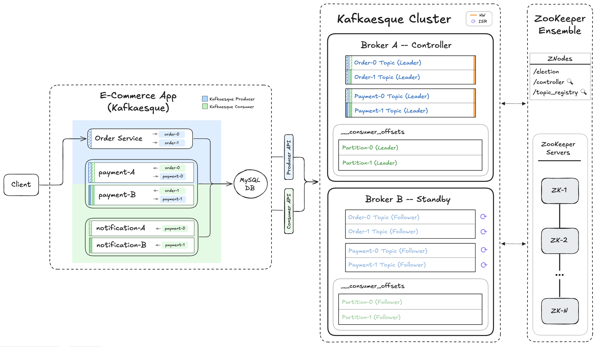

# 📺 Kafka – Section 4c

In this section, we introduce a **topic registry znode** in ZooKeeper to centralize topic configuration across the cluster. Brokers subscribe to this shared state using watchers, allowing them to automatically rebuild their local metadata, initialize partition logs, and recover state on restart without manual coordination.

<div align="center">
    
</div>

## 🎥 Video Walkthrough

**Title:** Kafka – Section 4c  
**Link:** [Watch on Udemy](https://www.udemy.com/course/practical-system-design/learn/lecture/55998921#overview)

# ⚙️ Instructions and Commands

From `~/Desktop/kafka_demo` (project root):

### 1. Start `zkServer` & `zkCli`

Start the ZooKeeper Server in foreground:

```bash
./apache-zookeeper-3.8.4-bin/bin/zkServer.sh start-foreground
```

-  On **Windows PowerShell**:
  ```bash
  .\apache-zookeeper-3.8.4-bin\bin\zkServer.cmd
  ```

> _Verify that the `.var/zookeeper` folder is created_

Start ZooKeeper CLI:

```bash
./apache-zookeeper-3.8.4-bin/bin/zkCli.sh
```

-  On **Windows PowerShell**:
  ```bash
  .\apache-zookeeper-3.8.4-bin\bin\zkCli.cmd
  ```

### 2. Launch Kafkaesque `broker_a`

> _Please make sure your virtual environment is activated. You can refer back to **[Section 4B → Step 3](/chapter_4/section_4b/README.md#3-ensure-virtual-environment-is-activated)** for the exact command._

```bash
BROKER_PORT=19092 BROKER_NAME=broker_a python -m kafkaesque
```

-  On **Windows PowerShell**:
  ```bash
  $env:BROKER_PORT="19092"; $env:BROKER_NAME="broker_a"; python -m kafkaesque
  ```

### 3. Launch Kafkaesque `broker_b`

> _Please make sure your virtual environment is activated. You can refer back to **[Section 4B → Step 3](/chapter_4/section_4b/README.md#3-ensure-virtual-environment-is-activated)** for the exact command._

```bash
BROKER_PORT=29092 BROKER_NAME=broker_b python -m kafkaesque
```

-  On **Windows PowerShell**:
  ```bash
  $env:BROKER_PORT="29092"; $env:BROKER_NAME="broker_b"; python -m kafkaesque
  ```

### 4. Create Topics on Controller (`broker_a`)

Create the `Order` and `Payment` data topics with `partitions=2`, `RF=2` and `minISR=2`.

```bash
curl -X POST http://localhost:19092/topics \
  -H 'content-type: application/json' \
  -d '{"name":"order","partitions":2,"replication_factor":2,"minISR":2}'

curl -X POST http://localhost:19092/topics \
  -H 'content-type: application/json' \
  -d '{"name":"payment","partitions":2,"replication_factor":2,"minISR":2}'
```

-  On **Windows PowerShell**:

  ```bash
  curl.exe -X POST http://localhost:19092/topics `
    -H 'content-type: application/json' `
    -d '{\"name\":\"order\",\"partitions\":2,\"replication_factor\":2,\"minISR\":2}'

  curl.exe -X POST http://localhost:19092/topics `
    -H 'content-type: application/json' `
    -d '{\"name\":\"payment\",\"partitions\":2,\"replication_factor\":2,\"minISR\":2}'
  ```

Create the internal `__consumer_offsets` topic with `partitions=2`, `RF=2` and no `minISR` value.

```bash
curl -X POST http://localhost:19092/topics \
  -H 'content-type: application/json' \
  -d '{"name":"__consumer_offsets","partitions":2,"replication_factor":2}'
```

-  On **Windows PowerShell**:
  ```bash
  curl.exe -X POST http://localhost:19092/topics `
    -H 'content-type: application/json' `
    -d '{\"name\":\"__consumer_offsets\",\"partitions\":2,\"replication_factor\":2}'
  ```

> _Verify that the correct folders and partition files have been created under the `.var` directory._

### 5. Inspect ZooKeeper State

From the ZooKeeper CLI:

```bash
ls /
get /topic_registry
```

### 6. Verify Internal State on `broker_a` and `broker_b`

Hit the debug endpoint:

```bash
curl http://localhost:19092/debug
curl http://localhost:29092/debug
```

-  On **Windows PowerShell**:
  ```bash
  curl.exe http://localhost:19092/debug
  curl.exe http://localhost:29092/debug
  ```

### 7. Launch `e_commerce_app_kafkaesque`

Launch app with both `broker_a` and `broker_b` addresses passed into `KAFKA_BOOTSTRAP`:

> _Refer back to **[Section 1D → Step 6](/chapter_1/section_1d/README.md#6-ensure-the-app_db_endpoint-environment-variable-is-set)** to set the `APP_DB_ENDPOINT` environment variable._

```bash
KAFKA_BOOTSTRAP=localhost:19092,localhost:29092 \
  DB_HOST=$APP_DB_ENDPOINT \
  python -m e_commerce_app_kafkaesque.launcher
```

-  On **Windows PowerShell**:
  ```bash
  $env:KAFKA_BOOTSTRAP = "localhost:19092,localhost:29092"
  $env:DB_HOST = $APP_DB_ENDPOINT
  python -m e_commerce_app_kafkaesque.launcher
  ```

### 8. Produce `order_1`

```bash
curl -X POST http://localhost:5001/produce \
  -H "Content-Type: application/json" \
  -d '{
    "topic": "order",
    "key": "order_1",
    "event": {
      "event_type": "OrderPlaced",
      "order_id": "order_1",
      "user_id": "user_1",
      "items": [
        { "product_id": "prod_1", "quantity": 2 },
        { "product_id": "prod_2", "quantity": 1 }
      ],
      "total_amount": 84.97,
      "timestamp": "2025-01-01T10:00:00Z"
    }
  }'
```

-  On **Windows PowerShell**:
  ```bash
  curl.exe -X POST http://localhost:5001/produce `
    -H "Content-Type: application/json" `
    -d '{
      \"topic\": \"order\",
      \"key\": \"order_1\",
      \"event\": {
        \"event_type\": \"OrderPlaced\",
        \"order_id\": \"order_1\",
        \"user_id\": \"user_1\",
        \"items\": [
          { \"product_id\": \"prod_1\", \"quantity\": 2 },
          { \"product_id\": \"prod_2\", \"quantity\": 1 }
        ],
        \"total_amount\": 84.97,
        \"timestamp\": \"2025-01-01T10:00:00Z\"
      }
    }'
  ```

### 9. Verify Partition Files

```bash
for f in .var/kafkaesque/*/*/*.log; do echo "== $f =="; cat "$f"; done
```

-  On **Windows PowerShell**:
  ```bash
  Get-ChildItem .var\kafkaesque\*\*\*.log | ForEach-Object {
    $r=$_.FullName.Replace((Get-Location).Path + '\','')
    "== $r =="; Get-Content $_ }
  ```

### 10. Verify Internal State on `broker_a` and `broker_b`

Hit the debug endpoint:

```bash
curl http://localhost:19092/debug
curl http://localhost:29092/debug
```

-  On **Windows PowerShell**:
  ```bash
  curl.exe http://localhost:19092/debug
  curl.exe http://localhost:29092/debug
  ```

### 11. Kill the Standby Broker (`broker_b`)

In `broker_b`'s terminal window, stop the process:

```bash
Ctrl + C
```

### 12. Bring `broker_b` back Online

> _Please make sure your virtual environment is activated. You can refer back to **[Section 4B → Step 3](/chapter_4/section_4b/README.md#3-ensure-virtual-environment-is-activated)** for the exact command._

```bash
BROKER_PORT=29092 BROKER_NAME=broker_b python -m kafkaesque
```

-  On **Windows PowerShell**:
  ```bash
  $env:BROKER_PORT="29092"; $env:BROKER_NAME="broker_b"; python -m kafkaesque
  ```

### 13. Verify Internal State on `broker_a` and `broker_b`

Hit the debug endpoint:

```bash
curl http://localhost:19092/debug
curl http://localhost:29092/debug
```

-  On **Windows PowerShell**:
  ```bash
  curl.exe http://localhost:19092/debug
  curl.exe http://localhost:29092/debug
  ```

### 14. Shutdown & Reset Environment

Stop the Kafkaesque brokers:

```bash
Ctrl + C
```

Stop the `e_commerce_app_kafkaesque`

```bash
Ctrl + C
```

Verify the final state from the ZooKeeper CLI:

```bash
ls /
get /topic_registry
```

In the terminal windows running `zkCli` and `zkServer`, stop each process:

```bash
Ctrl + C
```

> _Press `Y` if prompted to terminate batches_

Clean up Kafkaesque and ZooKeeper state:

```bash
rm -rf .var
```

-  On **Windows PowerShell**:
  ```bash
  Remove-Item .var -Recurse
  ```

Clear out `Orders` table:

> _Refer back to **[Section 1D → Step 6](/chapter_1/section_1d/README.md#6-ensure-the-app_db_endpoint-environment-variable-is-set)** to set the `APP_DB_ENDPOINT` environment variable._

```bash
docker run --rm -e MYSQL_PWD='Password100!' mysql:8.0 \
  mysql -h $APP_DB_ENDPOINT -u admin \
  --table -e "USE services_db; TRUNCATE TABLE Orders;"
```

-  On **Windows PowerShell**:
  ```bash
  docker run --rm -e MYSQL_PWD='Password100!' mysql:8.0 `
    mysql -h $APP_DB_ENDPOINT -u admin `
    --table -e "USE services_db; TRUNCATE TABLE Orders;"
  ```

<br>
