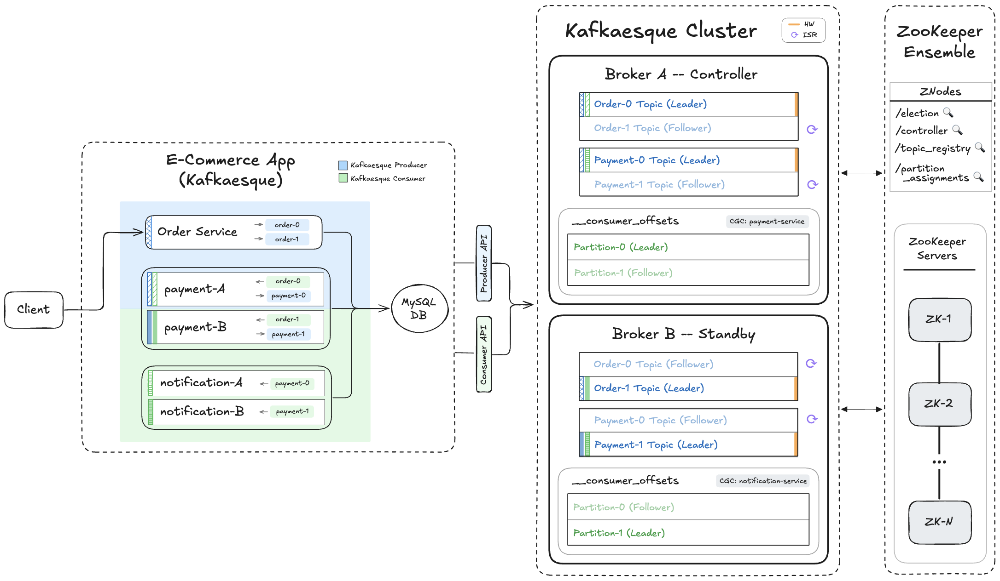

# 📺 Kafka – Section 4e

In this section, we make replication **peer-aware** by allowing each broker to dynamically discover the other broker through ZooKeeper and run replication in both directions. We also introduce **bootstrap-aware replication** so late-joining brokers can safely catch up on existing data before transitioning into normal steady-state replication.

<div align="center">
    
</div>

## 🎥 Video Walkthrough

**Title:** Kafka – Section 4e  
**Link:** [Watch on Udemy](https://www.udemy.com/course/practical-system-design/learn/lecture/55998935#overview)

# ⚙️ Instructions and Commands

From `~/Desktop/kafka_demo` (project root):

### 1. Start `zkServer` & `zkCli`

Refer back to **[Section 4A (Part 1) → Step 6](/chapter_4/section_4a/README.md#6-start-zkServer--zkCli)** for the commands to start ZooKeeper server and CLI.

### 2. Launch Kafkaesque `broker_a`

_Please make sure your virtual environment is activated, and that the dependencies are installed._  
_You can revisit **[Section 4C → Step 2](/chapter_4/section_4c/README.md#2-activate-the-virtual-environment)** for the specific commands._

```bash
BROKER_PORT=19092 BROKER_NAME=broker_a python -m kafkaesque
```

-  On **Windows PowerShell**:
  ```bash
  $env:BROKER_PORT="19092"; $env:BROKER_NAME="broker_a"; python -m kafkaesque
  ```

### 3. Create Topics on Controller (`minISR=1` for Data Topics)

Create the `Order` and `Payment` data topics with `partitions=2`, `RF=2` and `minISR=1`.

```bash
curl -X POST http://localhost:19092/topics \
  -H 'content-type: application/json' \
  -d '{"name":"order","partitions":2,"replication_factor":2,"minISR":1}'

curl -X POST http://localhost:19092/topics \
  -H 'content-type: application/json' \
  -d '{"name":"payment","partitions":2,"replication_factor":2,"minISR":1}'
```

-  On **Windows PowerShell**:

  ```bash
  curl.exe -X POST http://localhost:19092/topics `
    -H 'content-type: application/json' `
    -d '{\"name\":\"order\",\"partitions\":2,\"replication_factor\":2,\"minISR\":1}'

  curl.exe -X POST http://localhost:19092/topics `
    -H 'content-type: application/json' `
    -d '{\"name\":\"payment\",\"partitions\":2,\"replication_factor\":2,\"minISR\":1}'
  ```

Create the internal `__consumer_offsets` topic with `partitions=2`, `RF=2` and no `minISR` value.

```bash
curl -X POST http://localhost:19092/topics \
  -H 'content-type: application/json' \
  -d '{"name":"__consumer_offsets","partitions":2,"replication_factor":2}'
```

-  On **Windows PowerShell**:

  ```bash
  curl.exe -X POST http://localhost:19092/topics `
    -H 'content-type: application/json' `
    -d '{\"name\":\"__consumer_offsets\",\"partitions\":2,\"replication_factor\":2}'
  ```

_Verify that the correct folders and partition files have been created under the `.var` directory._

### 4. Launch `e_commerce_app_kafkaesque`

Refer back to **[Section 4C → Step 8](/chapter_4/section_4c/README.md#8-launch-e_commerce_app_kafkaesque)** for the command to launch `e_commerce_app_kafkaesque`.

### 5. Verify Internal State on `broker_a`

Hit the debug endpoint:

```bash
curl http://localhost:19092/debug
```

-  On **Windows PowerShell**:
  ```bash
  curl.exe http://localhost:19092/debug
  ```

### 6. Produce `order_1` + `order_2`

```bash
curl -X POST http://localhost:5001/produce \
  -H "Content-Type: application/json" \
  -d '{
    "topic": "order",
    "key": "order_1",
    "event": {
      "event_type": "OrderPlaced",
      "order_id": "order_1",
      "user_id": "user_1",
      "items": [
        { "product_id": "prod_1", "quantity": 2 },
        { "product_id": "prod_2", "quantity": 1 }
      ],
      "total_amount": 84.97,
      "timestamp": "2025-01-01T10:00:00Z"
    }
  }'

curl -X POST http://localhost:5001/produce \
  -H "Content-Type: application/json" \
  -d '{
    "topic": "order",
    "key": "order_2",
    "event": {
      "event_type": "OrderPlaced",
      "order_id": "order_2",
      "user_id": "user_1",
      "items": [
        { "product_id": "prod_3", "quantity": 1 }
      ],
      "total_amount": 39.99,
      "timestamp": "2025-01-01T10:00:30Z"
    }
  }'
```

-  On **Windows PowerShell:**
  - Use `curl.exe` instead of `curl` (to avoid the PowerShell alias)
  - Use backticks (`` ` ``) for multiline commands—**not** backslashes (`\`)
  - Any quotes inside your JSON payload must be escaped (use `\"` instead of `"`)

  ```bash
  curl.exe -X POST http://localhost:5001/produce `
    -H "Content-Type: application/json" `
    -d '{
      \"topic\": \"order\",
      \"key\": \"order_1\",
      \"event\": {
        \"event_type\": \"OrderPlaced\",
        \"order_id\": \"order_1\",
        \"user_id\": \"user_1\",
        \"items\": [
          { \"product_id\": \"prod_1\", \"quantity\": 2 },
          { \"product_id\": \"prod_2\", \"quantity\": 1 }
        ],
        \"total_amount\": 84.97,
        \"timestamp\": \"2025-01-01T10:00:00Z\"
      }
    }'

  curl.exe -X POST http://localhost:5001/produce `
    -H "Content-Type: application/json" `
    -d '{
      \"topic\": \"order\",
      \"key\": \"order_2\",
      \"event\": {
        \"event_type\": \"OrderPlaced\",
        \"order_id\": \"order_2\",
        \"user_id\": \"user_1\",
        \"items\": [
          { \"product_id\": \"prod_3\", \"quantity\": 1 }
        ],
      \"total_amount\": 39.99,
      \"timestamp\": \"2025-01-01T10:00:30Z\"
    }
  }'
  ```

### 7. Verify Internal State on `broker_a`

Refer back to **[Step 5](#5-verify-internal-state-on-broker_a)** for the debug command.

### 8. Launch Kafkaesque `broker_b`

_Please make sure your virtual environment is activated, and that the dependencies are installed._  
_You can revisit **[Section 4C → Step 2](/chapter_4/section_4c/README.md#2-activate-the-virtual-environment)** for the specific commands._

```bash
BROKER_PORT=29092 BROKER_NAME=broker_b python -m kafkaesque
```

-  On **Windows PowerShell**:
  ```bash
  $env:BROKER_PORT="29092"; $env:BROKER_NAME="broker_b"; python -m kafkaesque
  ```

### 9. Verify Internal State on `broker_a` and `broker_b`

Hit the debug endpoint:

```bash
curl http://localhost:19092/debug
curl http://localhost:29092/debug
```

-  On **Windows PowerShell**:
  ```bash
  curl.exe http://localhost:19092/debug
  curl.exe http://localhost:29092/debug
  ```

### 10. Shut Down Kafkaesque Brokers and `e_commerce_app_kafkaesque`

In the terminal windows running `broker_a` and `broker_b`, stop each process:

```bash
Ctrl + C
```

Stop the `e_commerce_app_kafkaesque` process:

```bash
Ctrl + C
```

### 11. Shut Down ZooKeeper CLI & Server

In the terminal windows running `zkCli` and `zkServer`, stop each process:

```bash
Ctrl + C
```

> _Press `Y` if prompted to terminate batches_

### 12. Clean Up Kafkaesque & ZooKeeper State

```bash
rm -rf .var
```

-  On **Windows PowerShell**:
  ```bash
  Remove-Item .var -Recurse
  ```

### 13. Clean Up `Orders` Table

> _Refer back to **[Section 1D → Step 4](/chapter_1//section_1d/README.md#4-ensure-the-app_db_endpoint-environment-variable-is-set)** to set the `APP_DB_ENDPOINT` environment variable._

```bash
docker run --rm -e MYSQL_PWD='Password100!' mysql:8.0 \
  mysql -h $APP_DB_ENDPOINT -u admin \
  --table -e "USE services_db; TRUNCATE TABLE Orders;"
```

-  On **Windows PowerShell**, run the command on a single line (no line breaks):
  ```bash
  docker run --rm -e MYSQL_PWD='Password100!' mysql:8.0 mysql -h $APP_DB_ENDPOINT -u admin --table -e "USE services_db; TRUNCATE TABLE Orders;"
  ```

<br>
