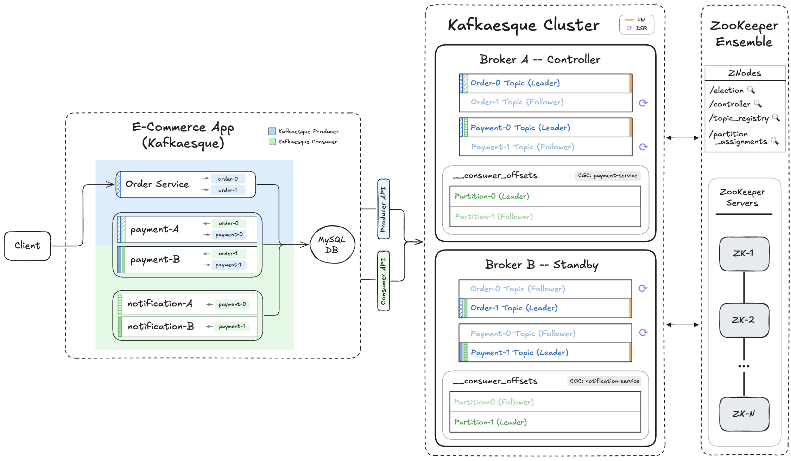

# 📺 Kafka – Section 4f

In this section, we introduce **request proxying** so brokers can automatically forward requests to the correct leader broker in the cluster. This allows controller requests, partition reads and writes, and consumer-group coordination requests to be routed dynamically based on the current ZooKeeper-driven cluster state.

- **Part 1 — Request Proxy Implementation**:  
  We update the broker endpoints to apply proxy-aware routing, then implement the router module to forward requests to the controller, partition leader, or consumer group coordinator when needed.

- **Part 2 — Request Proxy Validation**:  
  We validate proxy behavior end to end with a happy-path `minISR=1` flow, then test stricter `minISR=2` scenarios to observe request routing, broker failover, consumer rebalancing, and recovery under failure.

<div align="center">
    
</div>

## 🎥 Video Walkthrough

### 🔹 Part 1: Request Proxy Implementation

**Title:** Kafka – Section 4f (Part 1)  
**Link:** [Watch on Udemy](https://www.udemy.com)

### 🔹 Part 2: Request Proxy Validation

**Title:** Kafka – Section 4f (Part 2)  
**Link:** [Watch on Udemy](https://www.udemy.com)

# ⚙️ Instructions and Commands

## ✏️ Part 1 – Request Proxy Implementation

From `~/Desktop/kafka_demo` (project root):

### 1. Update `broker/app.py` to Enable Request Proxying

Add the appropriate proxy decorators to endpoints in `broker/app.py` so that requests are automatically routed to the correct leader (**Controller**, **Partition Leader**, or **Consumer Group Coordinator**).

### 2. Create Router Module

```bash
touch kafkaesque/broker/router.py
```

-  On **Windows PowerShell**:
  ```bash
  New-Item kafkaesque/broker/router.py
  ```

_Paste in `router.py` starter code._

<br>

## ✏️ Part 2 – Request Proxy Validation

### **🔬 Test Scenario 1 &nbsp; — &nbsp; `minISR=1`**

<details>
<summary><strong>Show Steps</strong></summary>
<br>

From `~/Desktop/kafka_demo` (project root):

### 1. Start `zkServer` & `zkCli`

Refer back to **[Section 4A (Part 1) → Step 6](/chapter_4/section_4a/README.md#6-start-zkServer--zkCli)** for the commands to start ZooKeeper server and CLI.

### 2. Launch Kafkaesque `broker_a`

_Please make sure your virtual environment is activated, and that the dependencies are installed._  
_You can revisit **[Section 4C → Step 2](/chapter_4/section_4c/README.md#2-activate-the-virtual-environment)** for the specific commands._

```bash
BROKER_PORT=19092 BROKER_NAME=broker_a python -m kafkaesque
```

-  On **Windows PowerShell**:
  ```bash
  $env:BROKER_PORT="19092"; $env:BROKER_NAME="broker_a"; python -m kafkaesque
  ```

### 3. Create Topics on Controller (`minISR=1` for Data Topics)

Create the `Order` and `Payment` data topics with `partitions=2`, `RF=2` and `minISR=1`.

```bash
curl -X POST http://localhost:19092/topics \
  -H 'content-type: application/json' \
  -d '{"name":"order","partitions":2,"replication_factor":2,"minISR":1}'

curl -X POST http://localhost:19092/topics \
  -H 'content-type: application/json' \
  -d '{"name":"payment","partitions":2,"replication_factor":2,"minISR":1}'
```

-  On **Windows PowerShell**:

  ```bash
  curl.exe -X POST http://localhost:19092/topics `
    -H 'content-type: application/json' `
    -d '{\"name\":\"order\",\"partitions\":2,\"replication_factor\":2,\"minISR\":1}'

  curl.exe -X POST http://localhost:19092/topics `
    -H 'content-type: application/json' `
    -d '{\"name\":\"payment\",\"partitions\":2,\"replication_factor\":2,\"minISR\":1}'
  ```

Create the internal `__consumer_offsets` topic with `partitions=2`, `RF=2` and no `minISR` value.

```bash
curl -X POST http://localhost:19092/topics \
  -H 'content-type: application/json' \
  -d '{"name":"__consumer_offsets","partitions":2,"replication_factor":2}'
```

-  On **Windows PowerShell**:

  ```bash
  curl.exe -X POST http://localhost:19092/topics `
    -H 'content-type: application/json' `
    -d '{\"name\":\"__consumer_offsets\",\"partitions\":2,\"replication_factor\":2}'
  ```

_Verify that the correct folders and partition files have been created under the `.var` directory._

### 4. Launch `e_commerce_app_kafkaesque`

Launch app with both `broker_a` and `broker_b` addresses passed into `KAFKA_BOOTSTRAP`:

> _Please make sure that the `APP_DB_ENDPOINT` environment variable is properly set. You can revisit **[Section 1D → Step 4](/chapter_1/section_1d/README.md#4-ensure-the-app_db_endpoint-environment-variable-is-set)** for the specific commands._

```bash
KAFKA_BOOTSTRAP=localhost:19092,localhost:29092 \
  DB_HOST=$APP_DB_ENDPOINT \
  python -m e_commerce_app_kafkaesque.launcher
```

-  On **Windows PowerShell**:
  ```bash
  $env:KAFKA_BOOTSTRAP = "localhost:19092,localhost:29092"
  $env:DB_HOST = $APP_DB_ENDPOINT
  python -m e_commerce_app_kafkaesque.launcher
  ```

### 5. Verify Internal State on `broker_a`

Hit the debug endpoint:

```bash
curl http://localhost:19092/debug
```

-  On **Windows PowerShell**:
  ```bash
  curl.exe http://localhost:19092/debug
  ```

### 6. Produce `order_1` + `order_2`

```bash
curl -X POST http://localhost:5001/produce \
  -H "Content-Type: application/json" \
  -d '{
    "topic": "order",
    "key": "order_1",
    "event": {
      "event_type": "OrderPlaced",
      "order_id": "order_1",
      "user_id": "user_1",
      "items": [
        { "product_id": "prod_1", "quantity": 2 },
        { "product_id": "prod_2", "quantity": 1 }
      ],
      "total_amount": 84.97,
      "timestamp": "2025-01-01T10:00:00Z"
    }
  }'

curl -X POST http://localhost:5001/produce \
  -H "Content-Type: application/json" \
  -d '{
    "topic": "order",
    "key": "order_2",
    "event": {
      "event_type": "OrderPlaced",
      "order_id": "order_2",
      "user_id": "user_1",
      "items": [
        { "product_id": "prod_3", "quantity": 1 }
      ],
      "total_amount": 39.99,
      "timestamp": "2025-01-01T10:00:30Z"
    }
  }'
```

-  On **Windows PowerShell:**
  - Use `curl.exe` instead of `curl` (to avoid the PowerShell alias)
  - Use backticks (`` ` ``) for multiline commands—**not** backslashes (`\`)
  - Any quotes inside your JSON payload must be escaped (use `\"` instead of `"`)

  ```bash
  curl.exe -X POST http://localhost:5001/produce `
    -H "Content-Type: application/json" `
    -d '{
      \"topic\": \"order\",
      \"key\": \"order_1\",
      \"event\": {
        \"event_type\": \"OrderPlaced\",
        \"order_id\": \"order_1\",
        \"user_id\": \"user_1\",
        \"items\": [
          { \"product_id\": \"prod_1\", \"quantity\": 2 },
          { \"product_id\": \"prod_2\", \"quantity\": 1 }
        ],
        \"total_amount\": 84.97,
        \"timestamp\": \"2025-01-01T10:00:00Z\"
      }
    }'

  curl.exe -X POST http://localhost:5001/produce `
    -H "Content-Type: application/json" `
    -d '{
      \"topic\": \"order\",
      \"key\": \"order_2\",
      \"event\": {
        \"event_type\": \"OrderPlaced\",
        \"order_id\": \"order_2\",
        \"user_id\": \"user_1\",
        \"items\": [
          { \"product_id\": \"prod_3\", \"quantity\": 1 }
        ],
      \"total_amount\": 39.99,
      \"timestamp\": \"2025-01-01T10:00:30Z\"
    }
  }'
  ```

### 7. Verify Internal State on `broker_a`

Hit the debug endpoint:

```bash
curl http://localhost:19092/debug
```

-  On **Windows PowerShell**:
  ```bash
  curl.exe http://localhost:19092/debug
  ```

### 8. Launch Kafkaesque `broker_b`

_Please make sure your virtual environment is activated, and that the dependencies are installed._  
_You can revisit **[Section 4C → Step 2](/chapter_4/section_4c/README.md#2-activate-the-virtual-environment)** for the specific commands._

```bash
BROKER_PORT=29092 BROKER_NAME=broker_b python -m kafkaesque
```

-  On **Windows PowerShell**:
  ```bash
  $env:BROKER_PORT="29092"; $env:BROKER_NAME="broker_b"; python -m kafkaesque
  ```

### 9. Verify Internal State on `broker_a` and `broker_b`

Hit the debug endpoint:

```bash
curl http://localhost:19092/debug
curl http://localhost:29092/debug
```

-  On **Windows PowerShell**:
  ```bash
  curl.exe http://localhost:19092/debug
  curl.exe http://localhost:29092/debug
  ```

### 10. Produce `order_3` + `order_4`

```bash
curl -X POST http://localhost:5001/produce \
  -H "Content-Type: application/json" \
  -d '{
    "topic": "order",
    "key": "order_3",
    "event": {
      "event_type": "OrderPlaced",
      "order_id": "order_3",
      "user_id": "user_1",
      "items": [
        { "product_id": "prod_4", "quantity": 1 }
      ],
      "total_amount": 2.13,
      "timestamp": "2025-01-01T10:01:00Z"
    }
  }'

curl -X POST http://localhost:5001/produce \
  -H "Content-Type: application/json" \
  -d '{
    "topic": "order",
    "key": "order_4",
    "event": {
      "event_type": "OrderPlaced",
      "order_id": "order_4",
      "user_id": "user_1",
      "items": [
        { "product_id": "prod_5", "quantity": 1 }
      ],
      "total_amount": 4.11,
      "timestamp": "2025-01-01T10:01:30Z"
    }
  }'
```

-  On **Windows PowerShell:**
  - Use `curl.exe` instead of `curl` (to avoid the PowerShell alias)
  - Use backticks (`` ` ``) for multiline commands—**not** backslashes (`\`)
  - Any quotes inside your JSON payload must be escaped (use `\"` instead of `"`)

  ```bash
  curl.exe -X POST http://localhost:5001/produce `
    -H "Content-Type: application/json" `
    -d '{
      \"topic\": \"order\",
      \"key\": \"order_3\",
      \"event\": {
        \"event_type\": \"OrderPlaced\",
        \"order_id\": \"order_3\",
        \"user_id\": \"user_1\",
        \"items\": [
          { \"product_id\": \"prod_4\", \"quantity\": 1 }
        ],
        \"total_amount\": 2.13,
        \"timestamp\": \"2025-01-01T10:01:00Z\"
      }
    }'

  curl.exe -X POST http://localhost:5001/produce `
    -H "Content-Type: application/json" `
    -d '{
      \"topic\": \"order\",
      \"key\": \"order_4\",
      \"event\": {
        \"event_type\": \"OrderPlaced\",
        \"order_id\": \"order_4\",
        \"user_id\": \"user_1\",
        \"items\": [
          { \"product_id\": \"prod_5\", \"quantity\": 1 }
        ],
      \"total_amount\": 4.11,
      \"timestamp\": \"2025-01-01T10:01:30Z\"
    }
  }'
  ```

### 11. Verify Internal State on `broker_a` and `broker_b`

Hit the debug endpoint:

```bash
curl http://localhost:19092/debug
curl http://localhost:29092/debug
```

-  On **Windows PowerShell**:
  ```bash
  curl.exe http://localhost:19092/debug
  curl.exe http://localhost:29092/debug
  ```

### 12. Shut Down Kafkaesque Brokers and `e_commerce_app_kafkaesque`

In the terminal windows running `broker_a` and `broker_b`, stop each process:

```bash
Ctrl + C
```

Stop the `e_commerce_app_kafkaesque` process:

```bash
Ctrl + C
```

### 13. Shut Down ZooKeeper CLI & Server

In the terminal windows running `zkCli` and `zkServer`, stop each process:

```bash
Ctrl + C
```

> _Press `Y` if prompted to terminate batches_

### 14. Clean Up Kafkaesque & ZooKeeper State

```bash
rm -rf .var
```

-  On **Windows PowerShell**:
  ```bash
  Remove-Item .var -Recurse
  ```

### 15. Clean Up `Orders` Table

> _Refer back to **[Section 1D → Step 4](/chapter_1//section_1d/README.md#4-ensure-the-app_db_endpoint-environment-variable-is-set)** to set the `APP_DB_ENDPOINT` environment variable._

```bash
docker run --rm -e MYSQL_PWD='Password100!' mysql:8.0 \
  mysql -h $APP_DB_ENDPOINT -u admin \
  --table -e "USE services_db; TRUNCATE TABLE Orders;"
```

-  On **Windows PowerShell**, run the command on a single line (no line breaks):
  ```bash
  docker run --rm -e MYSQL_PWD='Password100!' mysql:8.0 mysql -h $APP_DB_ENDPOINT -u admin --table -e "USE services_db; TRUNCATE TABLE Orders;"
  ```

<br>

---

<br>

</details>

### **🔬 Test Scenario 2 &nbsp; — &nbsp; `minISR=2`**

<details>
<summary><strong>Show Steps</strong></summary>
<br>

From `~/Desktop/kafka_demo` (project root):

### 1. Start `zkServer` & `zkCli`

Refer back to **[Section 4A (Part 1) → Step 6](/chapter_4/section_4a/README.md#6-start-zkServer--zkCli)** for the commands to start ZooKeeper server and CLI.

### 2. Launch Kafkaesque Brokers

_Please make sure your virtual environment is activated, and that the dependencies are installed._  
_You can revisit **[Section 4C → Step 2](/chapter_4/section_4c/README.md#2-activate-the-virtual-environment)** for the specific commands._

Launch `broker_a` in first terminal window:

```bash
BROKER_PORT=19092 BROKER_NAME=broker_a python -m kafkaesque
```

-  On **Windows PowerShell**:
  ```bash
  $env:BROKER_PORT="19092"; $env:BROKER_NAME="broker_a"; python -m kafkaesque
  ```

Launch `broker_b` in a second terminal window:

```bash
BROKER_PORT=29092 BROKER_NAME=broker_b python -m kafkaesque
```

-  On **Windows PowerShell**:
  ```bash
  $env:BROKER_PORT="29092"; $env:BROKER_NAME="broker_b"; python -m kafkaesque
  ```

### 3. Create Topics on Standby Broker (`minISR=2` for Data Topics)

Create the `Order` and `Payment` data topics with `partitions=2`, `RF=2` and `minISR=2`.

```bash
curl -X POST http://localhost:29092/topics \
  -H 'content-type: application/json' \
  -d '{"name":"order","partitions":2,"replication_factor":2,"minISR":2}'

curl -X POST http://localhost:29092/topics \
  -H 'content-type: application/json' \
  -d '{"name":"payment","partitions":2,"replication_factor":2,"minISR":2}'
```

-  On **Windows PowerShell**:

  ```bash
  curl.exe -X POST http://localhost:29092/topics `
    -H 'content-type: application/json' `
    -d '{\"name\":\"order\",\"partitions\":2,\"replication_factor\":2,\"minISR\":2}'

  curl.exe -X POST http://localhost:29092/topics `
    -H 'content-type: application/json' `
    -d '{\"name\":\"payment\",\"partitions\":2,\"replication_factor\":2,\"minISR\":2}'
  ```

Create the internal `__consumer_offsets` topic with `partitions=2`, `RF=2` and no `minISR` value.

```bash
curl -X POST http://localhost:29092/topics \
  -H 'content-type: application/json' \
  -d '{"name":"__consumer_offsets","partitions":2,"replication_factor":2}'
```

-  On **Windows PowerShell**:

  ```bash
  curl.exe -X POST http://localhost:29092/topics `
    -H 'content-type: application/json' `
    -d '{\"name\":\"__consumer_offsets\",\"partitions\":2,\"replication_factor\":2}'
  ```

_Verify that the correct folders and partition files have been created under the `.var` directory._

### 4. Launch `e_commerce_app_kafkaesque`

Launch app with both `broker_a` and `broker_b` addresses passed into `KAFKA_BOOTSTRAP`:

> _Please make sure that the `APP_DB_ENDPOINT` environment variable is properly set. You can revisit **[Section 1D → Step 4](/chapter_1/section_1d/README.md#4-ensure-the-app_db_endpoint-environment-variable-is-set)** for the specific commands._

```bash
KAFKA_BOOTSTRAP=localhost:19092,localhost:29092 \
  DB_HOST=$APP_DB_ENDPOINT \
  python -m e_commerce_app_kafkaesque.launcher
```

-  On **Windows PowerShell**:
  ```bash
  $env:KAFKA_BOOTSTRAP = "localhost:19092,localhost:29092"
  $env:DB_HOST = $APP_DB_ENDPOINT
  python -m e_commerce_app_kafkaesque.launcher
  ```

### 5. Verify Internal State on `broker_a` and `broker_b`

Hit the debug endpoint:

```bash
curl http://localhost:19092/debug
curl http://localhost:29092/debug
```

-  On **Windows PowerShell**:
  ```bash
  curl.exe http://localhost:19092/debug
  curl.exe http://localhost:29092/debug
  ```

### 6. Produce `order_1` + `order_2`

```bash
curl -X POST http://localhost:5001/produce \
  -H "Content-Type: application/json" \
  -d '{
    "topic": "order",
    "key": "order_1",
    "event": {
      "event_type": "OrderPlaced",
      "order_id": "order_1",
      "user_id": "user_1",
      "items": [
        { "product_id": "prod_1", "quantity": 2 },
        { "product_id": "prod_2", "quantity": 1 }
      ],
      "total_amount": 84.97,
      "timestamp": "2025-01-01T10:00:00Z"
    }
  }'

curl -X POST http://localhost:5001/produce \
  -H "Content-Type: application/json" \
  -d '{
    "topic": "order",
    "key": "order_2",
    "event": {
      "event_type": "OrderPlaced",
      "order_id": "order_2",
      "user_id": "user_1",
      "items": [
        { "product_id": "prod_3", "quantity": 1 }
      ],
      "total_amount": 39.99,
      "timestamp": "2025-01-01T10:00:30Z"
    }
  }'
```

-  On **Windows PowerShell:**
  - Use `curl.exe` instead of `curl` (to avoid the PowerShell alias)
  - Use backticks (`` ` ``) for multiline commands—**not** backslashes (`\`)
  - Any quotes inside your JSON payload must be escaped (use `\"` instead of `"`)

  ```bash
  curl.exe -X POST http://localhost:5001/produce `
    -H "Content-Type: application/json" `
    -d '{
      \"topic\": \"order\",
      \"key\": \"order_1\",
      \"event\": {
        \"event_type\": \"OrderPlaced\",
        \"order_id\": \"order_1\",
        \"user_id\": \"user_1\",
        \"items\": [
          { \"product_id\": \"prod_1\", \"quantity\": 2 },
          { \"product_id\": \"prod_2\", \"quantity\": 1 }
        ],
        \"total_amount\": 84.97,
        \"timestamp\": \"2025-01-01T10:00:00Z\"
      }
    }'

  curl.exe -X POST http://localhost:5001/produce `
    -H "Content-Type: application/json" `
    -d '{
      \"topic\": \"order\",
      \"key\": \"order_2\",
      \"event\": {
        \"event_type\": \"OrderPlaced\",
        \"order_id\": \"order_2\",
        \"user_id\": \"user_1\",
        \"items\": [
          { \"product_id\": \"prod_3\", \"quantity\": 1 }
        ],
      \"total_amount\": 39.99,
      \"timestamp\": \"2025-01-01T10:00:30Z\"
    }
  }'
  ```

### 7. Verify Internal State on `broker_a` and `broker_b`

Hit the debug endpoint:

```bash
curl http://localhost:19092/debug
curl http://localhost:29092/debug
```

-  On **Windows PowerShell**:
  ```bash
  curl.exe http://localhost:19092/debug
  curl.exe http://localhost:29092/debug
  ```

### 8. Kill the Controller (`broker_a`)

In `broker_a`'s terminal window, stop the process:

```bash
Ctrl + C
```

### 9. Verify Internal State on `broker_b`

Hit the debug endpoint:

```bash
curl http://localhost:29092/debug
```

-  On **Windows PowerShell**:
  ```bash
  curl.exe http://localhost:29092/debug
  ```

### 10. Produce `order_3` with `minISR` Not Satisfied

```bash
curl -X POST http://localhost:5001/produce \
  -H "Content-Type: application/json" \
  -d '{
    "topic": "order",
    "key": "order_3",
    "event": {
      "event_type": "OrderPlaced",
      "order_id": "order_3",
      "user_id": "user_1",
      "items": [
        { "product_id": "prod_4", "quantity": 1 }
      ],
      "total_amount": 2.13,
      "timestamp": "2025-01-01T10:01:00Z"
    }
  }'
```

-  On **Windows PowerShell:**
  - Use `curl.exe` instead of `curl` (to avoid the PowerShell alias)
  - Use backticks (`` ` ``) for multiline commands—**not** backslashes (`\`)
  - Any quotes inside your JSON payload must be escaped (use `\"` instead of `"`)

  ```bash
  curl.exe -X POST http://localhost:5001/produce `
    -H "Content-Type: application/json" `
    -d '{
      \"topic\": \"order\",
      \"key\": \"order_3\",
      \"event\": {
        \"event_type\": \"OrderPlaced\",
        \"order_id\": \"order_3\",
        \"user_id\": \"user_1\",
        \"items\": [
          { \"product_id\": \"prod_4\", \"quantity\": 1 }
        ],
        \"total_amount\": 2.13,
        \"timestamp\": \"2025-01-01T10:01:00Z\"
      }
    }'
  ```

### 11. Bring `broker_a` back Online

```bash
BROKER_PORT=19092 BROKER_NAME=broker_a python -m kafkaesque
```

-  On **Windows PowerShell**:
  ```bash
  $env:BROKER_PORT="19092"; $env:BROKER_NAME="broker_a"; python -m kafkaesque
  ```

### 12. Verify Internal State on `broker_a` and `broker_b`

Hit the debug endpoint:

```bash
curl http://localhost:19092/debug
curl http://localhost:29092/debug
```

-  On **Windows PowerShell**:
  ```bash
  curl.exe http://localhost:19092/debug
  curl.exe http://localhost:29092/debug
  ```

### 13. Simulate Consumer Failure

Kill `payment-A` consumer:

```bash
lsof -i :5002
kill -9 <PID>
```

-  On **Windows PowerShell**:
  ```bash
  netstat -ano | findstr :5002
  Stop-Process -Id <PID> -Force
  ```

Kill `notification-B` consumer:

```bash
lsof -i :5103
kill -9 <PID>
```

-  On **Windows PowerShell**:
  ```bash
  netstat -ano | findstr :5103
  Stop-Process -Id <PID> -Force
  ```

### 14. Verify Internal State on `broker_a` and `broker_b`

Hit the debug endpoint:

```bash
curl http://localhost:19092/debug
curl http://localhost:29092/debug
```

-  On **Windows PowerShell**:
  ```bash
  curl.exe http://localhost:19092/debug
  curl.exe http://localhost:29092/debug
  ```

### 15. Produce `order_3`

```bash
curl -X POST http://localhost:5001/produce \
  -H "Content-Type: application/json" \
  -d '{
    "topic": "order",
    "key": "order_3",
    "event": {
      "event_type": "OrderPlaced",
      "order_id": "order_3",
      "user_id": "user_1",
      "items": [
        { "product_id": "prod_4", "quantity": 1 }
      ],
      "total_amount": 2.13,
      "timestamp": "2025-01-01T10:01:00Z"
    }
  }'
```

-  On **Windows PowerShell:**
  - Use `curl.exe` instead of `curl` (to avoid the PowerShell alias)
  - Use backticks (`` ` ``) for multiline commands—**not** backslashes (`\`)
  - Any quotes inside your JSON payload must be escaped (use `\"` instead of `"`)

  ```bash
  curl.exe -X POST http://localhost:5001/produce `
    -H "Content-Type: application/json" `
    -d '{
      \"topic\": \"order\",
      \"key\": \"order_3\",
      \"event\": {
        \"event_type\": \"OrderPlaced\",
        \"order_id\": \"order_3\",
        \"user_id\": \"user_1\",
        \"items\": [
          { \"product_id\": \"prod_4\", \"quantity\": 1 }
        ],
        \"total_amount\": 2.13,
        \"timestamp\": \"2025-01-01T10:01:00Z\"
      }
    }'
  ```

### 16. Simulate Consumer Recovery

> _Revisit **[Section 1D → Step 4](/chapter_1/section_1d/README.md#4-ensure-the-app_db_endpoint-environment-variable-is-set)** for the commands to set the `APP_DB_ENDPOINT` environment variable._

Spin `payment-A` back up:

```bash
PORT=5002 \
  GROUP_ID=payment_service \
  CLIENT_ID=payment-A \
  SUBSCRIPTIONS=order \
  KAFKA_BOOTSTRAP=localhost:19092,localhost:29092 \
  DB_HOST=$APP_DB_ENDPOINT \
  python -m e_commerce_app_kafkaesque.services.payment_service
```

-  On **Windows PowerShell**:
  ```bash
  $env:PORT = 5002
  $env:GROUP_ID = "payment_service"
  $env:CLIENT_ID = "payment-A"
  $env:SUBSCRIPTIONS = "order"
  $env:KAFKA_BOOTSTRAP = "localhost:19092,localhost:29092"
  $env:DB_HOST = $APP_DB_ENDPOINT
  python -m e_commerce_app_kafkaesque.services.payment_service
  ```

Spin `notification-B` back up:

```bash
PORT=5103 \
  GROUP_ID=notification_service \
  CLIENT_ID=notification-B \
  SUBSCRIPTIONS=payment \
  KAFKA_BOOTSTRAP=localhost:19092,localhost:29092 \
  DB_HOST=$APP_DB_ENDPOINT \
  python -m e_commerce_app_kafkaesque.services.notification_service
```

-  On **Windows PowerShell**:
  ```bash
  $env:PORT = 5103
  $env:GROUP_ID = "notification_service"
  $env:CLIENT_ID = "notification-B"
  $env:SUBSCRIPTIONS = "payment"
  $env:KAFKA_BOOTSTRAP = "localhost:19092,localhost:29092"
  $env:DB_HOST = $APP_DB_ENDPOINT
  python -m e_commerce_app_kafkaesque.services.notification_service
  ```

### 17. Verify Internal State on `broker_a` and `broker_b`

Hit the debug endpoint:

```bash
curl http://localhost:19092/debug
curl http://localhost:29092/debug
```

-  On **Windows PowerShell**:
  ```bash
  curl.exe http://localhost:19092/debug
  curl.exe http://localhost:29092/debug
  ```

### 18. Produce `order_4`

```bash
curl -X POST http://localhost:5001/produce \
  -H "Content-Type: application/json" \
  -d '{
    "topic": "order",
    "key": "order_4",
    "event": {
      "event_type": "OrderPlaced",
      "order_id": "order_4",
      "user_id": "user_1",
      "items": [
        { "product_id": "prod_5", "quantity": 1 }
      ],
      "total_amount": 4.11,
      "timestamp": "2025-01-01T10:01:30Z"
    }
  }'
```

-  On **Windows PowerShell:**
  - Use `curl.exe` instead of `curl` (to avoid the PowerShell alias)
  - Use backticks (`` ` ``) for multiline commands—**not** backslashes (`\`)
  - Any quotes inside your JSON payload must be escaped (use `\"` instead of `"`)

  ```bash
  curl.exe -X POST http://localhost:5001/produce `
    -H "Content-Type: application/json" `
    -d '{
      \"topic\": \"order\",
      \"key\": \"order_4\",
      \"event\": {
        \"event_type\": \"OrderPlaced\",
        \"order_id\": \"order_4\",
        \"user_id\": \"user_1\",
        \"items\": [
          { \"product_id\": \"prod_5\", \"quantity\": 1 }
        ],
      \"total_amount\": 4.11,
      \"timestamp\": \"2025-01-01T10:01:30Z\"
    }
  }'
  ```

### 19. Verify Internal State on `broker_a` and `broker_b`

Hit the debug endpoint:

```bash
curl http://localhost:19092/debug
curl http://localhost:29092/debug
```

-  On **Windows PowerShell**:
  ```bash
  curl.exe http://localhost:19092/debug
  curl.exe http://localhost:29092/debug
  ```

### 20. Verify Partition Files

```bash
for f in .var/kafkaesque/*/*/*.log; do echo "== $f =="; cat "$f"; done
```

-  On **Windows PowerShell**:
  ```bash
  Get-ChildItem .var\kafkaesque\*\*\*.log | ForEach-Object {
    $r=$_.FullName.Replace((Get-Location).Path + '\','')
    "== $r =="; Get-Content $_ }
  ```

### 21. Verify Orders in the Database

Refer back to **[Section 1D → Step 4](/chapter_1//section_1d/README.md#4-ensure-the-app_db_endpoint-environment-variable-is-set)** to set the `APP_DB_ENDPOINT` environment variable.

```bash
docker run --rm -e MYSQL_PWD='Password100!' mysql:8.0 \
  mysql -h $APP_DB_ENDPOINT -u admin \
  --table -e "USE services_db; SELECT * FROM Orders;"
```

-  On **Windows PowerShell**, run the command on a single line (no line breaks):
  ```bash
  docker run --rm -e MYSQL_PWD='Password100!' mysql:8.0 mysql -h $APP_DB_ENDPOINT -u admin --table -e "USE services_db; SELECT * FROM Orders;"
  ```

### 22. Shut Down Kafkaesque Brokers and Application Services

In the terminal windows running `broker_a` and `broker_b`, stop each process:

```bash
Ctrl + C
```

Stop the `e_commerce_app_kafkaesque` process:

```bash
Ctrl + C
```

Additionally, shut down the processes for `payment-A` and `notification-B` in their respective windows:

```bash
Ctrl + C
```

### 23. Shut Down ZooKeeper CLI & Server

In the terminal windows running `zkCli` and `zkServer`, stop each process:

```bash
Ctrl + C
```

> _Press `Y` if prompted to terminate batches_

### 24. Clean Up Kafkaesque & ZooKeeper State

```bash
rm -rf .var
```

-  On **Windows PowerShell**:
  ```bash
  Remove-Item .var -Recurse
  ```

### 25. Clean Up `Orders` Table

> _Refer back to **[Section 1D → Step 4](/chapter_1//section_1d/README.md#4-ensure-the-app_db_endpoint-environment-variable-is-set)** to set the `APP_DB_ENDPOINT` environment variable._

```bash
docker run --rm -e MYSQL_PWD='Password100!' mysql:8.0 \
  mysql -h $APP_DB_ENDPOINT -u admin \
  --table -e "USE services_db; TRUNCATE TABLE Orders;"
```

-  On **Windows PowerShell**, run the command on a single line (no line breaks):
  ```bash
  docker run --rm -e MYSQL_PWD='Password100!' mysql:8.0 mysql -h $APP_DB_ENDPOINT -u admin --table -e "USE services_db; TRUNCATE TABLE Orders;"
  ```

<br>

---

<br>

</details>

<br>
