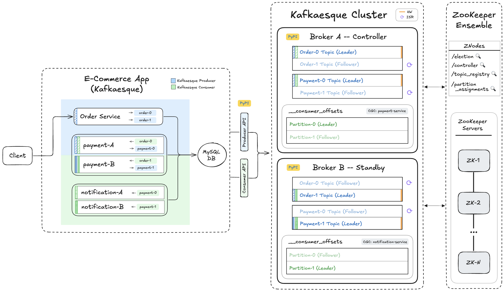

# 📺 Kafka – Section 5a

In this section, we **package Kafkaesque** for distribution and publish it to **Test PyPI**. We then verify that the published package works end to end by installing it into a clean environment and running the full Kafkaesque + e-commerce workflow using the released package instead of the local source code.

- **Part 1 — Test PyPI Packaging & Publish Flow**:  
  We create a Test PyPI account and API token, configure local publishing credentials, add the required packaging files, build and publish Kafkaesque, and prepare the e-commerce app to install Kafkaesque directly from Test PyPI.

- **Part 2 — Published Package Validation**:  
  We install Kafkaesque from Test PyPI into a clean environment, launch the brokers and e-commerce app from that installed package, produce all four orders, and verify broker state, log files, and database persistence end to end.

<div align="center">
    
</div>

## 🎥 Video Walkthrough

### 🔹 Part 1: Test PyPI Packaging & Publish Flow

**Title:** Kafka – Section 5a (Part 1)  
**Link:** [Watch on Udemy](https://www.udemy.com/course/practical-system-design/learn/lecture/55998953#overview)

### 🔹 Part 2: Published Package Validation

**Title:** Kafka – Section 5a (Part 2)  
**Link:** [Watch on Udemy](https://www.udemy.com/course/practical-system-design/learn/lecture/55998955#overview)

# ⚙️ Instructions and Commands

## ✏️ Part 1 – Test PyPI Packaging & Publish Flow

From `~/Desktop/kafka_demo` (project root):

### 1. Create or Update PyPI Configuration File

Create the file (if it doesn't already exist):

```bash
touch ~/.pypirc
```

-  On **Windows PowerShell**:
  ```bash
  New-Item ~/.pypirc
  ```

Verify the file contents:

```bash
cat ~/.pypirc
```

Open `~/.pypirc` in the code editor and add the following **TestPyPI** configuration:

```bash
[distutils]
index-servers = testpypi

[testpypi]
repository = https://test.pypi.org/legacy/
username = __token__
password = <YOUR_TEST_PYPI_API_TOKEN>
```

> _Replace `<YOUR_TEST_PYPI_API_TOKEN>` with the API token generated on [test.pypi.org](https://test.pypi.org)_

Verify the updated configuration:

```bash
cat ~/.pypirc
```

### 2. Create `LICENSE` File

```bash
touch LICENSE
```

-  On **Windows PowerShell**:
  ```bash
  New-Item LICENSE
  ```

> _Paste in `LICENSE` starter code._

### 3. Create `pyproject` Configuration File

```bash
touch pyproject.toml
```

-  On **Windows PowerShell**:
  ```bash
  New-Item pyproject.toml
  ```

> _Paste in `pyproject.toml` starter code._

### 4. Create `README` File

```bash
touch README.md
```

-  On **Windows PowerShell**:
  ```bash
  New-Item README.md
  ```

> _Paste in `README.md` starter code._

### 5. Build & Publish to TestPyPI

Make sure your virtual environment is activated:

```bash
source venv/bin/activate
```

-  On **Windows PowerShell**:
  ```bash
  .\venv\Scripts\Activate.ps1
  ```

Install or upgrade the required packaging tools:

```bash
pip install --upgrade build twine
```

Build the package:

```bash
python -m build
```

> _After running this command, a `dist/` directory should be created containing the package artifacts._

Upload the package to **TestPyPI**:

```bash
python -m twine upload -r testpypi dist/*
```

### 6. Create `e_commerce_app_kafkaesque` Requirements File

```bash
touch e_commerce_app_kafkaesque/requirements.txt
```

-  On **Windows PowerShell**:
  ```bash
  New-Item e_commerce_app_kafkaesque/requirements.txt
  ```

> _Paste in `requirements.txt` starter code._

<br>

## ✏️ Part 2 – Published Package Validation

### 1. Create the Release Test Directory

Create `kafkaesque_pypi_release_test`:

```bash
mkdir -p ~/Desktop/kafkaesque_pypi_release_test
```

Open the folder in VS Code:

```bash
code -n ~/Desktop/kafkaesque_pypi_release_test
```

> _Alternatively, you can also drag the `kafkaesque_pypi_release_test` folder directly into VS Code._

### 2. Set Up Test Virtual Environment

> <span style="color: gray;">📂 **Working directory:** `~/Desktop/kafkaesque_pypi_release_test`</span>

```bash
python3 -m venv test_venv
```

- Alternatively (on some systems):
  ```bash
  python -m venv test_venv
  ```

### 3. Activate Test Virtual Environment

> <span style="color: gray;">📂 **Working directory:** `~/Desktop/kafkaesque_pypi_release_test`</span>

```bash
source test_venv/bin/activate
```

-  On **Windows PowerShell**:

  ```bash
  .\test_venv\Scripts\Activate.ps1
  ```

- 💬 **Note**: If activation fails, you may need to allow script execution first:
  ```bash
  Set-ExecutionPolicy -Scope CurrentUser -ExecutionPolicy RemoteSigned -Force
  ```

### 4. Copy Over `e_commerce_app_kafkaesque`

> <span style="color: gray;">📂 **Working directory:** `~/Desktop/kafkaesque_pypi_release_test`</span>

```bash
rsync -a \
  --exclude='__pycache__' \
  ~/Desktop/kafka_demo/e_commerce_app_kafkaesque/ \
  ~/Desktop/kafkaesque_pypi_release_test/e_commerce_app_kafkaesque/
```

-  On **Windows PowerShell** use `robocopy`:
  ```bash
  robocopy `
    $HOME\Desktop\kafka_demo\e_commerce_app_kafkaesque `
    $HOME\Desktop\kafkaesque_pypi_release_test\e_commerce_app_kafkaesque `
    /E /XD __pycache__
  ```

### 5. Install Requirements

> <span style="color: gray;">📂 **Working directory:** `~/Desktop/kafkaesque_pypi_release_test`</span>

```bash
pip install -r e_commerce_app_kafkaesque/requirements.txt
```

> _After running this command, the `test_venv/lib` directory should contain a `kafkaesque` folder._

### 6. Start `zkServer` & `zkCli`

> <span style="color: gray;">📂 **Working directory:** `~/Desktop/kafka_demo`</span>

Start the ZooKeeper Server in foreground:

```bash
./apache-zookeeper-3.8.4-bin/bin/zkServer.sh start-foreground
```

-  On **Windows PowerShell**:
  ```bash
  .\apache-zookeeper-3.8.4-bin\bin\zkServer.cmd
  ```

Start ZooKeeper CLI:

```bash
./apache-zookeeper-3.8.4-bin/bin/zkCli.sh
```

-  On **Windows PowerShell**:
  ```bash
  .\apache-zookeeper-3.8.4-bin\bin\zkCli.cmd
  ```

### 7. Launch Kafkaesque `broker_a`

> <span style="color: gray;">📂 **Working directory:** `~/Desktop/kafkaesque_pypi_release_test`</span>

> _Please make sure your test virtual environment is activated. You can refer back to **[Step 3](#3-activate-test-virtual-environment)** for the exact command._

```bash
BROKER_PORT=19092 BROKER_NAME=broker_a kafkaesque
```

-  On **Windows PowerShell**:
  ```bash
  $env:BROKER_PORT="19092"; $env:BROKER_NAME="broker_a"; kafkaesque
  ```

### 8. Launch Kafkaesque `broker_b`

> <span style="color: gray;">📂 **Working directory:** `~/Desktop/kafkaesque_pypi_release_test`</span>

> _Please make sure your test virtual environment is activated. You can refer back to **[Step 3](#3-activate-test-virtual-environment)** for the exact command._

```bash
BROKER_PORT=29092 BROKER_NAME=broker_b kafkaesque
```

-  On **Windows PowerShell**:
  ```bash
  $env:BROKER_PORT="29092"; $env:BROKER_NAME="broker_b"; kafkaesque
  ```

### 9. Create Topics on Standby Broker (`minISR=2` for Data Topics)

> <span style="color: gray;">📂 **Working directory:** `~/Desktop/kafkaesque_pypi_release_test`</span>

Create the `Order` and `Payment` data topics with `partitions=2`, `RF=2` and `minISR=2`.

```bash
curl -X POST http://localhost:29092/topics \
  -H 'content-type: application/json' \
  -d '{"name":"order","partitions":2,"replication_factor":2,"minISR":2}'

curl -X POST http://localhost:29092/topics \
  -H 'content-type: application/json' \
  -d '{"name":"payment","partitions":2,"replication_factor":2,"minISR":2}'
```

-  On **Windows PowerShell**:

  ```bash
  curl.exe -X POST http://localhost:29092/topics `
    -H 'content-type: application/json' `
    -d '{\"name\":\"order\",\"partitions\":2,\"replication_factor\":2,\"minISR\":2}'

  curl.exe -X POST http://localhost:29092/topics `
    -H 'content-type: application/json' `
    -d '{\"name\":\"payment\",\"partitions\":2,\"replication_factor\":2,\"minISR\":2}'
  ```

Create the internal `__consumer_offsets` topic with `partitions=2`, `RF=2` and no `minISR` value.

```bash
curl -X POST http://localhost:29092/topics \
  -H 'content-type: application/json' \
  -d '{"name":"__consumer_offsets","partitions":2,"replication_factor":2}'
```

-  On **Windows PowerShell**:
  ```bash
  curl.exe -X POST http://localhost:29092/topics `
    -H 'content-type: application/json' `
    -d '{\"name\":\"__consumer_offsets\",\"partitions\":2,\"replication_factor\":2}'
  ```

> _Verify that the correct folders and partition files have been created under the `.var` directory._

### 10. Copy Over Environment Variable File

> <span style="color: gray;">📂 **Working directory:** `~/Desktop/kafkaesque_pypi_release_test`</span>

```bash
cp ~/Desktop/kafka_demo/terraform/rds/.env ~/Desktop/kafkaesque_pypi_release_test/
```

-  On **Windows PowerShell**:
  ```bash
  Copy-Item "$HOME\Desktop\kafka_demo\terraform\rds\.env.ps1" "$HOME\Desktop\kafkaesque_pypi_release_test\"
  ```

### 11. Ensure `APP_DB_ENDPOINT` Environment Variable Is Set

> <span style="color: gray;">📂 **Working directory:** `~/Desktop/kafkaesque_pypi_release_test`</span>

```bash
source .env
```

-  On **Windows PowerShell**:
  ```bash
  . .\.env.ps1
  ```

### 12. Launch `e_commerce_app_kafkaesque`

> <span style="color: gray;">📂 **Working directory:** `~/Desktop/kafkaesque_pypi_release_test`</span>

```bash
KAFKA_BOOTSTRAP=localhost:19092,localhost:29092 \
  DB_HOST=$APP_DB_ENDPOINT \
  python -m e_commerce_app_kafkaesque.launcher
```

-  On **Windows PowerShell**:
  ```bash
  $env:KAFKA_BOOTSTRAP = "localhost:19092,localhost:29092"
  $env:DB_HOST = $APP_DB_ENDPOINT
  python -m e_commerce_app_kafkaesque.launcher
  ```

### 13. Produce All 4 Test Orders (`order_1`, `order_2`, `order_3` and `order_4`)

> <span style="color: gray;">📂 **Working directory:** `~/Desktop/kafkaesque_pypi_release_test`</span>

```bash
curl -X POST http://localhost:5001/produce \
  -H "Content-Type: application/json" \
  -d '{
    "topic": "order",
    "key": "order_1",
    "event": {
      "event_type": "OrderPlaced",
      "order_id": "order_1",
      "user_id": "user_1",
      "items": [
        { "product_id": "prod_1", "quantity": 2 },
        { "product_id": "prod_2", "quantity": 1 }
      ],
      "total_amount": 84.97,
      "timestamp": "2025-01-01T10:00:00Z"
    }
  }'

curl -X POST http://localhost:5001/produce \
  -H "Content-Type: application/json" \
  -d '{
    "topic": "order",
    "key": "order_2",
    "event": {
      "event_type": "OrderPlaced",
      "order_id": "order_2",
      "user_id": "user_1",
      "items": [
        { "product_id": "prod_3", "quantity": 1 }
      ],
      "total_amount": 39.99,
      "timestamp": "2025-01-01T10:00:30Z"
    }
  }'

curl -X POST http://localhost:5001/produce \
  -H "Content-Type: application/json" \
  -d '{
    "topic": "order",
    "key": "order_3",
    "event": {
      "event_type": "OrderPlaced",
      "order_id": "order_3",
      "user_id": "user_1",
      "items": [
        { "product_id": "prod_4", "quantity": 1 }
      ],
      "total_amount": 2.13,
      "timestamp": "2025-01-01T10:01:00Z"
    }
  }'

curl -X POST http://localhost:5001/produce \
  -H "Content-Type: application/json" \
  -d '{
    "topic": "order",
    "key": "order_4",
    "event": {
      "event_type": "OrderPlaced",
      "order_id": "order_4",
      "user_id": "user_1",
      "items": [
        { "product_id": "prod_5", "quantity": 1 }
      ],
      "total_amount": 4.11,
      "timestamp": "2025-01-01T10:01:30Z"
    }
  }'
```

-  On **Windows PowerShell**:

  ```bash
  curl.exe -X POST http://localhost:5001/produce `
    -H "Content-Type: application/json" `
    -d '{
      \"topic\": \"order\",
      \"key\": \"order_1\",
      \"event\": {
        \"event_type\": \"OrderPlaced\",
        \"order_id\": \"order_1\",
        \"user_id\": \"user_1\",
        \"items\": [
          { \"product_id\": \"prod_1\", \"quantity\": 2 },
          { \"product_id\": \"prod_2\", \"quantity\": 1 }
        ],
        \"total_amount\": 84.97,
        \"timestamp\": \"2025-01-01T10:00:00Z\"
      }
    }'

  curl.exe -X POST http://localhost:5001/produce `
    -H "Content-Type: application/json" `
    -d '{
      \"topic\": \"order\",
      \"key\": \"order_2\",
      \"event\": {
        \"event_type\": \"OrderPlaced\",
        \"order_id\": \"order_2\",
        \"user_id\": \"user_1\",
        \"items\": [
          { \"product_id\": \"prod_3\", \"quantity\": 1 }
        ],
      \"total_amount\": 39.99,
      \"timestamp\": \"2025-01-01T10:00:30Z\"
    }
  }'

  curl.exe -X POST http://localhost:5001/produce `
    -H "Content-Type: application/json" `
    -d '{
      \"topic\": \"order\",
      \"key\": \"order_3\",
      \"event\": {
        \"event_type\": \"OrderPlaced\",
        \"order_id\": \"order_3\",
        \"user_id\": \"user_1\",
        \"items\": [
          { \"product_id\": \"prod_4\", \"quantity\": 1 }
        ],
        \"total_amount\": 2.13,
        \"timestamp\": \"2025-01-01T10:01:00Z\"
      }
    }'

  curl.exe -X POST http://localhost:5001/produce `
    -H "Content-Type: application/json" `
    -d '{
      \"topic\": \"order\",
      \"key\": \"order_4\",
      \"event\": {
        \"event_type\": \"OrderPlaced\",
        \"order_id\": \"order_4\",
        \"user_id\": \"user_1\",
        \"items\": [
          { \"product_id\": \"prod_5\", \"quantity\": 1 }
        ],
      \"total_amount\": 4.11,
      \"timestamp\": \"2025-01-01T10:01:30Z\"
    }
  }'
  ```

### 14. Verify Internal State on `broker_a` and `broker_b`

> <span style="color: gray;">📂 **Working directory:** `~/Desktop/kafkaesque_pypi_release_test`</span>

```bash
curl http://localhost:19092/debug
curl http://localhost:29092/debug
```

-  On **Windows PowerShell**:
  ```bash
  curl.exe http://localhost:19092/debug
  curl.exe http://localhost:29092/debug
  ```

### 15. Shut Down Kafkaesque Brokers and `e_commerce_app_kafkaesque`

> <span style="color: gray;">📂 **Working directory:** `~/Desktop/kafkaesque_pypi_release_test`</span>

In the terminal windows running `broker_a` and `broker_b`, stop each process:

```bash
Ctrl + C
```

Stop the `e_commerce_app_kafkaesque` process:

```bash
Ctrl + C
```

### 16. Verify Partition Files

> <span style="color: gray;">📂 **Working directory:** `~/Desktop/kafkaesque_pypi_release_test`</span>

```bash
for f in .var/kafkaesque/*/*/*.log; do echo "== $f =="; cat "$f"; done
```

-  On **Windows PowerShell**:
  ```bash
  Get-ChildItem .var\kafkaesque\*\*\*.log | ForEach-Object {
    $r=$_.FullName.Replace((Get-Location).Path + '\','')
    "== $r =="; Get-Content $_ }
  ```

### 17. Verify Orders in the Database

> <span style="color: gray;">📂 **Working directory:** `~/Desktop/kafkaesque_pypi_release_test`</span>

> _Refer back to **[Step 11](#6-ensure-app_db_endpoint-environment-variable-is-set)** to set the `APP_DB_ENDPOINT` environment variable._

```bash
docker run --rm -e MYSQL_PWD='Password100!' mysql:8.0 \
  mysql -h $APP_DB_ENDPOINT -u admin \
  --table -e "USE services_db; SELECT * FROM Orders;"
```

-  On **Windows PowerShell**:
  ```bash
  docker run --rm -e MYSQL_PWD='Password100!' mysql:8.0 `
    mysql -h $APP_DB_ENDPOINT -u admin `
    --table -e "USE services_db; SELECT * FROM Orders;"
  ```

### 18. Close & Delete `kafkaesque_pypi_release_test`

> <span style="color: gray;">📂 **Working directory:** `~/Desktop/kafka_demo`</span>

```bash
rm -rf ~/Desktop/kafkaesque_pypi_release_test
```

-  On **Windows PowerShell**:
  ```bash
  Remove-Item ~/Desktop/kafkaesque_pypi_release_test -Recurse
  ```

### 19. Shutdown & Reset Environment

> <span style="color: gray;">📂 **Working directory:** `~/Desktop/kafka_demo`</span>

In the terminal windows running `zkCli` and `zkServer`, stop each process:

```bash
Ctrl + C
```

> _Press `Y` if prompted to terminate batches_

Clean up ZooKeeper state:

```bash
rm -rf .var
```

-  On **Windows PowerShell**:
  ```bash
  Remove-Item .var -Recurse
  ```

Clear out `Orders` table:

> _Refer back to **[Section 1D → Step 6](/chapter_1/section_1d/README.md#6-ensure-the-app_db_endpoint-environment-variable-is-set)** to set the `APP_DB_ENDPOINT` environment variable._

```bash
docker run --rm -e MYSQL_PWD='Password100!' mysql:8.0 \
  mysql -h $APP_DB_ENDPOINT -u admin \
  --table -e "USE services_db; TRUNCATE TABLE Orders;"
```

-  On **Windows PowerShell**:
  ```bash
  docker run --rm -e MYSQL_PWD='Password100!' mysql:8.0 `
    mysql -h $APP_DB_ENDPOINT -u admin `
    --table -e "USE services_db; TRUNCATE TABLE Orders;"
  ```

<br>
