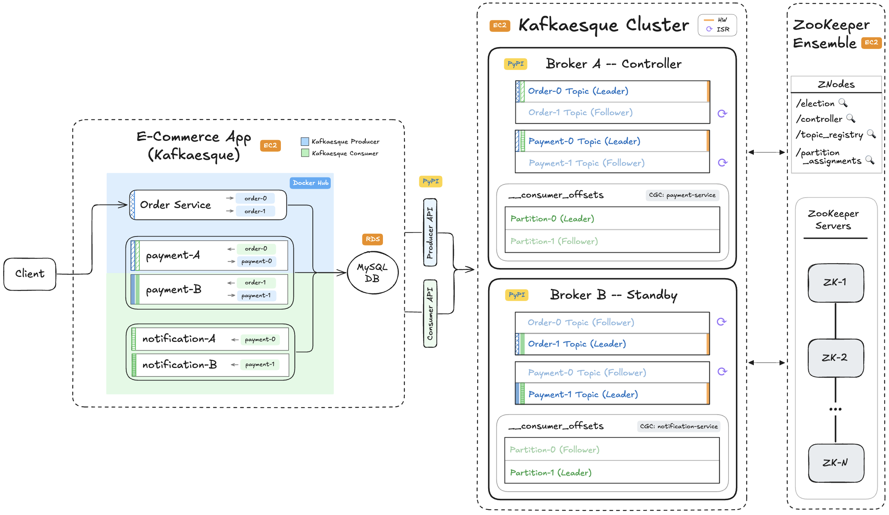

# 📺 Kafka – Section 5b

In this section, we **deploy the full Kafkaesque system to AWS**, including ZooKeeper, multi-broker infrastructure, and the e-commerce application. We package the application as a Docker image, provision cloud resources with Terraform, and validate the entire system end to end in a real cloud environment.

- **Part 1 — Dockerization & Terraform Infrastructure Setup**:  
  We containerize the e-commerce application, push the image to Docker Hub, and define the full AWS infrastructure using Terraform, including EC2 instances for ZooKeeper, Kafkaesque brokers, and the application, along with an RDS database.

- **Part 2 — AWS Deployment & End-to-End Validation**:  
  We apply the Terraform configuration to deploy the system, verify all services, produce test events, validate broker state and database persistence, and finally tear down the infrastructure.

<div align="center">
    
</div>

## 🎥 Video Walkthrough

### 🔹 Part 1: Dockerization & Terraform Infrastructure Setup

**Title:** Kafka – Section 5b (Part 1)  
**Link:** [Watch on Udemy](https://www.udemy.com/course/practical-system-design/learn/lecture/55998961#overview)

### 🔹 Part 2: AWS Deployment & End-to-End Validation

**Title:** Kafka – Section 5b (Part 2)  
**Link:** [Watch on Udemy](https://www.udemy.com/course/practical-system-design/learn/lecture/55998965#overview)

# ⚙️ Instructions and Commands

## ✏️ Part 1 – Dockerization & Terraform Infrastructure Setup

From `~/Desktop/kafka_demo` (project root):

### 1. Create `e_commerce_app_kafkaesque` Dockerfile

```bash
touch e_commerce_app_kafkaesque/dockerfile
```

-  On **Windows PowerShell**:
  ```bash
  New-Item e_commerce_app_kafkaesque/dockerfile
  ```

> _Paste in `dockerfile` starter code._

### 2. Build & Push to Docker Hub

Navigate into the `e_commerce_app_kafkaesque` directory:

```bash
cd e_commerce_app_kafkaesque
```

Authenticate with docker:

```bash
docker logout && docker login
```

-  On **Windows PowerShell**:
  ```bash
  docker logout; docker login
  ```

Remove previous `buildx` (if one exists):

```bash
docker buildx rm multi
```

Create new `buildx`:

```bash
docker buildx create --name multi --use --bootstrap
```

Build the multi-platform Docker image and push it to Docker Hub:

> _Replace `<YOUR_DOCKERHUB_USERNAME>` with your own username)_

```bash
docker buildx build \
  --platform linux/amd64,linux/arm64 \
  -t <YOUR_DOCKERHUB_USERNAME>/e-commerce-app-kafkaesque:latest \
  --push .
```

-  On **Windows PowerShell**:
  ```bash
  docker buildx build `
    --platform linux/amd64,linux/arm64 `
    -t <YOUR_DOCKERHUB_USERNAME>/e-commerce-app-kafkaesque:latest `
    --push .
  ```

### 3. Create Terraform project

Navigate back into `~/Desktop/kafka_demo` (project root):

```bash
cd ..
```

Create directory for `full-stack-kafkaesque` configuration:

```bash
mkdir terraform/full-stack-kafkaesque
```

Create `main.tf` file:

```bash
touch terraform/full-stack-kafkaesque/main.tf
```

-  On **Windows PowerShell**:
  ```bash
  New-Item terraform/full-stack-kafkaesque/main.tf
  ```

> _Paste in the Terraform starter code._

<br>

## ✏️ Part 2 – AWS Deployment & End-to-End Validation

### 1. Deploy with Terraform

Navigate into `terraform/full-stack-kafkaesque`:

```bash
cd terraform/full-stack-kafkaesque
```

Initialize Terraform:

```bash
terraform init
```

Apply Terraform configuration (this runs the plan step as well):

```bash
terraform apply
```

> _When prompted, type `yes` to confirm the deployment._

### 2. Capture Terraform Outputs as Environment Variables

Run these commands inside `<project_root>/terraform/full-stack-kafkaesque`:

```bash
FULLSTACK_KAFKAESQUE_DB_ENDPOINT=$(terraform output -raw fullstack_kafkaesque_db_endpoint)
KAFKAESQUE_BOOTSTRAP_URL=$(terraform output -raw kafkaesque_bootstrap_url)
E_COMMERCE_APP_KAFKAESQUE_URL=$(terraform output -raw e_commerce_app_kafkaesque_url)
ZOOKEEPER_URL=$(terraform output -raw zookeeper_url)
```

-  On **Windows PowerShell**:
  ```bash
  $FULLSTACK_KAFKAESQUE_DB_ENDPOINT = terraform output -raw fullstack_kafkaesque_db_endpoint
  $KAFKAESQUE_BOOTSTRAP_URL = terraform output -raw kafkaesque_bootstrap_url
  $E_COMMERCE_APP_KAFKAESQUE_URL = terraform output -raw e_commerce_app_kafkaesque_url
  $ZOOKEEPER_URL = terraform output -raw zookeeper_url
  ```

### 3. Verify RDS Database Deployment

```bash
docker run --rm -e MYSQL_PWD='Password100!' mysql:8.0 \
  mysql -h $FULLSTACK_KAFKAESQUE_DB_ENDPOINT -u admin \
  --table -e "USE services_db; SHOW TABLES;"
```

-  On **Windows PowerShell**:
  ```bash
  docker run --rm -e MYSQL_PWD='Password100!' mysql:8.0 `
    mysql -h $FULLSTACK_KAFKAESQUE_DB_ENDPOINT -u admin `
    --table -e "USE services_db; SHOW TABLES;"
  ```

### 4. Prepare to SSH

Navigate back into `~/Desktop/kafka_demo`

```bash
cd ../..
```

If you're on **macOS or Linux**, set the correct permissions on the key pair file (**Windows PowerShell** users can usually skip the `chmod` step):

```bash
chmod 400 "ecommerce-app-fullstack-keypair.pem"
```

### 5. Verify ZooKeeper Deployment

SSH into the ZooKeeper EC2 instance:

```bash
ssh -i "ecommerce-app-fullstack-keypair.pem" ubuntu@$ZOOKEEPER_URL
```

-  On **Windows PowerShell**:
  ```bash
  ssh -i "ecommerce-app-fullstack-keypair.pem" "ubuntu@${ZOOKEEPER_URL}"
  ```

> _When prompted, type `yes` for fingerprint verification._

Inside the **ZooKeeper EC2** instance:

- Navigate to `/opt`
  ```bash
  cd /opt
  ```
- List out directory contents
  ```bash
  ls
  ```
- Check `zkServer` status
  ```bash
  ./apache-zookeeper-3.8.4-bin/bin/zkServer.sh status
  ```
- Connect to `zkCli`
  ```bash
  ./apache-zookeeper-3.8.4-bin/bin/zkCli.sh
  ```
- From the ZooKeeper CLI, run the following commands
  ```bash
  ls /
  ls /election
  get /controller
  ```
- Exit ZooKeeper CLI
  ```bash
  Ctrl + C
  ```
- Exit the EC2 Instance
  ```bash
  exit
  ```

### 6. Verify Kafkaesque EC2 Deployment

Hit the broker debug endpoints:

```bash
curl "$KAFKAESQUE_BOOTSTRAP_URL:19092/debug"
curl "$KAFKAESQUE_BOOTSTRAP_URL:29092/debug"
```

-  On **Windows PowerShell**:
  ```bash
  curl.exe "${KAFKAESQUE_BOOTSTRAP_URL}:19092/debug"
  curl.exe "${KAFKAESQUE_BOOTSTRAP_URL}:29092/debug"
  ```

SSH into the Kafkaesque EC2 instance:

```bash
ssh -i "ecommerce-app-fullstack-keypair.pem" ubuntu@$KAFKAESQUE_BOOTSTRAP_URL
```

-  On **Windows PowerShell**:
  ```bash
  ssh -i "ecommerce-app-fullstack-keypair.pem" "ubuntu@${KAFKAESQUE_BOOTSTRAP_URL}"
  ```

> _When prompted, type `yes` for fingerprint verification._

Inside the **Kafkaesque EC2** instance:

- Inspect the Kafkaesque data directory
  ```bash
  ls .var/kafkaesque
  ```
- List all running Docker containers
  ```bash
  sudo docker ps
  ```
- View logs for **Broker A**
  ```bash
  sudo docker logs kafkaesque-broker-a
  ```
- View logs for **Broker B**
  ```bash
  sudo docker logs kafkaesque-broker-b
  ```
- Exit the EC2 Instance
  ```bash
  exit
  ```

### 7. Verify `e_commerce_app_kafkaesque` EC2 Deployment

SSH into the `e_commerce_app_kafkaesque` EC2 instance:

```bash
ssh -i "ecommerce-app-fullstack-keypair.pem" ubuntu@$E_COMMERCE_APP_KAFKAESQUE_URL
```

-  On **Windows PowerShell**:
  ```bash
  ssh -i "ecommerce-app-fullstack-keypair.pem" "ubuntu@${E_COMMERCE_APP_KAFKAESQUE_URL}"
  ```

> _When prompted, type `yes` for fingerprint verification._

Inside the **`e_commerce_app_kafkaesque` EC2** instance:

- List running Docker containers
  ```bash
  sudo docker ps
  ```
- View app logs
  ```bash
  sudo docker logs e-commerce-app-kafkaesque
  ```
- Exit the EC2 Instance
  ```bash
  exit
  ```

### 8. Produce All 4 Test Orders (`order_1`, `order_2`, `order_3` and `order_4`)

```bash
curl -X POST "$E_COMMERCE_APP_KAFKAESQUE_URL:5001/produce" \
  -H "Content-Type: application/json" \
  -d '{
    "topic": "order",
    "key": "order_1",
    "event": {
      "event_type": "OrderPlaced",
      "order_id": "order_1",
      "user_id": "user_1",
      "items": [
        { "product_id": "prod_1", "quantity": 2 },
        { "product_id": "prod_2", "quantity": 1 }
      ],
      "total_amount": 84.97,
      "timestamp": "2025-01-01T10:00:00Z"
    }
  }'

curl -X POST "$E_COMMERCE_APP_KAFKAESQUE_URL:5001/produce" \
  -H "Content-Type: application/json" \
  -d '{
    "topic": "order",
    "key": "order_2",
    "event": {
      "event_type": "OrderPlaced",
      "order_id": "order_2",
      "user_id": "user_1",
      "items": [
        { "product_id": "prod_3", "quantity": 1 }
      ],
      "total_amount": 39.99,
      "timestamp": "2025-01-01T10:00:30Z"
    }
  }'

curl -X POST "$E_COMMERCE_APP_KAFKAESQUE_URL:5001/produce" \
  -H "Content-Type: application/json" \
  -d '{
    "topic": "order",
    "key": "order_3",
    "event": {
      "event_type": "OrderPlaced",
      "order_id": "order_3",
      "user_id": "user_1",
      "items": [
        { "product_id": "prod_4", "quantity": 1 }
      ],
      "total_amount": 2.13,
      "timestamp": "2025-01-01T10:01:00Z"
    }
  }'

curl -X POST "$E_COMMERCE_APP_KAFKAESQUE_URL:5001/produce" \
  -H "Content-Type: application/json" \
  -d '{
    "topic": "order",
    "key": "order_4",
    "event": {
      "event_type": "OrderPlaced",
      "order_id": "order_4",
      "user_id": "user_1",
      "items": [
        { "product_id": "prod_5", "quantity": 1 }
      ],
      "total_amount": 4.11,
      "timestamp": "2025-01-01T10:01:30Z"
    }
  }'
```

-  On **Windows PowerShell:**

  ```bash
  curl.exe -X POST "${E_COMMERCE_APP_KAFKAESQUE_URL}:5001/produce" `
    -H "Content-Type: application/json" `
    -d '{
      \"topic\": \"order\",
      \"key\": \"order_1\",
      \"event\": {
        \"event_type\": \"OrderPlaced\",
        \"order_id\": \"order_1\",
        \"user_id\": \"user_1\",
        \"items\": [
          { \"product_id\": \"prod_1\", \"quantity\": 2 },
          { \"product_id\": \"prod_2\", \"quantity\": 1 }
        ],
        \"total_amount\": 84.97,
        \"timestamp\": \"2025-01-01T10:00:00Z\"
      }
    }'

  curl.exe -X POST "${E_COMMERCE_APP_KAFKAESQUE_URL}:5001/produce" `
    -H "Content-Type: application/json" `
    -d '{
      \"topic\": \"order\",
      \"key\": \"order_2\",
      \"event\": {
        \"event_type\": \"OrderPlaced\",
        \"order_id\": \"order_2\",
        \"user_id\": \"user_1\",
        \"items\": [
          { \"product_id\": \"prod_3\", \"quantity\": 1 }
        ],
      \"total_amount\": 39.99,
      \"timestamp\": \"2025-01-01T10:00:30Z\"
    }
  }'

  curl.exe -X POST "${E_COMMERCE_APP_KAFKAESQUE_URL}:5001/produce" `
    -H "Content-Type: application/json" `
    -d '{
      \"topic\": \"order\",
      \"key\": \"order_3\",
      \"event\": {
        \"event_type\": \"OrderPlaced\",
        \"order_id\": \"order_3\",
        \"user_id\": \"user_1\",
        \"items\": [
          { \"product_id\": \"prod_4\", \"quantity\": 1 }
        ],
        \"total_amount\": 2.13,
        \"timestamp\": \"2025-01-01T10:01:00Z\"
      }
    }'

  curl.exe -X POST "${E_COMMERCE_APP_KAFKAESQUE_URL}:5001/produce" `
    -H "Content-Type: application/json" `
    -d '{
      \"topic\": \"order\",
      \"key\": \"order_4\",
      \"event\": {
        \"event_type\": \"OrderPlaced\",
        \"order_id\": \"order_4\",
        \"user_id\": \"user_1\",
        \"items\": [
          { \"product_id\": \"prod_5\", \"quantity\": 1 }
        ],
      \"total_amount\": 4.11,
      \"timestamp\": \"2025-01-01T10:01:30Z\"
    }
  }'
  ```

### 9. Verify DB Writes:

```bash
docker run --rm -e MYSQL_PWD='Password100!' mysql:8.0 \
  mysql -h $FULLSTACK_KAFKAESQUE_DB_ENDPOINT -u admin \
  --table -e "USE services_db; SELECT * FROM Orders;"
```

-  On **Windows PowerShell**:
  ```bash
  docker run --rm -e MYSQL_PWD='Password100!' mysql:8.0 `
    mysql -h $FULLSTACK_KAFKAESQUE_DB_ENDPOINT -u admin `
    --table -e "USE services_db; SELECT * FROM Orders;"
  ```

### 10. Verify Kafkaesque EC2 Outputs

Hit the broker debug endpoints:

```bash
curl "$KAFKAESQUE_BOOTSTRAP_URL:19092/debug"
curl "$KAFKAESQUE_BOOTSTRAP_URL:29092/debug"
```

-  On **Windows PowerShell**:
  ```bash
  curl.exe "${KAFKAESQUE_BOOTSTRAP_URL}:19092/debug"
  curl.exe "${KAFKAESQUE_BOOTSTRAP_URL}:29092/debug"
  ```

SSH into the Kafkaesque EC2 instance:

```bash
ssh -i "ecommerce-app-fullstack-keypair.pem" ubuntu@$KAFKAESQUE_BOOTSTRAP_URL
```

-  On **Windows PowerShell**:
  ```bash
  ssh -i "ecommerce-app-fullstack-keypair.pem" "ubuntu@${KAFKAESQUE_BOOTSTRAP_URL}"
  ```

Inside the **Kafkaesque EC2** instance:

- View logs for **Broker A**
  ```bash
  sudo docker logs kafkaesque-broker-a
  ```
- View logs for **Broker B**
  ```bash
  sudo docker logs kafkaesque-broker-b
  ```
- Verify partition files
  ```bash
  for f in .var/kafkaesque/*/*/*.log; do echo "== $f =="; cat "$f"; done
  ```
- Exit the EC2 Instance
  ```bash
  exit
  ```

### 11. Destroy Terraform

Navigate into `terraform/full-stack-kafkaesque`:

```bash
cd terraform/full-stack-kafkaesque
```

Tear down environment:

```bash
terraform destroy
```

> _When prompted, type `yes` to confirm the destroy plan._

<br>
